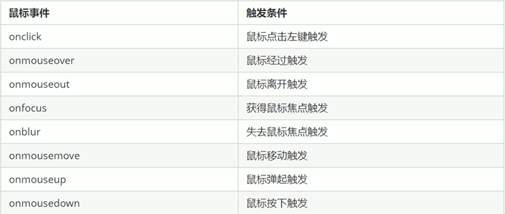
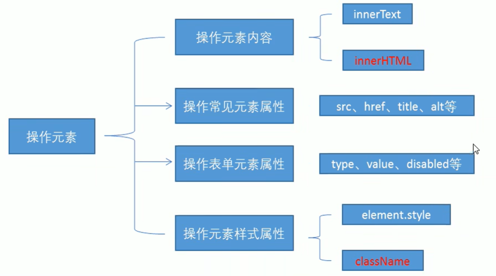
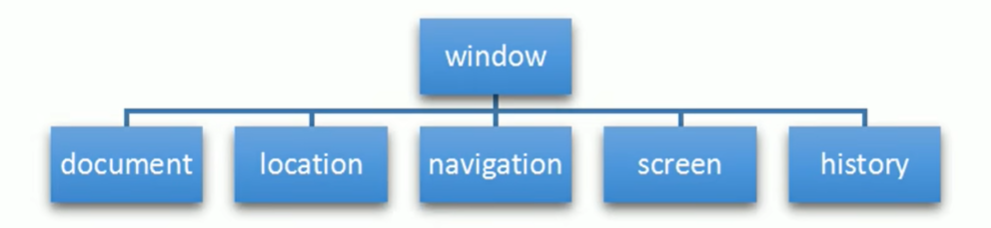

# DOM  BOM

#### js组成

ECMAScript（JavaScript语句）

DOM（页面文档对象模型）

BOM（浏览器对象模型）

#### API

API是一些预先定义的函数，目的是提供应用程序与开发人员基于某软件或硬件得以访问一组例程的能力，而有无需访问源码，或理解内部工作机制的细节。

**简单理解：**API是给程序员提供的一种工具，以便能更轻松的实现想要完成的功能。

#### Web API

Web API是浏览器提供的一套操作浏览器功能和页面元素的API（BOM和DOM）


#### 总结：

1. API是为我们程序员提供的一个接口，帮助我们实现某种功能，我们会使用就可以了，不必纠结内部如何实现
2. Web API主要是针对于浏览器提供的接口，主要针对于浏览器做交互效果
3. Web API一般都有输入和输出（函数的传参和返回值），Web API很多都是方法（函数）
4. 学习Web API可以结合前面学习内置对象方法的思路学习

## DOM

### 1、简介

文档对象模型，是W3C组织推荐的处理可扩展标记语言（HTML或者XML）的标准**编程接口。**

通过这些DOM接口可以改变网页的内容、结构和样式。

#### DOM树

- 文档：一个页面就是一个文档，DOM中使用document表示
- 元素：页面中的所有标签都是元素，DOM中使用element表示
- 节点：网页中的所有内容都是节点（标签、属性、文本、注释等），DOM中使用node表示


### 2、获取元素

#### 1、根据ID获取

get--获得，element--元素，by--通过，驼峰命名法

使用  

```javascript
var a = document.getElementById('id');
```

返回一个匹配特定ID的元素。参数 id 是大小写敏感的字符串，返回的是一个元素对象

```javascript
console.dir();
//打印我们返回的元素对象，更好的查看里面的属性和方法
```

```html
<!DOCTYPE html>
<html lang="en">
<head>
    <meta charset="UTF-8">
    <meta http-equiv="X-UA-Compatible" content="ie=edge">
    <meta name="viewport" content="width=device-width, initial-scale=1.0">
    <title>Document</title>
</head>
<body>
    <div id="time">2019-9-9</div>
    <script>
        //1、因为我们文档页面从上往下加载，所以我们script写到标签下面
        //2、get 获得element 元素 by 通过 驼峰命名法
        //3、参数 id 是大小写敏感的字符串
        var timer = document.getElementById('time');
        console.log(timer);
        //4、返回的是一个元素对象
        console.log(typeof timer);
        //5、console.dir 打印我们返回的元素对象  更好的查看里面的属性和方法
        console.dir(timer);
    </script>
</body>
</html>
```

#### 2、根据标签名获取

使用getElementsByTagName() 方法可以返回带有指定标签名的对象的集合

返回的是 获取过来元素对象的集合，以伪数组的形式存储

```html
var a = document.getElementsByTagName('标签名');
```

**注意：**

1、因为得到的是一个对象的结合，所以我们想要操作里面的元素就需要遍历

2、得到元素对象是动态的


还可以获取某个元素（父元素） 内部所以指定标签名的子元素

```html
element.getElementsByTagName('标签名');
```

**注意：**

父元素必须是单个对象（必须指明是哪一个元素对象），获取的时候不包括父元素自己

```html
<!DOCTYPE html>
<html lang="en">
<head>
    <meta charset="UTF-8">
    <meta http-equiv="X-UA-Compatible" content="IE=edge">
    <meta name="viewport" content="width=device-width, initial-scale=1.0">
    <title>Document</title>
</head>
<body>
    <ul>
        <li>我喜欢你</li>
        <li>我喜欢你</li>
        <li>我喜欢你</li>
        <li>我喜欢你</li>
    </ul>
    <ol id = 'ol'>
        <li>没有结果</li>
        <li>没有结果</li>
        <li>没有结果</li>
        <li>没有结果</li>
    </ol>
    <script>
        //1、返回的是获取过来元素对象的集合 以伪数组的形式存储的
        var lis = document.getElementsByTagName('li');
        console.log(lis);
        console.log(lis[0]);
        //2、我们想要依次打印里面的元素对象  可以采取遍历的方式
        //3、如果页面中只有一个li，返回的还是伪数组的形式
        //4、如果页面中没有这个元素，返回的是空的伪数组的形式
        //5、elemnet.getElementsByTagName('标签名');  父元素必须是指定的单个元素
        // var ol = document.getElementsByTagName('ol'); // [ol]
        // console.log(ol[0].getElementsByTagName('li'));
        var ol = document.getElementById('ol');
        console.log(ol.getElementsByTagName('li'));
    </script>
</body>
</html>
```

#### 3、H5新增获取元素方式

```html
document.getElementsByClassName('类名'); //根据类名返回元素对象集合
document.querySelector('选择器'); //根据指定选择器返回第一个元素对象
document.querySelectorAll('选择器'); //根据指定选择器返回

<!DOCTYPE html>
<html lang="en">
<head>
    <meta charset="UTF-8">
    <meta http-equiv="X-UA-Compatible" content="IE=edge">
    <meta name="viewport" content="width=device-width, initial-scale=1.0">
    <title>Document</title>
</head>
<body>
    <div class="box">盒子1</div>
    <div class="box">盒子2</div>
    <div id="nav">
        <ul>
            <li>首页</li>
            <li>产品</li>
        </ul>
    </div>
    <script>
        //1、getElementsByClassName 根据类名获取某些元素
        var boxs = document.getElementsByClassName('box');
        console.log(boxs);
        //2、querySelector 返回指定选择器的第一个元素对象  切记 里面的选择器需要加符号  .box   #nav
        var firstBox = document.querySelector('.box');
        console.log(firstBox);
        var nav = document.querySelector('#nav');
        console.log(nav);
        var li = document.querySelector('li');
        console.log(li);
        //3、querySelectorAll() 返回指定选择器的所以元素对象集合
        var allBox = document.querySelectorAll('.box');
        console.log(allBox);
        var lis = document.querySelectorAll('li');
        console.log(lis);
    </script>
</body>
</html>
```

#### 4、获取特殊元素

```html
<!DOCTYPE html>
<html lang="en">
<head>
    <meta charset="UTF-8">
    <meta http-equiv="X-UA-Compatible" content="IE=edge">
    <meta name="viewport" content="width=device-width, initial-scale=1.0">
    <title>Document</title>
</head>
<body>
    <script>
        //1、获取body元素
        var bodyEle = document.body;
        console.dir(bodyEle);
        //2、获取html元素
        var htmlEle = document.documentElement;
        console.log(htmlEle);
    </script>
</body>
</html>
```

### 3、事件基础

JavaScript使我们有能力创建动态页面，而事件是可以被JavaScript侦测到的行为

**简单理解**      触发 -- 响应机制

网页中的每个元素都可以产生某些可以触发JavaScript的事件，例如，我们可以在用户点击某按钮时产生一个事件，如何去执行某些操作

```html
<!DOCTYPE html>
<html lang="en">
<head>
    <meta charset="UTF-8">
    <meta http-equiv="X-UA-Compatible" content="IE=edge">
    <meta name="viewport" content="width=device-width, initial-scale=1.0">
    <title>Document</title>
</head>
<body>
    <button id="btn">铠甲合体</button>
    <script>
        //点击一个按钮，弹出一个对话框
        //1、事件是有三部分组成的 事件源  事件类型  事件处理程序  我们也称为事件三要素
        //(1) 事件源 事件被触发的对象  按钮
        var btn = document.getElementById('btn');
        //(2) 事件类型 如何触发 什么事件  比如鼠标点击(onclick) 还是鼠标经过  还是键盘按下
        //(3) 事件处理程序  通过一个函数赋值的方式完成
        btn.onclick = function() {
            alert('炎龙铠甲合体成功！');
        }
    </script>
</body>
</html>
```

**执行事件的步骤**

1、获取事件源

2、注册事件（绑定事件）

3、添加事件处理程序（采取函数赋值形式）


##### 常见的鼠标事件



### 4、操作元素

JavaScript的DOM操作可以改变网页内容、结构和样式，我们可以利用DOM操作元素来改变元素里面的内容、属性等

#### 1、改变元素内容

**element.innerText**

从起始位置到终止位置的内容，但它去除html标签，同时空格和换行也会去掉

也就是不识别html标签

**element.innerHTML**

起始位置到终止位置的全部内容，包括html标签，同时保留空格和换行

W3C标准

```html
<!DOCTYPE html>
<html lang="en">
<head>
    <meta charset="UTF-8">
    <meta http-equiv="X-UA-Compatible" content="IE=edge">
    <meta name="viewport" content="width=device-width, initial-scale=1.0">
    <title>Document</title>
    <style>
        div,p {
            width: 300px;
            height: 30px;
            line-height: 30px;
            color: #fff;
            background-color: pink;
        }
    </style>
</head>
<body>
    <button>显示当前系统时间</button>
    <div>某个时间</div>
    <p>时间</p>
    <script>
        //当我们点击了按钮，div里面的文字会发生变化
        //1、获取元素
        var btn = document.querySelector('button');
        var div = document.querySelector('div');
        //2、注册事件
        btn.onclick = function() {
            // div.innerText = '2021-11-16';
            div.innerText = getDate();
        }

        function getDate() {
            var date = new Date();
            var year = date.getFullYear();
            var month = date.getMonth() + 1;
            var dates = date.getDate();
            var arr = ['星期日','星期一','星期二','星期三','星期四','星期五','星期六'];
            var day = date.getDay();
            return '今天是' + year + '年' + month + '月' + dates + '日' + arr[day];
        }

        //我们元素可以不用添加事件
        var p = document.querySelector('p');
        p.innerText = getDate();
    </script>
    
</body>
</html>
```

#### 2、常用元素的属性操作

```html
<!DOCTYPE html>
<html lang="en">
<head>
    <meta charset="UTF-8">
    <meta http-equiv="X-UA-Compatible" content="IE=edge">
    <meta name="viewport" content="width=device-width, initial-scale=1.0">
    <title>Document</title>
    <style>
        button {
            width: 50px;
            height: 50px;
        }
        img {
            width: 100ex;
            height: 100ex;
        }
    </style>
</head>
<body>
    <button id="e">恶</button>
    <button id="shan">善</button>
    

    <script>
        //修改元素属性
        //1、获取元素
        var e = document.getElementById('e');
        var shan = document.getElementById('shan');
        var img = document.querySelector('img');
        //2、注册事件  处理程序
        e.onclick = function() {
            img.src = '../image/e.jpg';
            img.title = '恶';
        }
        shan.onclick = function() {
            img.src = '../image/shan.jpg';
            img.title = '善';
        }
    </script>
</body>
</html>
```

#### 3、修改表单属性

利用DOM可以操作如下表单元素的属性：

type、value、checked、selected、disabled

```html
<!DOCTYPE html>
<html lang="en">
<head>
    <meta charset="UTF-8">
    <meta http-equiv="X-UA-Compatible" content="IE=edge">
    <meta name="viewport" content="width=device-width, initial-scale=1.0">
    <title>Document</title>
</head>
<body>
    <button>按钮</button>
    <input type="text" value="输入内容">
    <script>
        //1、获取元素
        var btn = document.querySelector('button');
        var input = document.querySelector('input');
        //2、注册事件  处理程序
        btn.onclick = function() {
            // input.innerHTML = '被点击了';   这个是普通盒子   比如 div 标签里面的内容
            //表单里面的值 文字内容是通过value 来修改的
            input.value = '被点击了';
            //如果想要某个表单被禁用 不能再点击 disabled 我们想要这个按钮 button 禁用
            // btn.disabled = true;
            this.disabled = true;
            //this 指向的事件函数的调用者  也就是 btn
        }
    </script>
</body>
</html>
```

##### 显示隐藏密钥明文案例

```html
<!DOCTYPE html>
<html lang="en">

<head>
    <meta charset="UTF-8">
    <meta http-equiv="X-UA-Compatible" content="IE=edge">
    <meta name="viewport" content="width=device-width, initial-scale=1.0">
    <title>Document</title>
    <style>
        .box {
            width: 400px;
            border-bottom: 1px solid #ccc;
            margin: 100px auto;
        }

        .box input {
            width: 370px;
            height: 30px;
            border: 0;
            outline: none;
        }

        .box img {
            position: absolute;
            top: 99px;
            right: 800px;
            width: 15px;
        }
    </style>
</head>

<body>
    <div class="box">
        <label for="">
            
        </label>
        <input type="password" name="" id="pwd">
    </div>
    <script>
        var e = document.getElementById('e');
        var pwd = document.getElementById('pwd');
        e.onclick = function () {
            if (pwd.type == 'password') {
                pwd.type = 'text';
                e.src = '../image/shan.jpg';
            } else {
                pwd.type = 'password';
                e.src = '../image/e.jpg';
            }
        }
    </script>
</body>

</html>
```

#### 4、修改样式属性

我们可以通过JS修改元素的大小、颜色、位置等样式

1. element.style  行内样式操作
2. element.className    类名样式操作


**注意：**

1、js里面的样式采取驼峰命名法， 比如 fontSize 、 backgroundColor

2、js修改style 样式操作，产生的是行内样式，css权重比较高

```html
<!DOCTYPE html>
<html lang="en">
<head>
    <meta charset="UTF-8">
    <meta http-equiv="X-UA-Compatible" content="IE=edge">
    <meta name="viewport" content="width=device-width, initial-scale=1.0">
    <title>Document</title>
    <style>
        div {
            width: 200px;
            height: 200px;
            background-color: pink;
        }
    </style>
</head>
<body>
    <div></div>
    <script>
        var div = document.querySelector('div');
        div.onclick = function() {
            this.style.backgroundColor = 'black';
            this.style.width = '300px';
            this.style.height = '400px';
        }
    </script>
</body>
</html>
```

淘宝关闭二维码案例

```html
<!DOCTYPE html>
<html lang="en">
<head>
    <meta charset="UTF-8">
    <meta http-equiv="X-UA-Compatible" content="IE=edge">
    <meta name="viewport" content="width=device-width, initial-scale=1.0">
    <title>Document</title>
    <style>
        .box {
            position: relative;
            width: 74px;
            height: 88px;
            border: 1px solid #ccc;
            margin: 100px auto;
            font-size: 12px;
            text-align: center;
            color: #f40;
        }

        .box img {
            width: 60px;
            height: 60px;
            margin-top: 5px;
        }
        .close-btn {
            position: absolute;
            top: -1px;
            left: -16px;
            width: 14px;
            height: 14px;
            border: 1px solid #ccc;
            line-height: 14px;
            font-family: Arial,Helvetica,sans-serif;
            cursor: pointer;
        }
    </style>
</head>
<body>
    <div class="box">
        淘宝二维码
        
        <i class="close-btn">x</i>
    </div>
    <script>
        var btn = document.querySelector('.close-btn');
        var box = document.querySelector('.box');

        btn.onclick = function() {
            box.style.display = 'none';
        }
    </script>
</body>
</html>
```

##### 循环精灵图

```html
<!DOCTYPE html>
<html lang="en">

<head>
    <meta charset="UTF-8">
    <meta name="viewport" content="width=device-width, initial-scale=1.0">
    <meta http-equiv="X-UA-Compatible" content="ie=edge">
    <title>Document</title>
    <style>
        * {
            margin: 0;
            padding: 0;
        }
        
        li {
            list-style-type: none;
        }
        
        .box {
            width: 250px;
            margin: 100px auto;
        }
        
        .box li {
            float: left;
            width: 24px;
            height: 24px;
            background-color: pink;
            margin: 15px;
            background: url(../image/sprite.png) no-repeat;
        }
    </style>
</head>

<body>
    <div class="box">
        <ul>
            <li></li>
            <li></li>
            <li></li>
            <li></li>
            <li></li>
            <li></li>
            <li></li>
            <li></li>
            <li></li>
            <li></li>
            <li></li>
            <li></li>
        </ul>
    </div>
    <script>
        // 1. 获取元素 所有的小li 
        var lis = document.querySelectorAll('li');
        for (var i = 0; i < lis.length; i++) {
            // 让索引号 乘以 44 就是每个li 的背景y坐标  index就是我们的y坐标
            var index = i * 44;
            lis[i].style.backgroundPosition = '0 -' + index + 'px';
        }
    </script>
</body>

</html>
```

##### 显示隐藏文本框内容

```html
<!DOCTYPE html>
<html lang="en">

<head>
    <meta charset="UTF-8">
    <meta name="viewport" content="width=device-width, initial-scale=1.0">
    <meta http-equiv="X-UA-Compatible" content="ie=edge">
    <title>Document</title>
    <style>
        input {
            color: #999;
        }
    </style>
</head>

<body>
    <input type="text" value="手机">
    <script>
        // 1.获取元素
        var text = document.querySelector('input');
        // 2.注册事件 获得焦点事件 onfocus 
        text.onfocus = function() {
                // console.log('得到了焦点');
                if (this.value === '手机') {
                    this.value = '';
                }
                // 获得焦点需要把文本框里面的文字颜色变黑
                this.style.color = '#333';
            }
            // 3. 注册事件 失去焦点事件 onblur
        text.onblur = function() {
            // console.log('失去了焦点');
            if (this.value === '') {
                this.value = '手机';
            }
            // 失去焦点需要把文本框里面的文字颜色变浅色
            this.style.color = '#999';
        }
    </script>

</body>

</html>
```

##### 通过className修改元素属性

**注意**

1、如果修改样式较多，可以采取操作类名方式更改元素样式

2、class因为是保留字，因此使用className来操作元素类名属性

3、className 会直接更改元素的类名，会覆盖原先的类名

```html
<!DOCTYPE html>
<html lang="en">

<head>
    <meta charset="UTF-8">
    <meta name="viewport" content="width=device-width, initial-scale=1.0">
    <meta http-equiv="X-UA-Compatible" content="ie=edge">
    <title>Document</title>
    <style>
        div {
            width: 100px;
            height: 100px;
            background-color: pink;
        }
        
        .change {
            background-color: purple;
            color: #fff;
            font-size: 25px;
            margin-top: 100px;
        }
    </style>
</head>


<body>
    <div class="first">文本</div>
    <script>
        // 1. 使用 element.style 获得修改元素样式  如果样式比较少 或者 功能简单的情况下使用
        var test = document.querySelector('div');
        test.onclick = function() {
            // this.style.backgroundColor = 'purple';
            // this.style.color = '#fff';
            // this.style.fontSize = '25px';
            // this.style.marginTop = '100px';
            // 让我们当前元素的类名改为了 change

            // 2. 我们可以通过 修改元素的className更改元素的样式 适合于样式较多或者功能复杂的情况
            // this.className = 'change';
            // 3. 如果想要保留原先的类名，我们可以这么做 多类名选择器
            this.className = 'first change';
        }
    </script>
</body>

</html>
```

##### 密码框验证信息

```html
<!DOCTYPE html>
<html lang="en">

<head>
    <meta charset="UTF-8">
    <meta name="viewport" content="width=device-width, initial-scale=1.0">
    <meta http-equiv="X-UA-Compatible" content="ie=edge">
    <title>Document</title>
    <style>
        div {
            width: 600px;
            margin: 100px auto;
        }
        
        .message {
            display: inline-block;
            font-size: 12px;
            color: #999;
            background: url(../image/mess.png) no-repeat left center;
            padding-left: 20px;
        }
        
        .wrong {
            color: red;
            background-image: url(../image/wrong.png);
        }
        
        .right {
            color: green;
            background-image: url(../image/right.png);
        }
    </style>
</head>

<body>
    <div class="register">
        <input type="password" class="ipt">
        <p class="message">请输入6~16位密码</p>
    </div>
    <script>
        // 首先判断的事件是表单失去焦点 onblur
        // 如果输入正确则提示正确的信息颜色为绿色小图标变化
        // 如果输入不是6到16位，则提示错误信息颜色为红色 小图标变化
        // 因为里面变化样式较多，我们采取className修改样式
        // 1.获取元素
        var ipt = document.querySelector('.ipt');
        var message = document.querySelector('.message');
        //2. 注册事件 失去焦点
        ipt.onblur = function() {
            // 根据表单里面值的长度 ipt.value.length
            if (this.value.length < 6 || this.value.length > 16) {
                // console.log('错误');
                message.className = 'message wrong';
                message.innerHTML = '您输入的位数不对要求6~16位';
            } else {
                message.className = 'message right';
                message.innerHTML = '您输入的正确';
            }
        }
    </script>
</body>

</html>
```

##### 开关灯

```html
<!DOCTYPE html>
<html lang="en">

<head>
    <meta charset="UTF-8">
    <meta name="viewport" content="width=device-width, initial-scale=1.0">
    <meta http-equiv="X-UA-Compatible" content="ie=edge">
    <title>Document</title>
</head>

<body>
    <button id="btn">开关灯</button>
    <script>
        var btn = document.getElementById('btn');
        // var btn = document.querySelector('button');
        var flag = 0;
        btn.onclick = function() {
            if (flag == 0) {
                document.body.style.backgroundColor = 'black';
                flag = 1;
            } else {
                document.body.style.backgroundColor = '#fff';
                flag = 0;
            }
        }
    </script>
</body>

</html>
```

#### 操作元素小结



#### 5、排他思想

干掉其他人，再设置自己的样式

```html
<!DOCTYPE html>
<html lang="en">
<head>
    <meta charset="UTF-8">
    <meta http-equiv="X-UA-Compatible" content="IE=edge">
    <meta name="viewport" content="width=device-width, initial-scale=1.0">
    <title>Document</title>
</head>
<body>
    <button>按钮1</button>
    <button>按钮2</button>
    <button>按钮3</button>
    <button>按钮4</button>
    <button>按钮5</button>
    <script>
        //1、获取所有元素按钮
        var btns = document.getElementsByTagName('button');
        //btns得到的是伪数组 里面的每一个元素为 btns[i]
        for(var i = 0; i < btns.length; i++) {
            btns[i].onclick = function() {
                 //（1）先把所有的按钮背景颜色去掉
                 for(var i = 0; i < btns.length; i++) {
                    btns[i].style.backgroundColor = '';
                 }
                //（2）然后才让当前的元素背景颜色为红色
                this.style.backgroundColor = 'red';
            }
        }
        //2、首先排除其他人，然后再设置自己的样式，这种排除其他人的思想为排他思想
    </script>
</body>
</html>
```

#### 6、自定义属性值

##### 1、获取属性值

- 获取内置属性值（元素自身自带的属性）

```javascript
element.属性;
```

- 获取自定义的属性值

```
element.getAttribute('属性');
```

##### 2、设置属性值

- 设置内置属性值

```
element.属性 = '值';
```

- 设置自定义的属性

```
element.setAttribute('属性','值');
```

##### 3、移除属性

```
element.removeAttribute('属性');
```

```html
<body>
    <div id="demo" index="1" class="nav"></div>
    <script>
        var div = document.querySelector('div');
        // 1. 获取元素的属性值
        // (1) element.属性
        console.log(div.id);
        //(2) element.getAttribute('属性')  get得到获取 attribute 属性的意思 我们程序员自己添加的属性我们称为自定义属性 index
        console.log(div.getAttribute('id'));
        console.log(div.getAttribute('index'));
        // 2. 设置元素属性值
        // (1) element.属性= '值'
        div.id = 'test';
        div.className = 'navs';
        // (2) element.setAttribute('属性', '值');  主要针对于自定义属性
        div.setAttribute('index', 2);
        div.setAttribute('class', 'footer'); // class 特殊  这里面写的就是class 不是className
        // 3 移除属性 removeAttribute(属性)    
        div.removeAttribute('index');
    </script>
</body>
```

#### 7、H5自定义属性

目的：

- 保存并保存数据，有些数据可以保存到页面中而不用保存到数据库中
- 有些自定义属性很容易引起歧义，不容易判断到底是内置属性还是自定义的，所以H5有了规定

##### 1、设置H5自定义属性

H5规定自定义属性 `data-`开头作为属性名并赋值

```
<div data-index = "1"></>
// 或者使用JavaScript设置
div.setAttribute('data-index',1);
```

##### 2、 获取H5自定义属性

- 兼容性获取 `element.getAttribute('data-index')`

- H5新增的：`element.dataset.index` 或`element.dataset['index']` IE11才开始支持

```html
<body>
    <div getTime="20" data-index="2" data-list-name="andy"></div>
    <script>
        var div = document.querySelector('div');
        console.log(div.getAttribute('getTime'));
        div.setAttribute('data-time', 20);
        console.log(div.getAttribute('data-index'));
        console.log(div.getAttribute('data-list-name'));
        // h5新增的获取自定义属性的方法 它只能获取data-开头的
        // dataset 是一个集合里面存放了所有以data开头的自定义属性
        console.log(div.dataset);
        console.log(div.dataset.index);
        console.log(div.dataset['index']);
        // 如果自定义属性里面有多个-链接的单词，我们获取的时候采取 驼峰命名法
        console.log(div.dataset.listName);
        console.log(div.dataset['listName']);
    </script>
</body>
```

### 5、节点操作

获取元素通常使用两种方式：


#### 1、节点概述

一般的，节点至少拥有三个基本属性

- nodeType：节点类型
- nodeName：节点名称
- nodeValue：节点值

元素节点nodeType为	1	

属性节点nodeType为	2

文本节点nodeType为	3

> 节点操作主要操作的是元素节点

#### 2、父级节点

```
node.parentNode
```

- `parentNode`属性可以返回某节点的父结点，注意是最近的一个父结点
- 如果指定的节点没有父结点则返回null

```html
<body>
    <!-- 节点的优点 -->
    <div>我是div</div>
    <span>我是span</span>
    <ul>
        <li>我是li</li>
        <li>我是li</li>
        <li>我是li</li>
        <li>我是li</li>
    </ul>
    <div class="demo">
        <div class="box">
            <span class="erweima">×</span>
        </div>
    </div>

    <script>
        // 1. 父节点 parentNode
        var erweima = document.querySelector('.erweima');
        // var box = document.querySelector('.box');
        // 得到的是离元素最近的父级节点(亲爸爸) 如果找不到父节点就返回为 null
        console.log(erweima.parentNode);
    </script>
</body>
```

#### 3、子节点

```
parentNode.childNodes(标准)
```

- `parentNode.childNodes` 返回包含指定节点的子节点的集合，该集合为即时更新的集合
- 返回值包含了所有的子结点，包括元素节点，文本节点等
- 如果只想要获得里面的元素节点，则需要专门处理。所以我们一般不提倡使用`childNodes`

```
parentNode.children(非标准)
```

- `parentNode.children` 是一个只读属性，返回所有的子元素节点
- 它只返回子元素节点，其余节点不返回 （**这个是我们重点掌握的**）
- 虽然 children 是一个非标准，但是得到了各个浏览器的支持，因此我们可以放心使用

```html
<body>
    <ul>
        <li>我是li</li>
        <li>我是li</li>
        <li>我是li</li>
        <li>我是li</li>
    </ul>
    <ol>
        <li>我是li</li>
        <li>我是li</li>
        <li>我是li</li>
        <li>我是li</li>
    </ol>
    <script>
        // DOM 提供的方法（API）获取
        var ul = document.querySelector('ul');
        var lis = ul.querySelectorAll('li');
        // 1. 子节点  childNodes 所有的子节点 包含 元素节点 文本节点等等
        console.log(ul.childNodes);
        console.log(ul.childNodes[0].nodeType);
        console.log(ul.childNodes[1].nodeType);
        // 2. children 获取所有的子元素节点 也是我们实际开发常用的
        console.log(ul.children);
    </script>
</body>
```

##### 1、第一个子结点

```
parentNode.firstChild
```

- `firstChild` 返回第一个子节点，找不到则返回null
- 同样，也是包含所有的节点

##### 2、最后一个子结点

```
parentNode.lastChild
```

- `lastChild` 返回最后一个子节点，找不到则返回null
- 同样，也是包含所有的节点

```html
<body>
    <ol>
        <li>我是li1</li>
        <li>我是li2</li>
        <li>我是li3</li>
        <li>我是li4</li>
        <li>我是li5</li>
    </ol>
    <script>
        var ol = document.querySelector('ol');
        // 1. firstChild 第一个子节点 不管是文本节点还是元素节点
        console.log(ol.firstChild);
        console.log(ol.lastChild);
        // 2. firstElementChild 返回第一个子元素节点 ie9才支持
        console.log(ol.firstElementChild);
        console.log(ol.lastElementChild);
        // 3. 实际开发的写法  既没有兼容性问题又返回第一个子元素
        console.log(ol.children[0]);			//第一个子元素节点
        console.log(ol.children[ol.children.length - 1]);//最后一个子元素节点
    </script>
</body>
```

#### 4、兄弟节点

##### 1、下一个兄弟节点

```
node.nextSibling
```

- `nextSibling` 返回当前元素的下一个兄弟元素节点，找不到则返回null
- 同样，也是包含所有的节点

##### 2、上一个兄弟节点

```
node.previousSibling
```

- `previousSibling` 返回当前元素上一个兄弟元素节点，找不到则返回null
- 同样，也是包含所有的节点

##### 3、下一个兄弟节点(兼容性)

```
node.nextElementSibling
```

- `nextElementSibling` 返回当前元素下一个兄弟元素节点，找不到则返回null
- 有兼容性问题，IE9才支持

##### 4、上一个兄弟节点(兼容性)

```
node.previousElementSibling
```

- `previousElementSibling` 返回当前元素上一个兄弟元素节点，找不到则返回null
- 有兼容性问题，IE9才支持

```html
<body>
    <div>我是div</div>
    <span>我是span</span>
    <script>
        var div = document.querySelector('div');
        // 1.nextSibling 下一个兄弟节点 包含元素节点或者 文本节点等等
        console.log(div.nextSibling);		// #text
        console.log(div.previousSibling);	// #text
        // 2. nextElementSibling 得到下一个兄弟元素节点
        console.log(div.nextElementSibling);	//<span>我是span</span>
        console.log(div.previousElementSibling);//null
    </script>
</body>
```

**解决兼容性问题**：自己封装一个兼容性的函数

```js
function getNextElementSibling(element) {
    var el = element;
    while(el = el.nextSibling) {
        if(el.nodeType === 1){
            return el;
        }
    }
    return null;
}
```

#### 5、创建节点

```
document.createElement('tagName');
```

- `document.createElement()` 方法创建由 tagName 指定的HTML 元素
- 因为这些元素原先不存在，是根据我们的需求动态生成的，所以我们也称为**动态创建元素节点**

##### 1、添加节点

```
node.appendChild(child)
```

- `node.appendChild()` 方法将一个节点添加到指定父节点的子节点列表**末尾**。类似于 CSS 里面的 after 伪元素。

```
node.insertBefore(child,指定元素)
```

- `node.insertBefore()` 方法将一个节点添加到父节点的指定子节点**前面**。类似于 CSS 里面的 before 伪元素。

```html
<body>
    <ul>
        <li>123</li>
    </ul>
    <script>
        // 1. 创建节点元素节点
        var li = document.createElement('li');
        // 2. 添加节点 node.appendChild(child)  node 父级  child 是子级 后面追加元素  类似于数组中的push
        // 先获取父亲ul
        var ul = document.querySelector('ul');
        ul.appendChild(li);
        // 3. 添加节点 node.insertBefore(child, 指定元素);
        var lili = document.createElement('li');
        ul.insertBefore(lili, ul.children[0]);
        // 4. 我们想要页面添加一个新的元素分两步: 1. 创建元素 2. 添加元素
    </script>
</body>
```

##### 2、删除节点

```
node.removeChild(child)
```

- `node.removeChild()`方法从 DOM 中删除一个子节点，返回删除的节点

##### 3、复制节点

```
node.cloneNode()
```

- `node.cloneNode()`方法返回调用该方法的节点的一个副本。 也称为克隆节点/拷贝节点
- 如果括号参数为空或者为 false ，则是浅拷贝，即只克隆复制节点本身，不克隆里面的子节点
- 如果括号参数为 true ，则是深度拷贝，会复制节点本身以及里面所有的子节点

```html
<body>
    <ul>
        <li>1111</li>
        <li>2</li>
        <li>3</li>
    </ul>
    <script>
        var ul = document.querySelector('ul');
        // 1. node.cloneNode(); 括号为空或者里面是false 浅拷贝 只复制标签不复制里面的内容
        // 2. node.cloneNode(true); 括号为true 深拷贝 复制标签复制里面的内容
        var lili = ul.children[0].cloneNode(true);
        ul.appendChild(lili);
    </script>
</body>
```

##### 6、三种动态创建元素的区别

- `document.write()` 是直接将内容写入页面的内容流，但是文档流执行完毕，则它会导致页面全部重绘
- `innerHTML` 是将内容写入某个 DOM 节点，不会导致页面全部重绘
- `innerHTML` 创建多个元素效率更高（不要拼接字符串，采取数组形式拼接），结构稍微复杂

```html
<body>
    <div class="innner"></div>
    <div class="create"></div>
    <script>
        // 2. innerHTML 创建元素
        var inner = document.querySelector('.inner');
        // 2.1 innerHTML 用拼接字符串方法
        for (var i = 0; i <= 100; i++) {
            inner.innerHTML += '<a href="#">百度</a>';
        }
        // 2.2 innerHTML 用数组形式拼接
        var arr = [];
        for (var i = 0; i <= 100; i++) {
            arr.push('<a href="#">百度</a>');
        }
        inner.innerHTML = arr.join('');

        // 3.document.createElement() 创建元素
        var create = document.querySelector('.create');
        var a = document.createElement('a');
        create.appendChild(a);
    </script>
</body>
```

### 6、DOM核心

对于DOM操作，我们主要针对子元素的操作，主要有

创建、增、删、改、查、属性操作、时间操作

##### 1、创建

1. document.write
2. innerHTML
3. createElement

##### 2、增

1. appendChild
2. insertBefore

##### 3、删

1. removeChild

##### 4、改

- 主要修改dom的元素属性，dom元素的内容、属性、表单的值等

1. 修改元素属性：src、href、title 等
2. 修改普通元素内容：innerHTML、innerText
3. 修改表单元素：value、type、disabled
4. 修改元素样式：style、className

##### 5、查

主要获取查询dom的元素
DOM提供的API方法：getElementById、getElementsByTagName (古老用法，不推荐)
H5提供的新方法：querySelector、querySelectorAll (提倡)
利用节点操作获取元素：父(parentNode)、子(children)、兄(previousElementSibling、nextElementSibling) 提倡

##### 6、属性操作

- 主要针对于自定义属性

1. setAttribute：设置dom的属性值
2. getAttribute：得到dom的属性值
3. removeAttribute：移除属性

##### 7、事件操作


### 7、事件高级

#### 1、注册事件

给元素添加事件，称为注册事件或者绑定事件。

注册事件有两种方式：**传统方式**和**方法监听注册方式**

| 传统注册方式                                                 | 方法监听注册方式                                      |
| ------------------------------------------------------------ | ----------------------------------------------------- |
| 利用on开头的事件onlick                                       | w3c 标准推荐方式                                      |
| <button onclick = "alert("hi")"></button>                    | addEventListener() 它是一个方法                       |
| btn.onclick = function() {}                                  | IE9 之前的 IE 不支持此方法，可使用 attachEvent() 代替 |
| 特点：注册事件的**唯一性**                                   | 特点：同一个元素同一个事件可以注册多个监听器          |
| 同一个元素同一个事件只能设置一个处理函数，最后注册的处理函数将会覆盖前面注册的处理函数 | 按注册顺序依次执行                                    |

##### addEventListener事件监听方式

- `eventTarget.addEventListener()`方法将指定的监听器注册到 eventTarget（目标对象）上
- 当该对象触发指定的事件时，就会执行事件处理函数

```
eventTarget.addEventListener(type,listener[,useCapture])
```

该方法接收三个参数：

- `type`:事件类型字符串，比如click,mouseover,注意这里不要带on
- `listener`：事件处理函数，事件发生时，会调用该监听函数
- `useCapture`：可选参数，是一个布尔值，默认是 false。

```html
<body>
    <button>传统注册事件</button>
    <button>方法监听注册事件</button>
    <button>ie9 attachEvent</button>
    <script>
        var btns = document.querySelectorAll('button');
        // 1. 传统方式注册事件
        btns[0].onclick = function() {
            alert('hi');
        }
        btns[0].onclick = function() {
                alert('hao a u');
            }
            // 2. 事件监听注册事件 addEventListener 
            // (1) 里面的事件类型是字符串 所以加引号 而且不带on
            // (2) 同一个元素 同一个事件可以添加多个侦听器（事件处理程序）
        btns[1].addEventListener('click', function() {
            alert(22);
        })
        btns[1].addEventListener('click', function() {
                alert(33);
            })
            // 3. attachEvent ie9以前的版本支持
        btns[2].attachEvent('onclick', function() {
            alert(11);
        })
    </script>
</body>
```

##### attachEvent事件监听方式(兼容)

- `eventTarget.attachEvent()`方法将指定的监听器注册到 eventTarget（目标对象） 上
- 当该对象触发指定的事件时，指定的回调函数就会被执行

```
eventTarget.attachEvent(eventNameWithOn,callback)
```

该方法接收两个参数：

- `eventNameWithOn`：事件类型字符串，比如 onclick 、onmouseover ，这里要带 on
- `callback`： 事件处理函数，当目标触发事件时回调函数被调用
- ie9以前的版本支持。但ie已经寄了

#### 2、删除事件

解绑事件

##### 1、removeEventListener删除事件方式

```
eventTarget.removeEventListener(type,listener[,useCapture]);
```

该方法接收三个参数：

- `type`:事件类型字符串，比如click,mouseover,注意这里不要带on
- `listener`：事件处理函数，事件发生时，会调用该监听函数
- `useCapture`：可选参数，是一个布尔值，默认是 false。

##### 2、detachEvent删除事件方式(兼容)

```
eventTarget.detachEvent(eventNameWithOn,callback);
```

该方法接收两个参数：

- `eventNameWithOn`：事件类型字符串，比如 onclick 、onmouseover ，这里要带 on
- `callback`： 事件处理函数，当目标触发事件时回调函数被调用
- ie9以前的版本支持

##### 3、传统事件删除方式

```
eventTarget.onclick = null;
```

```html
<body>
    <div>1</div>
    <div>2</div>
    <div>3</div>
    <script>
        var divs = document.querySelectorAll('div');
        divs[0].onclick = function() {
            alert(11);
            // 1. 传统方式删除事件
            divs[0].onclick = null;
        }
        // 2.removeEventListener 删除事件
        divs[1].addEventListener('click',fn);   //里面的fn不需要调用加小括号

        function fn(){
            alert(22);
            divs[1].removeEventListener('click',fn);
        }
        // 3.IE9 中的删除事件方式
        divs[2].attachEvent('onclick',fn1);
        function fn1() {
            alert(33);
            divs[2].detachEvent('onclick',fn1);
        }
    </script>

</body>
```

#### 3、DOM事件流

事件流描述的是从页面中接收事件的顺序
事件发生时会在元素节点之间按照特定的顺序传播，这个传播过程即DOM事件流


事件冒泡： IE 最早提出，事件开始时由最具体的元素接收，然后逐级向上传播到到 DOM 最顶层节点的过程。

事件捕获： 网景最早提出，由 DOM 最顶层节点开始，然后逐级向下传播到到最具体的元素接收的过程。


**加深理解**：

我们向水里面扔一块石头，首先它会有一个下降的过程，这个过程就可以理解为从最顶层向事件发生的最具体元素（目标点）的捕获过程；之后会产生泡泡，会在最低点（ 最具体元素）之后漂浮到水面上，这个过程相当于事件冒泡。


##### 1、捕获阶段

- document -> html -> body -> father -> son

两个盒子嵌套，一个父盒子一个子盒子，我们的需求是当点击父盒子时弹出 father ，当点击子盒子时弹出 son

```html
<body>
    <div class="father">
        <div class="son">son盒子</div>
    </div>
    <script>
        // dom 事件流 三个阶段
        // 1. JS 代码中只能执行捕获或者冒泡其中的一个阶段。
        // 2. onclick 和 attachEvent（ie） 只能得到冒泡阶段。
        // 3. 捕获阶段 如果addEventListener 第三个参数是 true 那么则处于捕获阶段  document -> html -> body -> father -> son
        var son = document.querySelector('.son');
        son.addEventListener('click', function() {
             alert('son');
        }, true);
        var father = document.querySelector('.father');
        father.addEventListener('click', function() {
            alert('father');
        }, true);
    </script>
</body>
```

这是因为捕获阶段由 DOM 最顶层节点开始，然后逐级向下传播到到最具体的元素接收

- document -> html -> body -> father -> son
- 先看 document 的事件，没有；再看 html 的事件，没有；再看 body 的事件，没有；再看 father 的事件，有就先执行；再看 son 的事件，再执行。

##### 2、冒泡阶段

- son -> father ->body -> html -> document

```html
<body>
    <div class="father">
        <div class="son">son盒子</div>
    </div>
    <script>
		// 4. 冒泡阶段 如果addEventListener 第三个参数是 false 或者 省略 那么则处于冒泡阶段  son -> father ->body -> html -> document
        var son = document.querySelector('.son');
        son.addEventListener('click', function() {
            alert('son');
        }, false);
        var father = document.querySelector('.father');
        father.addEventListener('click', function() {
            alert('father');
        }, false);
        document.addEventListener('click', function() {
            alert('document');
        })
    </script>
</body>
```

这是因为冒泡阶段开始时由最具体的元素接收，然后逐级向上传播到到 DOM 最顶层节点

- son -> father ->body -> html -> document

##### 3、小结

- JS 代码中只能执行捕获或者冒泡其中的一个阶段
- `onclick` 和 `attachEvent`只能得到冒泡阶段
- `addEventListener(type,listener[,useCapture])`第三个参数如果是 true，表示在事件捕获阶段调用事件处理程序；如果是 false (不写默认就是false),表示在事件冒泡阶段调用事件处理程序
- **实际开发中我们很少使用事件捕获，我们更关注事件冒泡。**
- **有些事件是没有冒泡的，比如 onblur、onfocus、onmouseenter、onmouseleave**

#### 4、事件对象

```js
eventTarget.onclick = function(event) {
   // 这个 event 就是事件对象，我们还喜欢的写成 e 或者 evt 
} 
eventTarget.addEventListener('click', function(event) {
   // 这个 event 就是事件对象，我们还喜欢的写成 e 或者 evt  
})
```

- 官方解释：event 对象代表事件的状态，比如键盘按键的状态、鼠标的位置、鼠标按钮的状态
- 简单理解：
  - 事件发生后，跟事件相关的一系列信息数据的集合都放到这个对象里面
  - 这个对象就是事件对象 event，它有很多属性和方法，比如“
    - 谁绑定了这个事件
    - 鼠标触发事件的话，会得到鼠标的相关信息，如鼠标位置
    - 键盘触发事件的话，会得到键盘的相关信息，如按了哪个键
- 这个 event 是个形参，系统帮我们设定为事件对象，不需要传递实参过去
- 当我们注册事件时， event 对象就会被系统自动创建，并依次传递给事件监听器（事件处理函数）

```js
<body>
    <div>123</div>
    <script>
        // 事件对象
        var div = document.querySelector('div');
        div.onclick = function(e) {
                // console.log(e);
                // console.log(window.event);
                // e = e || window.event;
                console.log(e);


            }
        // 1. event 就是一个事件对象 写到我们侦听函数的 小括号里面 当形参来看
        // 2. 事件对象只有有了事件才会存在，它是系统给我们自动创建的，不需要我们传递参数
        // 3. 事件对象 是 我们事件的一系列相关数据的集合 跟事件相关的 比如鼠标点击里面就包含了鼠标的相关信息，鼠标坐标啊，如果是键盘事件里面就包含的键盘事件的信息 比如 判断用户按下了那个键
        // 4. 这个事件对象我们可以自己命名 比如 event 、 evt、 e
        // 5. 事件对象也有兼容性问题 ie678 通过 window.event 兼容性的写法  e = e || window.event;
    </script>
</body>
```

##### 1、事件对象的常见属性和方法


e.target 和 this 的区别：

- this 是事件绑定的元素， 这个函数的调用者（绑定这个事件的元素）
- e.target 是事件触发的元素。

##### 2、事件对象阻止默认行为

```html
<body>
    <div>123</div>
    <a href="http://www.baidu.com">百度</a>
    <form action="http://www.baidu.com">
        <input type="submit" value="提交" name="sub">
    </form>
    <script>
        // 常见事件对象的属性和方法
        // 1. 返回事件类型
        var div = document.querySelector('div');
        div.addEventListener('click', fn);
        div.addEventListener('mouseover', fn);
        div.addEventListener('mouseout', fn);

        function fn(e) {
            console.log(e.type);

        }
        // 2. 阻止默认行为（事件） 让链接不跳转 或者让提交按钮不提交
        var a = document.querySelector('a');
        a.addEventListener('click', function(e) {
                e.preventDefault(); //  dom 标准写法
            })
            // 3. 传统的注册方式
        a.onclick = function(e) {
            // 普通浏览器 e.preventDefault();  方法
            // e.preventDefault();
            // 低版本浏览器 ie678  returnValue  属性
            // e.returnValue;
            // 我们可以利用return false 也能阻止默认行为 没有兼容性问题 特点： return 后面的代码不执行了， 而且只限于传统的注册方式
            return false;
            alert(11);
        }
    </script>
</body>
```

##### 3、阻止事件冒泡

事件冒泡：开始时由最具体的元素接收，然后逐级向上传播到到 DOM 最顶层节点

事件冒泡本身的特性，会带来的坏处，也会带来的好处，需要我们灵活掌握。

- 标准写法

```
e.stopPropagation();
```

```html
<body>
    <div class="father">
        <div class="son">son儿子</div>
    </div>
    <script>
        // 常见事件对象的属性和方法
        // 阻止冒泡  dom 推荐的标准 stopPropagation() 
        var son = document.querySelector('.son');
        son.addEventListener('click', function(e) {
            alert('son');
            e.stopPropagation(); // stop 停止  Propagation 传播
            e.cancelBubble = true; // 非标准 cancel 取消 bubble 泡泡
        }, false);

        var father = document.querySelector('.father');
        father.addEventListener('click', function() {
            alert('father');
        }, false);
        document.addEventListener('click', function() {
            alert('document');
        })
    </script>
</body>
```

##### 4、事件委托

- 事件委托也称为事件代理，在 jQuery 里面称为事件委派

- 事件委托的原理
  - **不是每个子节点单独设置事件监听器，而是事件监听器设置在其父节点上，然后利用冒泡原理影响设置每个子节点**

```html
<body>
    <ul>
        <li>知否知否，点我应有弹框在手！</li>
        <li>知否知否，点我应有弹框在手！</li>
        <li>知否知否，点我应有弹框在手！</li>
        <li>知否知否，点我应有弹框在手！</li>
        <li>知否知否，点我应有弹框在手！</li>
    </ul>
    <script>
        // 事件委托的核心原理：给父节点添加侦听器， 利用事件冒泡影响每一个子节点
        var ul = document.querySelector('ul');
        ul.addEventListener('click', function(e) {
            // alert('知否知否，点我应有弹框在手！');
            // e.target 这个可以得到我们点击的对象
            e.target.style.backgroundColor = 'pink';
            // 点了谁，就让谁的style里面的backgroundColor颜色变为pink
        })
    </script>
</body>
```

以上案例：给 ul 注册点击事件，然后利用事件对象的 target 来找到当前点击的 li，因为点击 li，事件会冒泡到 ul 上， ul 有注册事件，就会触发事件监听器。

#### 5、鼠标事件


##### 1、禁止鼠标右键与鼠标选中

- `contextmenu`主要控制应该何时显示上下文菜单，主要用于程序员取消默认的上下文菜单

- `selectstart` 禁止鼠标选中

```html
<body>
    <h1>我是一段不愿意分享的文字</h1>
    <script>
        // 1. contextmenu 我们可以禁用右键菜单
        document.addEventListener('contextmenu', function(e) {
                e.preventDefault(); // 阻止默认行为
            })
            // 2. 禁止选中文字 selectstart
        document.addEventListener('selectstart', function(e) {
            e.preventDefault();

        })
    </script>
</body>
```

##### 2、鼠标事件对象

- **event**对象代表事件的状态，跟事件相关的一系列信息的集合

- 现阶段我们主要是用鼠标事件对象 **MouseEvent** 和键盘事件对象 **KeyboardEvent。**


```html
<body>
    <script>
        // 鼠标事件对象 MouseEvent
        document.addEventListener('click', function(e) {
            // 1. client 鼠标在可视区的x和y坐标	也就是相对于可见区域，不管其他
            console.log(e.clientX);
            console.log(e.clientY);
            console.log('---------------------');

            // 2. page 鼠标在页面文档的x和y坐标
            console.log(e.pageX);
            console.log(e.pageY);
            console.log('---------------------');

            // 3. screen 鼠标在电脑屏幕的x和y坐标
            console.log(e.screenX);
            console.log(e.screenY);

        })
    </script>
</body>
```

#### 6、键盘事件

| 键盘事件对象 **属性** | 说明                    |
| --------------------- | ----------------------- |
| keyCode               | 返回该**键**值的ASCII值 |

- `onkeydown`和 `onkeyup` 不区分字母大小写，`onkeypress` 区分字母大小写。

- 我们实际开发中，我们更多的使用keydown和keyup， 它能识别所有的键（包括功能键）

- `Keypress` 不识别功能键，但是`keyCode`属性能区分大小写，返回不同的ASCII值


```html
<body>
    <script>
        // 键盘事件对象中的keyCode属性可以得到相应键的ASCII码值
        // 1. 我们的keyup 和keydown事件不区分字母大小写  a 和 A 得到的都是65
        // 2. 我们的keypress 事件 区分字母大小写  a  97 和 A 得到的是65
        document.addEventListener('keyup', function(e) {
            console.log('up:' + e.keyCode);
            // 我们可以利用keycode返回的ASCII码值来判断用户按下了那个键
            if (e.keyCode === 65) {
                alert('您按下的a键');
            } else {
                alert('您没有按下a键')
            }

        })
        document.addEventListener('keypress', function(e) {
            console.log('press:' + e.keyCode);
        })
    </script>
</body>
```

## BOM

### 1、简介

- BOM = Browser Object Model 👉浏览器对象模型
- 它提供了独立于内容而与浏览器窗口进行交互的对象，其核心对象是 window

- BOM 由一系列相关的对象构成，并且每个对象都提供了很多方法与属性
- BOM 缺乏标准，JavaScript 语法的标准化组织是 ECMA, DOM 的标准化组织是 W3C, BOM最初是Netscape 浏览器标准的一部分

| DOM                                | BOM                                              |
| ---------------------------------- | ------------------------------------------------ |
| 文档对象模型                       | 浏览器对象模型                                   |
| DOM 就是把 文档 当作一个对象来看待 | 把 浏览器当作一个对象来看待                      |
| DOM 的顶级对象是 document          | BOM 的顶级对象是 window                          |
| DOM 主要学习的是操作页面元素       | BOM 学习的是浏览器窗口交互的一些对象             |
| DOM 是 W3C 标准规范                | BOM 是浏览器厂商在各自浏览器上定义的，兼容性较差 |

#### 1、BOM的构成



- BOM 比 DOM 更大。它包含 DOM。
- window 对象是浏览器的顶级对象，它具有双重角色

- 它是 JS 访问浏览器窗口的一个接口
- 它是一个**全局对象**。定义在全局作用域中的变量、函数都会变成 window 对象的属性和方法

- 在调用的时候可以省略 window，前面学习的对话框都属于 window 对象方法，如 `alert()、prompt()`等。
- **注意**：window下的一个特殊属性 window.name

```js
// 定义在全局作用域中的变量会变成window对象的属性
var num = 10;
console.log(window.num);
// 10

// 定义在全局作用域中的函数会变成window对象的方法
function fn() {
    console.log(11);
}
console.fn();
// 11

var name = 10;  //不要用这个name变量,window下有一个特殊属性window.name
console.log(window.num);
```

### 2、window对象的常见事件

#### 1、窗口加载事件

`window.onload`是窗口（页面）加载事件，当文档内容完全加载完成会触发该事件（包括图像，脚本文件，CSS文件等），就调用的处理函数

```js
window.onload = function(){
    
};

// 或者
window.addEventListener("load",function(){});
```

- 有了`window.onload`就可以把JS代码写到页面元素的上方

- 因为`onload`是等页面内容全部加载完毕，再去执行处理函数
- `window.onload` 传统注册事件方式，只能写一次

- 如果有多个，会以最后一个`window.onload`为准
- **如果使用addEventListener 则没有限制**

```
document.addEventListener('DOMContentLoaded',function(){})
```

接收两个参数：

- DOMCountentLoaded事件触发时，仅当DOM加载完成，不包括样式表，图片，flash等等
- 如果页面的图片很多的话, 从用户访问到onload触发可能需要较长的时间

- 交互效果就不能实现，必然影响用户的体验，此时用 `DOMContentLoaded`事件比较合适。

**二者区别**

- `load`等页面内容全部加载完毕，包括页面dom元素，图片，flash，css等
- `DOMContentLoaded` 是DOM加载完毕，不包含图片 flash css 等就可以执行，加载速度比load更快一些

```html
<script>
    // window.onload = function() {
    //     var btn = document.querySelector('button');
    //     btn.addEventListener('click', function() {
    //         alert('点击我');
    //     })
    // }
    // window.onload = function() {
    //     alert(22);
    // }
    
    window.addEventListener('load', function() {
        var btn = document.querySelector('button');
        btn.addEventListener('click', function() {
            alert('点击我');
        })
    })
    window.addEventListener('load', function() {

        alert(22);
    })
    document.addEventListener('DOMContentLoaded', function() {
            alert(33);
        })
        // load 等页面内容全部加载完毕，包含页面dom元素 图片 flash  css 等等
        // DOMContentLoaded 是DOM 加载完毕，不包含图片 falsh css 等就可以执行 加载速度比 load更快一些
</script>
```

#### 2、调整窗口大小事件

`window.onresize` 是调整窗口大小加载事件，当触发时就调用的处理函数

```
window.onresize = function() {}

// 或者
window.addEventListener('resize',function(){});
```

- 只要窗口大小发生像素变化，就会触发这个事件
- 我们经常利用这个事件完成响应式布局。`window.innerWidth` 当前屏幕的宽度

```html
<body>
    <script>
        window.addEventListener('load', function() {
            var div = document.querySelector('div');
            window.addEventListener('resize', function() {
                console.log(window.innerWidth);

                console.log('变化了');
                if (window.innerWidth <= 800) {
                    div.style.display = 'none'; //	隐藏
                } else {
                    div.style.display = 'block';//	显示
                }

            })
        })
    </script>
    <div></div>
</body>
```

### 3、定时器

window 对象给我们提供了两个定时器

- `setTimeout()`
- `setInterval()`

##### 1、setTimeout()定时器

`setTimeout()`方法用于设置一个定时器，该定时器在定时器到期后执行调用函数。

```
window.setTimeout(调用函数,[延迟的毫秒数]);
```

**注意**：

- `window`可以省略
- 这个调用函数
  - 可以直接写函数
  - 或者写函数名
  - 或者采取字符串 **‘函数名()’** （不推荐）

- 延迟的毫秒数省略默认是0，如果写，必须是毫秒
- 因为定时器可能有很多，所以我们经常给定时器赋值一个标识符

- `setTimeout()` 这个调用函数我们也称为**回调函数** callback
- 普通函数是按照代码顺序直接调用，而这个函数，需要等待事件，事件到了才会去调用这个函数，因此称为回调函数。

```html
<body>
    <script>
        // 1. setTimeout 
        // 语法规范：  window.setTimeout(调用函数, 延时时间);
        // 1. 这个window在调用的时候可以省略
        // 2. 这个延时时间单位是毫秒 但是可以省略，如果省略默认的是0
        // 3. 这个调用函数可以直接写函数 还可以写 函数名 还有一个写法 '函数名()'
        // 4. 页面中可能有很多的定时器，我们经常给定时器加标识符 （名字)
        // setTimeout(function() {
        //     console.log('时间到了');

        // }, 2000);
        function callback() {
            console.log('爆炸了');

        }
        var timer1 = setTimeout(callback, 3000);
        var timer2 = setTimeout(callback, 5000);
        // setTimeout('callback()', 3000); // 我们不提倡这个写法
    </script>
</body>
```

##### 2、clearTimeout()停止定时器

- `clearTimeout()`方法取消了先前通过调用 `setTimeout()`建立的定时器

```
window.clearTimeout(timeoutID)
```

**注意**：

- `window`可以省略
- 里面的参数就是定时器的标识符

```html
<body>
    <button>点击停止定时器</button>
    <script>
        var btn = document.querySelector('button');
        var timer = setTimeout(function() {
            console.log('爆炸了');
        }, 5000);
        btn.addEventListener('click', function() {
            clearTimeout(timer);
        })
    </script>
</body>
```

##### 3、setInterval()定时器

- `setInterval()`方法重复调用一个函数，每隔这个时间，就去调用一次回调函数

```
window.setInterval(回调函数,[间隔的毫秒数]);
```

- `window`可以省略
- 这个回调函数:
  - 可以直接写函数
  - 或者写函数名
  - 或者采取字符 ‘函数名()’

- 第一次执行也是间隔毫秒数之后执行，之后每隔毫秒数就执行一次

```html
<body>
    <script>
        // 1. setInterval 
        // 语法规范：  window.setInterval(调用函数, 延时时间);
        setInterval(function() {
            console.log('继续输出');

        }, 1000);
        // 2. setTimeout  延时时间到了，就去调用这个回调函数，只调用一次 就结束了这个定时器
        // 3. setInterval  每隔这个延时时间，就去调用这个回调函数，会调用很多次，重复调用这个函数
    </script>
</body>
```

##### 4、clearInterval()停止定时器

- `clearInterval ( )` 方法取消了先前通过调用 `setInterval()` 建立的定时器

**注意：**

- `window`可以省略
- 里面的参数就是定时器的标识符

```html
<body>
    <button class="begin">开启定时器</button>
    <button class="stop">停止定时器</button>
    <script>
        var begin = document.querySelector('.begin');
        var stop = document.querySelector('.stop');
        var timer = null; // 全局变量  null是一个空对象
        begin.addEventListener('click', function() {
            timer = setInterval(function() {
                console.log('ni hao ma');

            }, 1000);
        })
        stop.addEventListener('click', function() {
            clearInterval(timer);
        })
    </script>
</body>
```

##### 5、this指向

- `this`的指向在函数定义的时候是确定不了的，只有函数执行的时候才能确定`this`到底指向谁

**this指向：**

- 全局作用域或者普通函数中`this`指向全局对象`window`(注意定时器里面的this指向window)
- 方法调用中谁调用`this`指向谁
- 构造函数中`this`指向构造函数实例

```html
<body>
    <button>点击</button>
    <script>
        // this 指向问题 一般情况下this的最终指向的是那个调用它的对象

        // 1. 全局作用域或者普通函数中this指向全局对象window（ 注意定时器里面的this指向window）
        console.log(this);

        function fn() {
            console.log(this);

        }
        window.fn();
        window.setTimeout(function() {
            console.log(this);

        }, 1000);
        // 2. 方法调用中谁调用this指向谁
        var o = {
            sayHi: function() {
                console.log(this); // this指向的是 o 这个对象

            }
        }
        o.sayHi();
        var btn = document.querySelector('button');
        // btn.onclick = function() {
        //     console.log(this); // this指向的是btn这个按钮对象

        // }
        btn.addEventListener('click', function() {
                console.log(this); // this指向的是btn这个按钮对象

            })
            // 3. 构造函数中this指向构造函数的实例
        function Fun() {
            console.log(this); // this 指向的是fun 实例对象

        }
        var fun = new Fun();
    </script>
</body>
```

### 4、JS指向机制

#### 1、Js是单线程

- JavaScript 语言的一大特点就是单线程，也就是说，同一个时间只能做一件事。这是因为 Javascript 这门脚本语言诞生的使命所致——JavaScript 是为处理页面中用户的交互，以及操作 DOM 而诞生的。比如我们对某个 DOM 元素进行添加和删除操作，不能同时进行。 应该先进行添加，之后再删除。
- 单线程就意味着，所有任务需要排队，前一个任务结束，才会执行后一个任务。这样所导致的问题是： 如果 JS 执行的时间过长，这样就会造成页面的渲染不连贯，导致页面渲染加载阻塞的感觉。

#### 2、同步和异步

- 为了解决这个问题，利用多核 CPU 的计算能力，HTML5 提出 Web Worker 标准，允许 JavaScript 脚本创建多个线程

- 于是，JS 中出现了同步和异步。

- 同步：前一个任务结束后再执行后一个任务
  - 同步任务都在主线程上执行，形成一个 **执行栈**

- 异步：在做这件事的同时，你还可以去处理其他事情
  - JS中的异步是通过回调函数实现的
  - 异步任务有以下三种类型
    - 普通事件，如`click`,`resize`等
    - 资源加载，如`load`,`error`等
    - 定时器，包括`setInterval`,`setTimeout`等

- 异步任务相关回调函数添加到任务队列（也称消息队列）中


**执行机制**

1. 先执行执行栈中的**同步**任务
2. **异步任务**(回调函数)放入任务队列中
3. 一旦执行栈中的所有同步任务执行完毕，系统就会**按次序读取**任务队列中的异步任务，于是被读取的异步任务**结束等待状态**，**进入执行栈**，开始执行


```js
console.log(1);
document.onclick = function() {
    console.log('click');
}
console.log(2);
setTimeout(function() {
    console.log(3)
}, 3000)
```

执行结果为1、2、3，如果点击了屏幕，那么久根据时间关系，在3秒内点击就click显示在3之前，在3秒后点击click就显示在3之后


同步任务放在执行栈中执行，异步任务由异步进程处理放到任务队列中，执行栈中的任务执行完毕会去任务队列中查看是否有异步任务执行，由于主线程不断的重复获得任务、执行任务、再获取任务、再执行，所以这种机制被称为**事件循环**（ event loop）。

### 5、location对象

- window 对象给我们提供了一个 `location`属性用于获取或者设置窗体的url，并且可以解析url。因为这个属性返回的是一个对象，所以我们将这个属性也称为 location 对象。

#### 1、url

统一资源定位符（uniform resouce locator，URL）是互联网上标准资源的地址。互联网上的每个文件都有一个唯一的 URL，它包含的信息指出文件的位置以及浏览器应该怎么处理它。

url 的一般语法格式为：

```js
protocol://host[:port]/path/[?query]#fragment

http://www.itcast.cn/index.html?name=andy&age=18#link
```

| 组成     | 说明                                     |
| -------- | ---------------------------------------- |
| protocol | 通信协议 常用的http,ftp,maito等          |
| host     | 主机(域名) www.itheima.com               |
| port     | 端口号，可选                             |
| path     | 路径 由零或多个`'/'`符号隔开的字符串     |
| query    | 参数 以键值对的形式，通过`&`符号分隔开来 |
| fragment | 片段 `#`后面内容 常见于链接 锚点         |

#### 2、location对象属性

| location对象属性    | 返回值                            |
| ------------------- | --------------------------------- |
| **location.href**   | 获取或者设置整个URL               |
| location.host       | 返回主机（域名）www.baidu.com     |
| location.port       | 返回端口号，如果未写返回空字符串  |
| location.pathname   | 返回路径                          |
| **location.search** | 返回参数                          |
| location.hash       | 返回片段 #后面内容常见于链接 锚点 |

**5s之后跳转页面**

```html
<body>
    <button>点击</button>
    <div></div>
    <script>
        var btn = document.querySelector('button');
        var div = document.querySelector('div');
        var timer = 5;
        setInterval(function() {
            if (timer == 0) {
                location.href = 'http://www.itcast.cn';
            } else {
                div.innerHTML = '您将在' + timer + '秒钟之后跳转到首页';
                timer--;
            }

        }, 1000);
    </script>
</body>
```

#### 3、location对象方法

| location对象方法   | 返回值                                                       |
| ------------------ | ------------------------------------------------------------ |
| location.assign()  | 跟href一样，可以跳转页面（也称为重定向页面）                 |
| location.replace() | 替换当前页面，因为不记录历史，所以不能后退页面               |
| location.reload()  | 重新加载页面，相当于刷新按钮或者 f5 ，如果参数为true 强制刷新 ctrl+f5 |

```html
<body>
    <button>点击</button>
    <script>
        var btn = document.querySelector('button');
        btn.addEventListener('click', function() {
            // 记录浏览历史，所以可以实现后退功能
            // location.assign('http://www.itcast.cn');
            // 不记录浏览历史，所以不可以实现后退功能
            // location.replace('http://www.itcast.cn');
            location.reload(true);
        })
    </script>
</body>
```

### 6、navigator对象

- navigator 对象包含有关浏览器的信息，它有很多属性
- 我们常用的是`userAgent`,该属性可以返回由客户机发送服务器的`user-agent`头部的值

下面前端代码可以判断用户是用哪个终端打开页面的，如果是用 PC 打开的，我们就跳转到 PC 端的页面，如果是用手机打开的，就跳转到手机端页面

```js
if((navigator.userAgent.match(/(phone|pad|pod|iPhone|iPod|ios|iPad|Android|Mobile|BlackBerry|IEMobile|MQQBrowser|JUC|Fennec|wOSBrowser|BrowserNG|WebOS|Symbian|Windows Phone)/i))) {
    window.location.href = "";     //手机
 } else {
    window.location.href = "";     //电脑
 }
```

### 7、history对象

- window 对象给我们提供了一个 history 对象，与浏览器历史记录进行交互
- 该对象包含用户（在浏览器窗口中）访问过的 URL。

| history对象方法 | 作用                                                         |
| --------------- | ------------------------------------------------------------ |
| back()          | 可以后退功能                                                 |
| forward()       | 前进功能                                                     |
| go(参数)        | 前进后退功能，参数如果是 1 前进1个页面 如果是 -1 后退1个页面 |

```html
<body>
    <a href="list.html">点击我去往列表页</a>
    <button>前进</button>
    <script>
        var btn = document.querySelector('button');
        btn.addEventListener('click', function() {
            // history.forward();
            history.go(1);
        })
    </script>
</body>
```

