# JavaScript面向对象

## 1、面向对象

> 面向对象的特性：
>
> 封装性、继承性、多态性

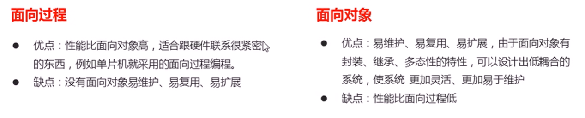

## 2、ES6中的类和对象

面向对象的思维特点：

1. 抽取（抽象）对象共用的属性和行为组织(封装)成一个类(模板)
2. 对类进行实例化, 获取类的对象

> 面向对象编程我们考虑的是有哪些对象，按照面向对象的思维特点，不断的创建对象，使用对象，指挥对象做事情

### 1、对象

在 JavaScript 中，对象是一组无序的相关属性和方法的集合，所有的事物都是对象，例如字符串、数值、数组、函数等。

对象是由属性和方法组成的

- 属性：事物的**特征，在对象中用属性**来表示
- 方法：事物的**行为，在对象中用方法**来表示

### 2、类

在 ES6 中新增加了类的概念，可以使用 class 关键字声明一个类，之后以这个类来实例化对象。

- 类抽象了对象的公共部分，它泛指某一大类（class）
- 对象特指某一个，通过类实例化一个具体的对象

#### 1、创建类

```
class name {
    // class body
}
```

实例

```
var XX = new name();
```

> 注意：类必须使用`new` 实例化对象

#### 2、构造函数

`constructor()` 方法是类的构造函数(默认方法)，**用于传递参数,返回实例对象**，通过 new 命令生成对象实例时，自动调用该方法。如果没有显示定义, 类内部会自动给我们创建一个`constructor()`

```html
<script>
    // 1. 创建类 class  创建一个 明星类
    class Star {
        // constructor 构造器或者构造函数
        constructor(uname, age) {
            this.uname = uname;
            this.age = age;
        }
    }

    // 2. 利用类创建对象 new
    var ldh = new Star('刘德华', 18);
    var zxy = new Star('张学友', 20);
    console.log(ldh);
    console.log(zxy);
</script>
```

- 通过 class 关键字创建类，类名我们还是习惯性**定义首字母大写**
- 类里面有个 `constructor`函数，可以接收传递过来的参数，同时返回实例对象
- `constructor`函数只要 new 生成实例时，就会自动调用这个函数，如果我们不写这个函数，类也会自动生成这个函数

- 最后注意语法规范
  - 创建类——类名后面不要加小括号
  - 生成实例——类名后面加小括号
  - 构造函数不需要加 function 关键字

#### 3、类添加方法

```js
class Person {
  constructor(name,age) {   
      // constructor 称为构造器或者构造函数
      this.name = name;
      this.age = age;
    }
   say() {
      console.log(this.name + '你好');
   }
}      
var ldh = new Person('刘德华', 18); 
ldh.say() 
```

**注意**： 方法之间不需要加逗号分隔，同时方法不需要添加 function 关键字。

```js
<script>
    // 1. 创建类 class  创建一个 明星类
    class Star {
        // 类的共有属性放到 constructor 里面
        constructor(uname, age) {
            this.uname = uname;
            this.age = age;
        }
        sing(song) {
            console.log(this.uname + song);
        }
    }

    // 2. 利用类创建对象 new
    var ldh = new Star('刘德华', 18);
    var zxy = new Star('张学友', 20);
    console.log(ldh);
    console.log(zxy);
    // (1) 我们类里面所有的函数不需要写function 
    // (2) 多个函数方法之间不需要添加逗号分隔
    ldh.sing('冰雨');
    zxy.sing('李香兰');
</script>
```

- 类的共有属性放到`constructor` 里面
- 类里面的函数都不需要写 `function` 关键字

### 3、继承

> 子类可以继承父类的一些属性和方法。

```js
// 父类
class Father {
    
}
// 子类继承父类
class Son extends Father {
    
}
```

实例

```html
<script>
    // 父类有加法方法
    class Father {
        constructor(x, y) {
            this.x = x;
            this.y = y;
        }
        sum() {
            console.log(this.x + this.y);
        }
    }
    // 子类继承父类加法方法 同时 扩展减法方法
    class Son extends Father {
        constructor(x, y) {
            // 利用super 调用父类的构造函数
            // super 必须在子类this之前调用
            super(x, y);
            this.x = x;
            this.y = y;
        }
        subtract() {
            console.log(this.x - this.y);
        }
    }
    var son = new Son(5, 3);
    son.subtract();
    son.sum();
</script>
```

### 4、super关键字

- `super` 关键字用于访问和调用对象父类上的函数，可以调用父类的构造函数，也可以调用父类的普通函数

#### 1、调用父类的构造函数

```js
// 父类
class Person {
    constructor(surname){
        this.surname = surname;
    }
}
// 子类继承父类
class Student entends Person {
    constructor(surname,firstname) {
        super(surname);					//调用父类的 constructor(surname)
        this.firstname = firstname;		//定义子类独有的属性
    }
}
```

注意：**子类在构造函数中使用super,必须放到this前面（必须先调用父类的构造方法，在使用子类构造方法）**

```js
// 父类
class Father {
    constructor(surname){
        this.surname = surname;
    }
    saySurname() {
        console.log('我的姓是' + this.surname);
    }
}
// 子类继承父类
class Son entends Father {
    constructor(surname,firstname) {
        super(surname);					//调用父类的 constructor(surname)
        this.firstname = firstname;		//定义子类独有的属性
    }
    sayFirstname() {
        console.log('我的名字是:' + this.firstname);
    }
}

var damao = new Son('刘','德华');
damao.saySurname();
damao.sayFirstname();
```

#### 2、调用父类的普通函数

```js
class Father {
    say() {
        return '我是爸爸';
    }
}
class Son extends Father {
    say(){
        // super.say() super调用父类的方法
        return super.say() + '的儿子';
    }
}

var damao = new Son();
console.log(damao.say());
```

- 多个方法之间不需要添加逗号分隔
- 继承中属性和方法的查找原则：就近原则，先看子类，再看父类

### 5、注意点

1. 在ES6中类没有变量提升，所以必须先定义类，才能通过类实例化对象

2. 类里面的共有属性和方法一定要加 `this`使用

3. 类里面的`this`指向：

   - `constructor` 里面的 `this`指向实例对象
   - 方法里面的`this`指向这个方法的调用者

   > 也就说，谁调用这个方法，this就指向谁

```html
<body>
    <button>点击</button>
    <script>
        var that;
        var _that;
        class Star {
            constructor(uname, age) {
                // constructor 里面的this 指向的是 创建的实例对象
                that = this;
                this.uname = uname;
                this.age = age;
                // this.sing();
                this.btn = document.querySelector('button');
                this.btn.onclick = this.sing;
            	//sing 不需要加括号，我们需要的是点击后才运行，如果变成 sing() 就会立即执行    
            }
            sing() {
            // 这个sing方法里面的this 指向的是 btn 这个按钮,因为这个按钮调用了这个函数
                console.log(that.uname); 
                // that里面存储的是constructor里面的this
            }
            dance() {
                // 这个dance里面的this 指向的是实例对象 ldh 因为ldh 调用了这个函数
                _that = this;
                console.log(this);
            }
        }
        var ldh = new Star('刘德华');
        console.log(that === ldh);
        ldh.dance();
        console.log(_that === ldh);

        // 1. 在 ES6 中类没有变量提升，所以必须先定义类，才能通过类实例化对象

        // 2. 类里面的共有的属性和方法一定要加this使用.
    </script>
</body>
```

## 3、构造函数和原型

### 1、概述

在典型的 OOP 的语言中（如 Java），都存在类的概念，类就是对象的模板，对象就是类的实例，但在 ES6之前， JS 中并没用引入类的概念。

> ES6， 全称 ECMAScript 6.0 ，2015.06 发版。但是目前浏览器的 JavaScript 是 ES5 版本，大多数高版本的浏览器也支持 ES6，不过只实现了 ES6 的部分特性和功能。

在 ES6之前 ，对象不是基于类创建的，而是用一种称为构建函数的特殊函数来定义对象和它们的特征。

- 创建对象有三种方式
  - **对象字面量**
  - **new Object()**
  - **自定义构造函数**

```js
// 1. 利用 new Object() 创建对象
var obj1 = new Object();

// 2. 利用对象字面量创建对象
var obj2 = {}；

// 3.利用构造函数创建对象
function Star(uname,age) {
    this.uname = uname;
    this.age = age;
    this.sing = function() {
        console.log('我会唱歌');
    }
}
var ldh = new Star('刘德华',18);
```

注意：

1. 构造函数用于创建某一类对象，其首字母要大写
2. 构造函数要和`new`一起使用才有意义

### 2、构造函数

- 构造函数是一种特殊的函数，主要用来初始化对象(为对象成员变量赋初始值)，它总与`new`一起使用
- 我们可以把对象中的一些公共的属性和方法抽取出来，然后封装到这个函数里面

new 在执行时会做四件事

1. 在内存中创建一个新的空对象。
2. 让 this 指向这个新的对象。
3. 执行构造函数里面的代码，给这个新对象添加属性和方法。
4. 返回这个新对象（所以构造函数里面不需要 return ）。

#### 1、静态成员和实例成员

JavaScript 的构造函数中可以添加一些成员，可以在构造函数本身上添加，也可以在构造函数内部的`this`上添加。通过这两种方式添加的成员，就分别称为**静态成员和实例成员**。

- 静态成员: 在构造函数本身上添加的成员为静态成员，只能由构造函数本身来访问
- 实例成员: 在构造函数内部创建的对象成员称为实例成员，只能由实例化的对象来访问

```js
// 构造函数中的属性和方法我们称为成员，成员可以添加
function Star(uname,age) {
    this.uname = uname;
    this.age = age;
    this.sing = function() {
        console.log('我会唱歌');
    }
}
var ldh = new Star('刘德华',18);

// 实例成员就是构造函数内部通过this添加的成员  uname age sing  就是实例成员
// 实例成员只能通过实例化的对象来访问
ldh.sing();
Star.uname; // undefined     不可以通过构造函数来访问实例成员

// 静态成员就是在构造函数本身上添加的成员 sex 就是静态成员
// 静态成员只能通过构造函数来访问
Star.sex = '男';
Star.sex;
ldh.sex; // undefined  不能通过对象来访问
```

#### 2、构造函数的问题

构造函数方法很好用，但是存在浪费内存的问题。


- **我们希望所有的对象使用同一个函数，这样就比较节省内存**

### 3、构造函数原型 prototype

- 构造函数通过原型分配的函数是所有对象所**共享**的,这样就解决了内存浪费问题
- JavaScript 规定，每一个构造函数都有一个`prototype`属性，指向另一个对象，注意这个`prototype`就是一个**对象**，**这个对象的所有属性和方法，都会被构造函数所拥有**

- 我们可以把那些**不变的方法**，直接定义在`prototype` 对象上，这样所有对象的实例就可以共享这些方法

```html
<body>
    <script>
        // 1. 构造函数的问题. 
        function Star(uname, age) {
    		//公共属性定义到构造函数里面
            this.uname = uname;
            this.age = age;
            // this.sing = function() {
            //     console.log('我会唱歌');
            // }
        }
		//公共的方法我们放到原型对象身上
        Star.prototype.sing = function() {
            console.log('我会唱歌');
        }
        var ldh = new Star('刘德华', 18);
        var zxy = new Star('张学友', 19);
        console.log(ldh.sing === zxy.sing);
        ldh.sing();
        zxy.sing();
        // 2. 一般情况下,我们的公共属性定义到构造函数里面, 公共的方法我们放到原型对象身上
    </script>
</body>
```

- 一般情况下,我们的公共属性定义到构造函数里面, 公共的方法我们放到原型对象身上

> 原型是什么？

- 一个对象，我们也称为 `prototype` 为原型对象

> 原型的作用是什么？

- 共享方法

### 4、对象原型 __ proto __

- 对象都会有一个属性 `_proto_` 指向构造函数的`prototype`原型对象，之所以我们对象可以使用构造函数`prototype` 原型对象的属性和方法，就是因为对象有`_proto_`原型的存在。
- `_proto_`对象原型和原型对象 `prototype` 是**等价**的

- `_proto_`对象原型的意义就在于**为对象的查找机制提供一个方向，或者说一条路线**，但是它是一个非标准属性，因此实际开发中，不可以使用这个属性，它只是**内部指向原型对象** `prototype`


- `Star.prototype 和 ldh._proto_` 指向相同

```html
<body>
    <script>
        function Star(uname, age) {
            this.uname = uname;
            this.age = age;
        }
        Star.prototype.sing = function() {
            console.log('我会唱歌');
        }
        var ldh = new Star('刘德华', 18);
        var zxy = new Star('张学友', 19);
        ldh.sing();
        console.log(ldh); 
		// 对象身上系统自己添加一个 __proto__ 指向我们构造函数的原型对象 prototype
        console.log(ldh.__proto__ === Star.prototype);
        // 方法的查找规则: 首先先看ldh 对象身上是否有 sing 方法,如果有就执行这个对象上的sing
        // 如果没有sing 这个方法,因为有 __proto__ 的存在,就去构造函数原型对象prototype身上去查找sing这个方法
    </script>
</body>
```

### 5、constructor 构造函数

- 对象原型(__ proto __) 和构造函数(prototype)原型对象 里面都有一个属性 constructor 属性， constructor 我们称为构造函数，因为它指回构造函数本身。

- `constructor`主要用于记录该对象引用于哪个构造函数，它可以让原型对象重新指向原来的构造函数
- **一般情况下，对象的方法都在构造函数(prototype)的原型对象中设置**

- 如果有多个对象的方法，我们可以给原型对象`prototype`采取对象形式赋值，但是这样会覆盖构造函数原型对象原来的内容，这样修改后的原型对象`constructor`就不再指向当前构造函数了。此时，我们可以在修改后的原型对象中，添加一个`constructor`指向原来的构造函数

```html
<body>
    <script>
        function Star(uname, age) {
            this.uname = uname;
            this.age = age;
        }
        // 很多情况下,我们需要手动的利用constructor 这个属性指回 原来的构造函数
        // Star.prototype.sing = function() {
        //     console.log('我会唱歌');
        // };
        // Star.prototype.movie = function() {
        //     console.log('我会演电影');
        // }
        Star.prototype = {
            // 如果我们修改了原来的原型对象,给原型对象赋值的是一个对象,则必须手动的利用constructor指回原来的构造函数
            constructor: Star,
            sing: function() {
                console.log('我会唱歌');
            },
            movie: function() {
                console.log('我会演电影');
            }
        }
        var ldh = new Star('刘德华', 18);
        var zxy = new Star('张学友', 19);
    </script>
</body>
```

### 6、三者关系

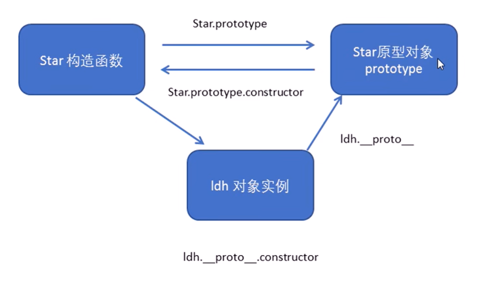

### 7、原型链查找规则

1. 当访问一个对象的属性(包括方法)时，首先查找这个对象自身有没有该属性
2. 如果没有就查找它的原型(也就是`_proto_`指向的`prototype原型对象`)
3. 如果还没有就查找原型对象的原型(Object的原型对象)
4. 依次类推一直找到Object为止(null)
5. __ proto __对象原型的意义就在于为对象成员查找机制提供一个方向，或者说一条路线。


```html
<body>
    <script>
        function Star(uname, age) {
            this.uname = uname;
            this.age = age;
        }
        Star.prototype.sing = function() {
            console.log('我会唱歌');
        }
        var ldh = new Star('刘德华', 18);
        // 1. 只要是对象就有__proto__ 原型, 指向原型对象
        console.log(Star.prototype);
        console.log(Star.prototype.__proto__ === Object.prototype);
        // 2.我们Star原型对象里面的__proto__原型指向的是 Object.prototype
        console.log(Object.prototype.__proto__);
        // 3. 我们Object.prototype原型对象里面的__proto__原型  指向为 null
    </script>
</body>
```

### 8、原型对象this指向

- 构造函数中的 `this`指向我们的实例对象
- 原型对象里面放的是方法，这个方法里面的`this`指向的是这个方法的调用者，也就是这个实例对象

```html
<body>
    <script>
        function Star(uname, age) {
            this.uname = uname;
            this.age = age;
        }
        var that;
        Star.prototype.sing = function() {
            console.log('我会唱歌');
            that = this;
        }
        var ldh = new Star('刘德华', 18);
        // 1. 在构造函数中,里面this指向的是对象实例 ldh
        ldh.sing();
        console.log(that === ldh);

        // 2.原型对象函数里面的this 指向的是 实例对象 ldh
    </script>
</body>
```

### 9、扩展内置对象

- 可以通过原型对象，对原来的内置对象进行扩展自定义的方法
- 比如给数组增加自定义求偶数和的功能

```html
<body>
    <script>
        // 原型对象的应用 扩展内置对象方法

        Array.prototype.sum = function() {
            var sum = 0;
            for (var i = 0; i < this.length; i++) {
                sum += this[i];
            }
            return sum;
        };
        //	这个会覆盖原先的prototype
        // Array.prototype = {
        //     sum: function() {
        //         var sum = 0;
        //         for (var i = 0; i < this.length; i++) {
        //             sum += this[i];
        //         }
        //         return sum;
        //     }

        // }
        var arr = [1, 2, 3];
        console.log(arr.sum());
        console.log(Array.prototype);
        var arr1 = new Array(11, 22, 33);
        console.log(arr1.sum());
    </script>
</body>
```

注意：

- 数组和字符串内置对象不能给原型对象覆盖操作`Array.prototype = {}`，只能是`Array.prototype.xxx = function(){}`的方式

## 4、继承

ES6 之前并没有给我们提供`extends`继承

- 我们可以通过构造函数+原型对象模拟实现继承，被称为组合继承

### 1、call()

> 调用这个函数，并且修改函数运行时的 this 指向

```
fun.call(thisArg,arg1,arg2,......)
```

- `thisArg`：当前调用函数 this 的指向对象
- `arg1,arg2`： 传递的其他参数

```html
<body>
    <script>
        // call 方法
        function fn(x, y) {
            console.log('我希望我的希望有希望');
            console.log(this);		// Object{...}
            console.log(x + y);		// 3
        }

        var o = {
            name: 'andy'
        };
        // fn();
        // 1. call() 可以调用函数
        // fn.call();
        // 2. call() 可以改变这个函数的this指向 此时这个函数的this 就指向了o这个对象
        fn.call(o, 1, 2);
    </script>
</body>
```

### 2、借用构造函数继承父类型属性

- 核心原理: 通过 `call()` 把父类型的 this 指向子类型的 this，这样就可以实现子类型继承父类型的属性

```html
<body>
    <script>
        // 借用父构造函数继承属性
        // 1. 父构造函数
        function Father(uname, age) {
            // this 指向父构造函数的对象实例
            this.uname = uname;
            this.age = age;
        }
        // 2 .子构造函数 
        function Son(uname, age, score) {
            // this 指向子构造函数的对象实例
            Father.call(this, uname, age);
            //	使用father的构造函数，再把father的构造函数中的this修改成指向子构造函数对象的this
            this.score = score;
        }
        var son = new Son('刘德华', 18, 100);
        console.log(son);
    </script>
</body>
```

### 3、借用原型对象继承父类型方法

- 一般情况下，对象的方法都在构造函数的原型对象中设置，通过构造函数无法继承父类方法

核心原理：

1. 将子类所共享的方法提取出来，让子类的 `prototype 原型对象 = new 父类()`
2. 本质： 子类原型对象等于是实例化父类，因为父类实例化之后另外开辟空间，就不会影响原来父类原型对象
3. 将子类的`constructor`重新指向子类的构造函数

```html
<body>
    <script>
        // 借用父构造函数继承属性
        // 1. 父构造函数
        function Father(uname, age) {
            // this 指向父构造函数的对象实例
            this.uname = uname;
            this.age = age;
        }
        Father.prototype.money = function() {
            console.log(100000);
        };
        // 2 .子构造函数 
        function Son(uname, age, score) {
            // this 指向子构造函数的对象实例
            Father.call(this, uname, age);
            this.score = score;
        }
        // Son.prototype = Father.prototype;  这样直接赋值会有问题,如果修改了子原型对象,父原型对象也会跟着一起变化
        Son.prototype = new Father();
        // 如果利用对象的形式修改了原型对象,别忘了利用constructor 指回原来的构造函数
        Son.prototype.constructor = Son;
        // 这个是子构造函数专门的方法
        Son.prototype.exam = function() {
            console.log('孩子要考试');

        }
        var son = new Son('刘德华', 18, 100);
        console.log(son);
        console.log(Father.prototype);
        console.log(Son.prototype.constructor);//	这个会指向father，需要利用constructor 指回原来的构造函数
    </script>
</body>
```

### 4、类的本质

1. class 本质还是 **function**
2. 类的所有方法都定义在类的 `prototype`属性上
3. 类创建的实例，里面也有`_proto_`指向类的`prototype`原型对象
4. 所以 ES6 的类它的绝大部分功能，ES5都可以做到，新的class写法只是让对象原型的写法更加清晰、更像面向对象编程的语法而已。
5. 所以 ES6 的类其实就是**语法糖**
6. 语法糖：语法糖就是一种便捷写法，简单理解。有两种方法可以实现同样的功能，但是一种写法更加清晰、方便，那么这个方法就是语法糖

## 5、ES5新增方法

ES5 给我们新增了一些方法，可以很方便的操作数组或者字符串

- 数组方法
- 字符串方法
- 对象方法

### 1、数组方法

- 迭代(遍历)方法：foreach() ，map()，filter()，some() ，every() ;

#### 1、forEach()

```
array.forEach(function(currentValue,index,arr))
```

- currentValue : 数组当前项的值
- index: 数组当前项的索引
- arr: 数组对象本身

```html
<body>
    <script>
        // forEach 迭代(遍历) 数组
        var arr = [1, 2, 3];
        var sum = 0;
        arr.forEach(function(value, index, array) {
            console.log('每个数组元素' + value);
            console.log('每个数组元素的索引号' + index);
            console.log('数组本身' + array);
            sum += value;
        })
        console.log(sum);
    </script>
</body>
```

#### 2、filter()筛选数组

```
array.filter(function(currentValue,index,arr))
```

- `filter()`方法创建一个新的数组，新数组中的元素是通过检查指定数组中符合条件的所有元素，主要用于筛选数组
- **注意它直接返回一个新数组**

```html
<body>
    <script>
        // filter 筛选数组
        var arr = [12, 66, 4, 88, 3, 7];
        var newArr = arr.filter(function(value, index) {
            // return value >= 20;
            return value % 2 === 0;
        });
        console.log(newArr);
    </script>
</body>
```

#### 3、some()

- `some()`方法用于检测数组中的元素是否满足指定条件（查找数组中是否有满足条件的元素）
- 注意它返回的是**布尔值**，如果查找到这个元素，就返回true，如果查找不到就返回false
- 如果找到第一个满足条件的元素，则终止循环，不再继续查找

```html
<body>
    <script>
        // some 查找数组中是否有满足条件的元素 
        var arr1 = ['red', 'pink', 'blue'];
        var flag1 = arr1.some(function(value) {
            return value == 'pink';
        });
        console.log(flag1);
        // 1. filter 也是查找满足条件的元素 返回的是一个数组 而且是把所有满足条件的元素返回回来
        // 2. some 也是查找满足条件的元素是否存在  返回的是一个布尔值 如果查找到第一个满足条件的元素就终止循环
    </script>
</body>
```

### 2、字符串方法

- `trim()`方法会从一个字符串的两端删除空白字符，但中间的空格不会去掉
- `trim()`方法并不影响原字符串本身，它返回的是一个新的字符串

```html
<body>
    <input type="text"> <button>点击</button>
    <div></div>
    <script>
        // trim 方法去除字符串两侧空格，但中间的空格不会去掉
        var str = '   an  dy   ';
        console.log(str);
        var str1 = str.trim();
        console.log(str1);
        var input = document.querySelector('input');
        var btn = document.querySelector('button');
        var div = document.querySelector('div');
        btn.onclick = function() {
            var str = input.value.trim();
            if (str === '') {
                alert('请输入内容');
            } else {
                console.log(str);
                console.log(str.length);
                div.innerHTML = str;
            }
        }
    </script>
</body>
```

### 3、对象方法

#### 1、Object.keys()

1. `Object.keys()`用于获取对象自身所有的属性
2. 效果类似`for...in`
3. 返回一个由属性名组成的**数组**

```html
<body>
    <script>
        // 用于获取对象自身所有的属性
        var obj = {
            id: 1,
            pname: '小米',
            price: 1999,
            num: 2000
        };
        var arr = Object.keys(obj);
        console.log(arr);
        arr.forEach(function(value) {
            console.log(value);
            // id
            // pname
            // price
            // num
        })
    </script>
</body>
```

#### 2、Object.defineProperty()

- `Object.defineProperty()`定义对象中新属性或修改原有的属性(了解)

```
Object.defineProperty(obj,prop,descriptor)
```

- obj : 目标对象
- prop : 需定义或修改的属性的名字
- descriptor : 目标属性所拥有的特性

```html
<body>
    <script>
        // Object.defineProperty() 定义新属性或修改原有的属性
        var obj = {
            id: 1,
            pname: '小米',
            price: 1999
        };
        // 1. 以前的对象添加和修改属性的方式
        // obj.num = 1000;
        // obj.price = 99;
        // console.log(obj);
        // 2. Object.defineProperty() 定义新属性或修改原有的属性
        Object.defineProperty(obj, 'num', {
            value: 1000,
            enumerable: true
        });
        console.log(obj);
        Object.defineProperty(obj, 'price', {
            value: 9.9
        });
        console.log(obj);
        Object.defineProperty(obj, 'id', {
            // 如果值为false 不允许修改这个属性值 默认值也是false
            writable: false,
        });
        obj.id = 2;
        console.log(obj);
        Object.defineProperty(obj, 'address', {
            value: '中国山东蓝翔技校xx单元',
            // 如果只为false 不允许修改这个属性值 默认值也是false
            writable: false,
            // enumerable 如果值为false 则不允许遍历, 默认的值是 false
            enumerable: false,
            // configurable 如果为false 则不允许删除这个属性 不允许在修改第三个参数里面的特性 默认为false
            configurable: false
        });
        console.log(obj);
        console.log(Object.keys(obj));
        delete obj.address;
        console.log(obj);
        delete obj.pname;
        console.log(obj);
        Object.defineProperty(obj, 'address', {
            value: '中国山东蓝翔技校xx单元',
            // 如果值为false 不允许修改这个属性值 默认值也是false
            writable: true,
            // enumerable 如果值为false 则不允许遍历, 默认的值是 false
            enumerable: true,
            // configurable 如果为false 则不允许删除这个属性 默认为false
            configurable: true
        });
        console.log(obj.address);
    </script>
</body>
```

- 第三个参数 descriptor 说明：以对象形式{ }书写
- value：设置属性的值，默认为undefined

- writeable: 值是否可以重写 true | false 默认为false
- enumerable: 目标属性是否可以被枚举 true | false 默认为false

- configurable: 目标属性是否可以被删除或是否可以再次修改特性 true | false 默认为false

## 6、函数进阶

### 1、函数的定义方式

1. 函数声明方式 function 关键字(命名函数)
2. 函数表达式(匿名函数)
3. new Function()

```
var fn = new Function('参数1','参数2',.....,'函数体');
```

- Function 里面参数都必须是字符串格式
- 第三种方式执行效率低，也不方便书写，因此较少使用
- 所有函数都是 Function 的实例(对象)
- 函数也属于对象

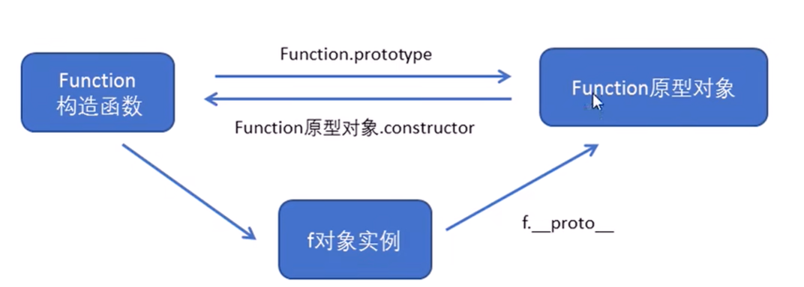

```html
<body>
    <script>
        //  函数的定义方式

        // 1. 自定义函数(命名函数) 

        function fn() {};

        // 2. 函数表达式 (匿名函数)

        var fun = function() {};


        // 3. 利用 new Function('参数1','参数2', '函数体');
		//             Function 里面参数都必须是字符串格式，执行效率低，较少写

        var f = new Function('a', 'b', 'console.log(a + b)');
        f(1, 2);
        // 4. 所有函数都是 Function 的实例(对象)
        console.dir(f);
        // 5. 函数也属于对象
        console.log(f instanceof Object);
    </script>
</body>
```

### 2、函数的调用方式

1. 普通函数
2. 对象的方法
3. 构造函数
4. 绑定事件函数
5. 定时器函数
6. 立即执行函数

```html
<body>
    <script>
        // 函数的调用方式

        // 1. 普通函数
        function fn() {
            console.log('人生的巅峰');
 
        }
        // fn();   fn.call()
        // 2. 对象的方法
        var o = {
            sayHi: function() {
                console.log('人生的巅峰');

            }
        }
        o.sayHi();
        // 3. 构造函数
        function Star() {};
        new Star();
        // 4. 绑定事件函数
        // btn.onclick = function() {};   // 点击了按钮就可以调用这个函数
        // 5. 定时器函数
        // setInterval(function() {}, 1000);  这个函数是定时器自动1秒钟调用一次
        // 6. 立即执行函数
        (function() {
            console.log('人生的巅峰');
        })();
        // 立即执行函数是自动调用
    </script>
</body>
```

### 3、函数内this的指向

- `this`指向，是当我们调用函数的时候确定的，调用方式的不同决定了`this`的指向不同，一般我们指向我们的调用者

| 调用方式     | this指向                                   |
| ------------ | ------------------------------------------ |
| 普通函数调用 | window                                     |
| 构造函数调用 | 实例对象，原型对象里面的方法也指向实例对象 |
| 对象方法调用 | 该方法所属对象                             |
| 事件绑定方法 | 绑定事件对象                               |
| 定时器函数   | window                                     |
| 立即执行函数 | window                                     |

```html
<body>
    <button>点击</button>
    <script>
        // 函数的不同调用方式决定了this 的指向不同
        // 1. 普通函数 this 指向window
        function fn() {
            console.log('普通函数的this' + this);
        }
        window.fn();
        // 2. 对象的方法 this指向的是对象 o
        var o = {
            sayHi: function() {
                console.log('对象方法的this:' + this);
            }
        }
        o.sayHi();
        // 3. 构造函数 this 指向 ldh 这个实例对象 原型对象里面的this 指向的也是 ldh这个实例对象
        function Star() {};
        Star.prototype.sing = function() {

        }
        var ldh = new Star();
        // 4. 绑定事件函数 this 指向的是函数的调用者 btn这个按钮对象
        var btn = document.querySelector('button');
        btn.onclick = function() {
            console.log('绑定时间函数的this:' + this);
        };
        // 5. 定时器函数 this 指向的也是window
        window.setTimeout(function() {
            console.log('定时器的this:' + this);

        }, 1000);
        // 6. 立即执行函数 this还是指向window
        (function() {
            console.log('立即执行函数的this' + this);
        })();
    </script>
</body>
```

### 4、改变函数内部this指向

- JavaScript 为我们专门提供了一些函数方法来帮我们处理函数内部 this 的指向问题，常用的有 `bind(),call(),apply()`三种方法

#### 1、call() 方法

- `call()`方法调用一个对象，简单理解为调用函数的方式，但是它可以改变函数的`this`指向
- `fun.call(thisArg,arg1,arg2,.....)`
- `thisArg`: 在 fun 函数运行时指定的 this 值

- `arg1,arg2`: 传递的其他参数
- 返回值就是函数的返回值，因为它就是调用函数
- 因此当我们想改变 this 指向，同时想调用这个函数的时候，可以使用 call，比如继承

```html
<body>
    <script>
        // 改变函数内this指向  js提供了三种方法  call()  apply()  bind()

        // 1. call()
        var o = {
            name: 'andy'
        }

        function fn(a, b) {
            console.log(this);
            console.log(a + b);

        };
        fn.call(o, 1, 2);
        // call 第一个可以调用函数 第二个可以改变函数内的this 指向
        // call 的主要作用可以实现继承
        function Father(uname, age, sex) {
            this.uname = uname;
            this.age = age;
            this.sex = sex;
        }

        function Son(uname, age, sex) {
            Father.call(this, uname, age, sex);
        }
        var son = new Son('刘德华', 18, '男');
        console.log(son);
    </script>
</body>
```

#### 2、apply()方法

- `apply()`方法调用一个函数，简单理解为调用函数的方式，但是它可以改变函数的 `this`指向

```
fun.apply(thisArg,[argsArray])
```

- thisArg: 在 fun 函数运行时指定的 this 值
- argsArray : 传递的值，必须包含在数组里面

- 返回值就是函数的返回值，因为它就是调用函数
- 因此 apply 主要跟数组有关系，比如使用 Math.max() 求数组的最大值

```html
<body>
    <script>
        // 改变函数内this指向  js提供了三种方法  call()  apply()  bind()

        // 2. apply()  应用 运用的意思
        var o = {
            name: 'andy'
        };

        function fn(arr) {
            console.log(this);
            console.log(arr); // 'pink'

        };
        fn.apply(o, ['pink']);
        // 1. 也是调用函数 第二个可以改变函数内部的this指向
        // 2. 但是他的参数必须是数组(伪数组)
        // 3. apply 的主要应用 比如说我们可以利用 apply 借助于数学内置对象求数组最大值 
        // Math.max();
        var arr = [1, 66, 3, 99, 4];
        var arr1 = ['red', 'pink'];
        // var max = Math.max.apply(null, arr);
        var max = Math.max.apply(Math, arr);
        var min = Math.min.apply(Math, arr);
        console.log(max, min);
    </script>
</body>
```

#### 3、bind()方法

- `bind()`方法不会调用函数。但是能改变函数内部 `this`指向

```
fun.bind(thisArg,arg1,arg2,....)
```

- 返回由指定的 `this`值和初始化参数改造的 **原函数拷贝**
- 因此当我们**只是想改变 this 指向**，并且不想调用这个函数的时候，可以使用bind

```html
<body>
    <button>点击</button>
    <button>点击</button>
    <button>点击</button>
    <script>
        // 改变函数内this指向  js提供了三种方法  call()  apply()  bind()

        // 3. bind()  绑定 捆绑的意思
        var o = {
            name: 'andy'
        };

        function fn(a, b) {
            console.log(this);
            console.log(a + b);


        };
        var f = fn.bind(o, 1, 2);
        f();
        // 1. 不会调用原来的函数   可以改变原来函数内部的this 指向
        // 2. 返回的是原函数改变this之后产生的新函数
        // 3. 如果有的函数我们不需要立即调用,但是又想改变这个函数内部的this指向此时用bind 
        // 4. 我们有一个按钮,当我们点击了之后,就禁用这个按钮,3秒钟之后开启这个按钮
        // var btn1 = document.querySelector('button');
        // btn1.onclick = function() {
        //     this.disabled = true; // 这个this 指向的是 btn 这个按钮
        //     // var that = this;
        //     setTimeout(function() {
        //         // that.disabled = false; // 定时器函数里面的this 指向的是window
        //         this.disabled = false; // 此时定时器函数里面的this 指向的是btn
        //     }.bind(this), 3000); // 这个this 指向的是btn 这个对象
        // }
        var btns = document.querySelectorAll('button');
        for (var i = 0; i < btns.length; i++) {
            btns[i].onclick = function() {
                this.disabled = true;
                setTimeout(function() {
                    this.disabled = false;
                }.bind(this), 2000);
            }
        }
    </script>
</body>
```

#### 4、总结

call apply bind 总结：

相同点：

- 都可以改变函数内部的 `this`指向

区别点：

- `call`和`apply`会调用函数，并且改变函数内部的`this`指向
- `call`和`apply`传递的参数不一样，call 传递参数，apply 必须数组形式
- `bind`不会调用函数，可以改变函数内部`this`指向

主要应用场景

1. `call`经常做继承
2. `apply`经常跟数组有关系，比如借助于数学对线实现数组最大值与最小值
3. `bind`不调用函数，但是还想改变this指向，比如改变定时器内部的this指向

## 7、严格模式

- JavaScript 除了提供正常模式外，还提供了严格模式
- ES5 的严格模式是采用具有限制性 JavaScript 变体的一种方式，即在严格的条件下运行 JS 代码

- 严格模式在IE10 以上版本的浏览器才会被支持，旧版本浏览器会被忽略

- 严格模式对正常的JavaScript语义做了一些更改：

  - 消除了Javascript 语法的一些不合理、不严谨之处，减少了一些怪异行为

  - 消除代码运行的一些不安全之处，保证代码运行的安全

  - 提高编译器效率，增加运行速度

  - 禁用了在 ECMAScript 的未来版本中可能会定义的一些语法，为未来新版本的 Javascript 做好铺垫。比如一些保留字如：class, enum, export, extends, import, super 不能做变量名

### 1、开启严格模式

#### 1、为脚本开启严格模式

- 为整个脚本文件开启严格模式，需要在所有语句之前放一个特定语句
- `"use strict"` 或`'use strict'`

```html
<script>
    'user strict';
	console.log("这是严格模式。");
</script>
```

因为`"use strict"`加了引号，所以老版本的浏览器会把它当作一行普通字符串而忽略。

有的 script 基本是严格模式，有的 script 脚本是正常模式，这样不利于文件合并，所以可以将整个脚本文件放在一个立即执行的匿名函数之中。这样独立创建一个作用域而不影响其他 script 脚本文件。

```html
<script>
	(function (){
    	'use strict';
    	 var num = 10;
    	 function fn() {}
	})();   
</script>
```

#### 2、为函数开启严格模式

- 若要给某个函数开启严格模式，需要把`"use strict"`或`'use strict'`声明放在函数体所有语句之前

```html
<body>
    <!-- 为整个脚本(script标签)开启严格模式 -->
    <script>
        'use strict';
        //   下面的js 代码就会按照严格模式执行代码
    </script>
    <script>
        (function() {
            'use strict';
        })();
    </script>
    <!-- 为某个函数开启严格模式 -->
    <script>
        // 此时只是给fn函数开启严格模式
        function fn() {
            'use strict';
            // 下面的代码按照严格模式执行
        }

        function fun() {
            // 里面的还是按照普通模式执行
        }
    </script>
</body>
```

- 将`"use strict"` 放在函数体的第一行，则整个函数以 "严格模式"运行。

### 2、严格模式中的变化

- 严格模式对JavaScript的语法和行为，都做了一些改变

#### 1、变量规定

- 在正常模式中，如果一个变量没有声明就赋值，默认是全局变量
- 严格模式禁止这种用法，变量都必须先用var 命令声明，然后再使用
- 严禁删除已经声明变量，例如，``delete x` 语法是错误的

```html
<body>
    <script>
        'use strict';
        // 1. 我们的变量名必须先声明再使用
        // num = 10;
        // console.log(num);
        var num = 10;
        console.log(num);
        // 2.我们不能随意删除已经声明好的变量
        // delete num;
    </script>
</body>
```

#### 2、严格模式下this指向问题

1. 以前在全局作用域函数中的`this`指向`window`对象
2. 严格模式下全局作用域中函数中的`this` 是 undefined
3. 以前构造函数时不加 `new` 也可以调用，当普通函数，`this`指向全局对象
4. 严格模式下，如果构造函数不加 `new` 调用，`this`指向的是 `undefined` ，如果给它赋值，会报错
5. `new` 实例化的构造函数指向创建的对象实例
6. 定时器`this` 还是指向`window`
7. 事件、对象还是指向调用者

```html
<body>
    <script>
        'use strict';
		//3. 严格模式下全局作用域中函数中的 this 是 undefined。
        function fn() {
            console.log(this); // undefined。

        }
        fn();
        //4. 严格模式下,如果 构造函数不加new调用, this 指向的是undefined 如果给他赋值则 会报错.
        function Star() {
            this.sex = '男';
        }
        // Star();
        var ldh = new Star();
        console.log(ldh.sex);
        //5. 定时器 this 还是指向 window 
        setTimeout(function() {
            console.log(this);

        }, 2000);
        
    </script>
</body>
```

### 3、函数变化

1. 函数不能有重名的**参数**
2. 函数必须声明在顶层，新版本的JavaScript会引入“块级作用域”（ES6中已引入）。为了与新版本接轨，**不允许在非函数的代码块内声明函数**

```html
<body>
    <script>
        'use strict';
        // 6. 严格模式下函数里面的参数不允许有重名
        function fn(a, a) {
           console.log(a + a);

        };
        // fn(1, 2);
        function fn() {}
        
        // 不允许在非函数的代码块内声明函数
        if() {
            function fn() {}	//	这样不允许
        }
    </script>
</body>
```

## 8、高阶函数

- 高阶函数是对其他函数进行操作的函数，它接收函数作为参数或将函数作为返回值输出

接收函数作为参数

```html
<body>
    <div></div>
    <script>
        // 高阶函数- 函数可以作为参数传递
        function fn(a, b, callback) {
            console.log(a + b);
            callback && callback();	//	callback 若存在，则调用，不存在，不调用	&&是且的意思，把必须都为真才能执行
        }
        fn(1, 2, function() {
            console.log('我是最后调用的');

        });

    </script>
</body>
```

将函数作为返回值

```html
<script>
    function fn(){
        return function() {}
    }
</script>
```

- 此时 fn 就是一个高阶函数
- 函数也是一种数据类型，同样可以作为参数，传递给另外一个参数使用。最典型的就是作为回调函数
- 同理函数也可以作为返回值传递回来

## 9、闭包

### 1、变量作用域

变量根据作用域的不同分为两种：全局变量和局部变量

1. 函数内部可以使用全局变量
2. 函数外部不可以使用局部变量
3. 当函数执行完毕，本作用域内的局部变量会销毁。

### 2、什么是闭包

闭包指有权访问另一个函数作用域中的变量的**函数**

> 简单理解：一个作用域可以访问另外一个函数内部的局部变量

```html
<body>
    <script>
        // 闭包（closure）指有权访问另一个函数作用域中变量的函数。
        // 闭包: 我们fn2 这个函数作用域 访问了另外一个函数 fn1 里面的局部变量 num
        function fn1() {		// fn1就是闭包函数
            var num = 10;
            function fn2() {
                console.log(num); 	//10
            }
            fn2();
        }
        fn1();
    </script>
</body>
```

### 3、在chrome中调试闭包

1. 打开浏览器，按 F12 键启动 chrome 调试工具。
2. 设置断点。
3. 找到 Scope 选项（Scope 作用域的意思）。
4. 当我们重新刷新页面，会进入断点调试，Scope 里面会有两个参数（global 全局作用域、local 局部作用域）。
5. 当执行到 fn2() 时，Scope 里面会多一个 Closure 参数 ，这就表明产生了闭包。

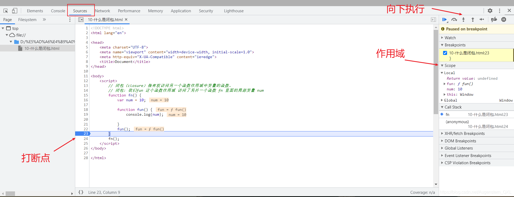

### 4、闭包的作用

- 延伸变量的作用范围

```html
<body>
    <script>
        // 闭包（closure）指有权访问另一个函数作用域中变量的函数。
        // 一个作用域可以访问另外一个函数的局部变量 
        // 我们fn 外面的作用域可以访问fn 内部的局部变量
        // 闭包的主要作用: 延伸了变量的作用范围
        function fn() {
            var num = 10;
            return function() {
                console.log(num);
            }
        }
        var f = fn();
        f();
    </script>
</body>
```

练习：

点击li输出索引号：

```html
<body>
    <ul class="nav">
        <li>榴莲</li>
        <li>臭豆腐</li>
        <li>鲱鱼罐头</li>
        <li>大猪蹄子</li>
    </ul>
    <script>
        // 闭包应用-点击li输出当前li的索引号
        // 1. 我们可以利用动态添加属性的方式
        var lis = document.querySelector('.nav').querySelectorAll('li');
        for (var i = 0; i < lis.length; i++) {
            lis[i].index = i;
            lis[i].onclick = function() {
                // console.log(i);
                console.log(this.index);

            }
        }
        // 2. 利用闭包的方式得到当前小li 的索引号
        for (var i = 0; i < lis.length; i++) {
            // 利用for循环创建了4个立即执行函数
            // 立即执行函数也成为小闭包因为立即执行函数里面的任何一个函数都可以使用它的i这变量
            (function(i) {
                // console.log(i);
                lis[i].onclick = function() {
                    console.log(i);

                }
            })(i);
        }
    </script>
</body>
```


定时器中的闭包：

```html
<body>
    <ul class="nav">
        <li>榴莲</li>
        <li>臭豆腐</li>
        <li>鲱鱼罐头</li>
        <li>大猪蹄子</li>
    </ul>
    <script>
        // 闭包应用-3秒钟之后,打印所有li元素的内容
        var lis = document.querySelector('.nav').querySelectorAll('li');
        for (var i = 0; i < lis.length; i++) {
            (function(i) {
                setTimeout(function() {
                    console.log(lis[i].innerHTML);
                }, 3000)
            })(i);
        }
    </script>
</body>
```


## 10、递归

**如果一个函数在内部可以调用其本身，那么这个函数就是递归函数**

简单理解： 函数内部自己调用自己，这个函数就是递归函数

由于递归很容易发生"栈溢出"错误，所以必须要加**退出条件 return**

```html

<body>
    <script>
        // 递归函数 : 函数内部自己调用自己, 这个函数就是递归函数
        var num = 1;

        function fn() {
            console.log('我要打印6句话');

            if (num == 6) {
                return; // 递归里面必须加退出条件
            }
            num++;
            fn();
        }
        fn();
    </script>
</body>
```

## 11、浅拷贝和深拷贝

1. 浅拷贝只是拷贝一层，更深层次对象级别的只拷贝引用
2. 深拷贝拷贝多层，每一级别的数据都会拷贝
3. `Object.assign(target,....sources)` ES6新增方法可以浅拷贝

### 1、浅拷贝

```js
// 浅拷贝只是拷贝一层，更深层次对象级别的只拷贝引用
var obj = {
    id: 1,
    name: 'andy',
    msg: {
        age: 18
    }
};
var o = {}
for(var k in obj){
    // k是属性名，obj[k]是属性值
    o[k] = obj.[k];
}
console.log(o);
// 浅拷贝语法糖
Object.assign(o,obj);
```

### 2、深拷贝

```js
// 深拷贝拷贝多层，每一级别的数据都会拷贝
var obj = {
    id: 1,
    name: 'andy',
    msg: {
        age: 18
    }
    color: ['pink','red']
};
var o = {};
// 封装函数
function deepCopy(newobj,oldobj){
    for(var k in oldobj){
        // 判断属性值属于简单数据类型还是复杂数据类型
        // 1.获取属性值   oldobj[k]
        var item = obldobj[k];
        // 2.判断这个值是否是数组
        if(item instanceof Array){
            newobj[k] = [];
            deepCopy(newobj[k],item)
        }else if (item instanceof Object){
              // 3.判断这个值是否是对象
            newobj[k] = {};
            deepCopy(newobj[k],item)
        }else {
            // 4.属于简单数据类型
            newobj[k] = item;
            
        } 
    }
}
deepCopy(o,obj);
```

## 12、正则表达式

正则表达式是用于匹配字符串中字符组合的模式。在JavaScript中，正则表达式也是对象。

正则表通常被用来检索、替换那些符合某个模式（规则）的文本，例如验证表单：用户名表单只能输入英文字母、数字或者下划线， 昵称输入框中可以输入中文(匹配)。此外，正则表达式还常用于过滤掉页面内容中的一些敏感词(替换)，或从字符串中获取我们想要的特定部分(提取)等 。

### 1、特点

- 实际开发，一般都是直接复制写好的正则表达式
- 但是要求会使用正则表达式并且根据自身实际情况修改正则表达式

### 2、创建正则表达式

在JavaScript中，可以通过两种方式创建正则表达式

1. 通过调用 RegExp 对象的构造函数创建
2. 通过字面量创建

#### 1、通过调用 RegExp 对象的构造函数创建

- 通过调用 RegExp 对象的构造函数创建

```
var 变量名 = new RegExp(/表达式/);
```

#### 2、通过字面量创建

- 通过字面量创建

```
var 变量名 = /表达式/;
```

注释中间放表达式就是正则字面量

#### 3、测试正则表达式 test

- `test()`正则对象方法，用于检测字符串是否符合该规则，该对象会返回`true`或`false`,其参数是测试字符串

```
regexObj.test(str)
```

- `regexObj` 写的是正则表达式
- `str` 我们要测试的文本
- 就是检测`str`文本是否符合我们写的正则表达式规范

```html
<body>
    <script>
        // 正则表达式在js中的使用

        // 1. 利用 RegExp对象来创建 正则表达式
        var regexp = new RegExp(/123/);
        console.log(regexp);

        // 2. 利用字面量创建 正则表达式
        var rg = /123/;
        // 3.test 方法用来检测字符串是否符合正则表达式要求的规范
        console.log(rg.test(123));
        console.log(rg.test('abc'));
    </script>
</body>
```

### 3、正则表达式中的特殊在字符

#### 1、边界符

正则表达式中的边界符(位置符)用来提示字符所处的位置，主要有两个字符

| 边界符 | 说明                         |
| ------ | ---------------------------- |
| ^      | 表示匹配行首的文本(以谁开始) |
| $      | 表示匹配行尾的文本(以谁结束) |

如果^ 和 $ 在一起，表示必须是精确匹配

```js
// 边界符 ^ $
var rg = /abc/;   //正则表达式里面不需要加引号，不管是数字型还是字符串型
// /abc/只要包含有abc这个字符串返回的都是true
console.log(rg.test('abc'));
console.log(rg.test('abcd'));
console.log(rg.test('aabcd'));

var reg = /^abc/;
console.log(reg.test('abc'));   //true
console.log(reg.test('abcd'));	// true
console.log(reg.test('aabcd')); // false

var reg1 = /^abc$/
// 以abc开头，以abc结尾，必须是abc
```

#### 2、字符类

- 字符类表示有一系列字符可供选择，只要匹配其中一个就可以了
- 所有可供选择的字符都放在方括号内

##### 1、[] 方括号

```
/[abc]/.test('andy');     // true
```

后面的字符串只要包含 abc 中任意一个字符,都返回true

##### 2、[-]方括号内部 范围符

```
/^[a-z]$/.test()
```

方括号内部加上 - 表示范围，这里表示 a - z 26个英文字母都可以

##### 3、[^] 方括号内部 取反符 ^

```
/[^abc]/.test('andy')   // false
```

方括号内部加上 ^ 表示取反，只要包含方括号内的字符，都返回 false

注意和边界符 ^ 区别，边界符写到方括号外面

##### 4、字符组合

```
/[a-z1-9]/.test('andy')    // true
```

方括号内部可以使用字符组合，这里表示包含 a 到 z的26个英文字母和1到9的数字都可以

```html
<body>
    <script>
        //var rg = /abc/;  只要包含abc就可以 
        // 字符类: [] 表示有一系列字符可供选择，只要匹配其中一个就可以了
        var rg = /[abc]/; // 只要包含有a 或者 包含有b 或者包含有c 都返回为true
        console.log(rg.test('andy'));
        console.log(rg.test('baby'));
        console.log(rg.test('color'));
        console.log(rg.test('red'));
        var rg1 = /^[abc]$/; // 三选一 只有是a 或者是 b  或者是c 这三个字母才返回 true
        console.log(rg1.test('aa'));
        console.log(rg1.test('a'));
        console.log(rg1.test('b'));
        console.log(rg1.test('c'));
        console.log(rg1.test('abc'));
        console.log('------------------');

        var reg = /^[a-z]$/; // 26个英文字母任何一个字母返回 true  - 表示的是a 到z 的范围  
        console.log(reg.test('a'));
        console.log(reg.test('z'));
        console.log(reg.test(1));
        console.log(reg.test('A'));
        // 字符组合
        var reg1 = /^[a-zA-Z0-9_-]$/; // 26个英文字母(大写和小写都可以)任何一个字母返回 true  
        console.log(reg1.test('a'));
        console.log(reg1.test('B'));
        console.log(reg1.test(8));
        console.log(reg1.test('-'));
        console.log(reg1.test('_'));
        console.log(reg1.test('!'));
        console.log('----------------');
        // 如果中括号里面有^ 表示取反的意思 千万和 我们边界符 ^ 别混淆
        var reg2 = /^[^a-zA-Z0-9_-]$/;
        console.log(reg2.test('a'));
        console.log(reg2.test('B'));
        console.log(reg2.test(8));
        console.log(reg2.test('-'));
        console.log(reg2.test('_'));
        console.log(reg2.test('!'));
    </script>
</body>
```

#### 3、量词符

量词符用来设定某个模式出现的次数

| 量词  | 说明             |
| ----- | ---------------- |
| *     | 重复零次或更多次 |
| +     | 重复一次或更多次 |
| ?     | 重复零次或一次   |
| {n}   | 重复n次          |
| {n,}  | 重复n次或更多次  |
| {n,m} | 重复n到m次       |

```html
<body>
    <script>
        // 量词符: 用来设定某个模式出现的次数
        // 简单理解: 就是让下面的a这个字符重复多少次
        // var reg = /^a$/;


        //  * 相当于 >= 0 可以出现0次或者很多次 
        // var reg = /^a*$/;
        // console.log(reg.test(''));
        // console.log(reg.test('a'));
        // console.log(reg.test('aaaa'));


        //  + 相当于 >= 1 可以出现1次或者很多次
        // var reg = /^a+$/;
        // console.log(reg.test('')); // false
        // console.log(reg.test('a')); // true
        // console.log(reg.test('aaaa')); // true

        //  ?  相当于 1 || 0
        // var reg = /^a?$/;
        // console.log(reg.test('')); // true
        // console.log(reg.test('a')); // true
        // console.log(reg.test('aaaa')); // false

        //  {3 } 就是重复3次
        // var reg = /^a{3}$/;
        // console.log(reg.test('')); // false
        // console.log(reg.test('a')); // false
        // console.log(reg.test('aaaa')); // false
        // console.log(reg.test('aaa')); // true
        //  {3, }  大于等于3
        var reg = /^a{3,}$/;
        console.log(reg.test('')); // false
        console.log(reg.test('a')); // false
        console.log(reg.test('aaaa')); // true
        console.log(reg.test('aaa')); // true
        //  {3,16}  大于等于3 并且 小于等于16
        var reg = /^a{3,6}$/;
        console.log(reg.test('')); // false
        console.log(reg.test('a')); // false
        console.log(reg.test('aaaa')); // true
        console.log(reg.test('aaa')); // true
        console.log(reg.test('aaaaaaa')); // false
    </script>
</body>
```

#### 4、用户名验证

功能需求：

1. 如果用户名输入合法, 则后面提示信息为 : 用户名合法,并且颜色为绿色
2. 如果用户名输入不合法, 则后面提示信息为: 用户名不符合规范, 并且颜色为绿色

分析：

1. 用户名只能为英文字母,数字,下划线或者短横线组成, 并且用户名长度为 6~16位.
2. 首先准备好这种正则表达式模式 /$[a-zA-Z0-9-_]{6,16}^/
3. 当表单失去焦点就开始验证.
4. 如果符合正则规范, 则让后面的span标签添加 right 类.
5. 如果不符合正则规范, 则让后面的span标签添加 wrong 类.

```html
<body>
    <input type="text" class="uname"> <span>请输入用户名</span>
    <script>
        //  量词是设定某个模式出现的次数
        var reg = /^[a-zA-Z0-9_-]{6,16}$/; // 这个模式用户只能输入英文字母 数字 下划线 短横线但是有边界符和[] 这就限定了只能多选1
        // {6,16}  中间不要有空格
        // console.log(reg.test('a'));
        // console.log(reg.test('8'));
        // console.log(reg.test('18'));
        // console.log(reg.test('aa'));
        // console.log('-------------');
        // console.log(reg.test('andy-red'));
        // console.log(reg.test('andy_red'));
        // console.log(reg.test('andy007'));
        // console.log(reg.test('andy!007'));
        var uname = document.querySelector('.uname');
        var span = document.querySelector('span');
        uname.onblur = function() {
            if (reg.test(this.value)) {
                console.log('正确的');
                span.className = 'right';
                span.innerHTML = '用户名格式输入正确';
            } else {
                console.log('错误的');
                span.className = 'wrong';
                span.innerHTML = '用户名格式输入不正确';
            }
        }
    </script>
</body>
```

### 4、括号总结

1. 大括号 量词符 里面面表示重复次数
2. 中括号 字符集合 匹配方括号中的任意字符
3. 小括号 表示优先级

```js
// 中括号 字符集合 匹配方括号中的任意字符
var reg = /^[abc]$/;
// a || b || c
// 大括号 量词符 里面表示重复次数
var reg = /^abc{3}$/;   // 它只是让c 重复3次 abccc
// 小括号 表示优先级
var reg = /^(abc){3}$/;  //它是让 abc 重复3次
```

在线测试正则表达式：https://c.runoob.com/

### 5、预定义类

预定义类指的是 某些常见模式的简写写法

| 预定类 | 说明                                                         |
| ------ | ------------------------------------------------------------ |
| \d     | 匹配0-9之间的任一数字，相当于[0-9]                           |
| \D     | 匹配所有0-9以外的字符，相当于[ ^ 0-9]                        |
| \w     | 匹配任意的字母、数字和下划线,相当于[A-Za-z0-9_ ]             |
| \W     | 除所有字母、数字、和下划线以外的字符，相当于[ ^A-Za-z0-9_ ]  |
| \s     | 匹配空格（包括换行符，制表符，空格符等），相当于[\t\t\n\v\f] |
| \S     | 匹配非空格的字符，相当于[ ^ \t\r\n\v\f]                      |

#### 1、表单验证

分析：

1.手机号码: `/^1[3|4|5|7|8][0-9]{9}$/`

2.QQ: `[1-9][0-9]{4,}` (腾讯QQ号从10000开始)

3.昵称是中文: `^[\u4e00-\u9fa5]{2,8}$`

```html
<body>
    <script>
        // 座机号码验证:  全国座机号码  两种格式:   010-12345678  或者  0530-1234567
        // 正则里面的或者 符号  |  
        // var reg = /^\d{3}-\d{8}|\d{4}-\d{7}$/;
        var reg = /^\d{3,4}-\d{7,8}$/;
    </script>
</body>
```

### 6、正则表达式中的替换

#### 1、replace 替换

- `replace()`方法可以实现替换字符串操作，用来替换的参数可以是一个字符串或是一个正则表达式

```
stringObject.replace(regexp/substr,replacement)
```

1. 第一个参数: 被替换的字符串或者正则表达式
2. 第二个参数：替换为的字符串
3. 返回值是一个替换完毕的新字符串

```js
// 替换 replace
var str = 'andy和red';
var newStr = str.replace('andy','baby');
var newStr = str.replace(/andy/,'baby');
```

#### 2、正则表达式参数

```
/表达式/[switch]
```

`switch`按照什么样的模式来匹配，有三种

- `g`: 全局匹配
- `i`:忽略大小写
- `gi`: 全局匹配 + 忽略大小写

```
replace(/激情/g,'**');
```

# ES6

> ES全称EcmaScript，是脚本语言的规范，而平时经常编写的JavaScript，是EcmaScript的一种实现，所以ES新特性其实就是指的是JavaScript的新特性


## let变量

- 声明格式

```
let a;
let b,c,d;
let e = 100;
let f = 32, g = 'dad', h = []
```

> let 允许创建**块级作用域**，ES6 推荐在函数中使用 let 定义变量，而非 var
>
> let 是在代码块内有效，var 是在全局范围内有效

**特点：**

- 变量不能重复声明，只能声明一次

  ```
  let star = '妮露';
  let star = '胡桃';
  ```

- 块级作用域      全局，函数 eval

  ```
  {
  	let star= '妮露';
  }
  consloe.log(star);	//错误，let是块级作用域，不能使用。var是全局作用域
  ```

- 不存在变量提升

  ```
  console.log(star);
  let star = '妮露';	//错误，先声明才能调用，没有变量提升。var可以
  ```

- 不影响作用域链

  ```
  {
  	let star = '妮露';
      function fn() {
           console.log(star);
      }
  }
  fn();
  ```

- for 循环计数器很适合用 let

```js
for (var i = 0; i < 10; i++) {
  setTimeout(function(){
    console.log(i);
  })
}
// 输出十个 10
for (let j = 0; j < 10; j++) {
  setTimeout(function(){
    console.log(j);
  })
}
// 输出 0123456789
```

- 变量 i 是用 var 声明的，在全局范围内有效，所以全局中只有一个变量 i, 每次循环时，setTimeout 定时器里面的 i 指的是全局变量 i ，而循环里的十个 setTimeout 是在循环结束后才执行，所以此时的 i 都是 10。
- 变量 j 是用 let 声明的，当前的 j 只在本轮循环中有效，每次循环的 j 其实都是一个新的变量，所以 setTimeout 定时器里面的 j 其实是不同的变量，即最后输出 12345。（若每次循环的变量 j 都是重新声明的，如何知道前一个循环的值？这是因为 JavaScript 引擎内部会记住前一个循环的值）。

## const变量

同样在块级作用域有效的另一个变量声明方式是 const，它可以声明一个常量。ES6 中，const 声明的常量类似于指针，**它指向某个引用，也就是说这个「常量」并非一成不变的**，如：

```js
{
  const ARR = [5,6];
  ARR.push(7);
  console.log(ARR); // [5,6,7]
  ARR = 10; // TypeError
}
```

有几个点需要注意：

- let 和 const 声明只在最靠近的一个块中（花括号内）有效
- 当使用常量 const 声明时，请使用**大写变量**，如：CAPITAL_CASING(一般都是大写)
- const **在声明时必须被赋值**
- 常量的值不能修改
- 块级作用域
- 对于数组和对象的元素修改，不算做对常量的修改，不会报错

## 变量的解构赋值

- 解构可以避免在对象赋值时产生中间变量

#### 1、数组的解构

```
const F4 = ['妮露','申鹤','胡桃','甘雨'];
let [ni, shen, hu, gan] = F4;	//数组需要中括号
console.log(ni);
console.log(shen);
console.log(hu);
console.log(gan);
```

#### 2、对象的解构

```
const ni =  {
	name: '妮露',
    age: 20,
    tiaowu: function() {
    	console.log("花神之舞");
    }
}
let {name, age, tiaowu} = ni;	//对象需要花括号
console.log(name);
console.log(age);
console.log(tiaowu);
```

## 模板字符串

ES6 中有一种十分简洁的方法组装一堆字符串和变量。

- ${ ... } 用来渲染一个变量
- ` 作为分隔符

#### 1、声明

```
let str = `字符串!`;
console.log(str, typeof str);
```

#### 2、内容中可以直接出现换行符

```
let str = `<ul>
			<li>妮露</li>
    		<li>申鹤</li>
    		<li>胡桃</li>
           </ul>`;
console.log(str);
```

#### 3、变量拼接

```
let lover = '妮露';
let wife = `${lover}是我的老婆`;
console.log(wife);
```

## 简化对象写法

- ES6 允许声明在对象字面量时使用**简写语法**，来初始化属性变量和函数的定义方法，并且允许在对象属性中进行计算操作

```js
function getCar(make, model, value) {
  return {
    // 简写变量
    make,  // 等同于 make: make
    model, // 等同于 model: model
    value, // 等同于 value: value
 
    // 属性可以使用表达式计算值
    ['make' + make]: true,
 
    // 忽略 `function` 关键词简写对象函数
    depreciate() {
      this.value -= 2500;
    }
  };
}
 
let car = getCar('Barret', 'Lee', 40000);
 
// output: {
//     make: 'Barret',
//     model:'Lee',
//     value: 40000,
//     makeBarret: true,
//     depreciate: [Function: depreciate]
// }
```

## 箭头函数

声明：

```
let fn = function() {	//	以前的声明一个函数

}	

let fn = (a, b) => {	//	现在可以省略function，改为 =>
    return a + b;
}
let result = fn(1,2)
console.log(result);
```

#### 1、this是静态的

> this 始终指向函数声明时所在作用域下的this的值

```js
function getName(){
    console.log(this.name);
}
let getName1 = () => {
    console.log(this.name);
}
// 设置window对象的name属性
window.name = '妮露';
const wife = {
    name: '胡桃'
}
//  直接调用
getName();  //  妮露
getName1(); //  妮露

//  call方法
getName.call(wife);  //  胡桃
getName1.call(wife); //  妮露
```

#### 2、不能作为构造实例化对象

```
let Person = (name, age) => {	//	出现错误，因为Person不是一个构造函数
    this.name = name;
    this.age = age;
}
let wife = new Person('妮露',20);
console.log(wife);
```

#### 3、不能使用 arguments 变量

```
let fn = () => {	//	错误，不能使用这个变量
    console.log(arguments);
}
fn(1,2,3);
```

#### 4、箭头函数的简写

- 省略小括号——当形参有且只有一个的时候

```
let add = n => {
	return n + n;
}
console.log(9);		//	结果为18
```

- 省略花括号——当代码体只有一条语句的时候，此时 `return`必须省略，而且语句的执行结果就是函数的返回值

```
let pow = n => n * n;
console.log(pow(8));	//	结果为64
```

## 函数参数默认值

- 允许给函数参数赋值初始化

```
function add(a,b,c=10) {
	return a + b + c;
}
let result = add(1,2);	//	只传前面两个数，c为10。如果传3个数，则c的值就会被传过去的替换掉
let result1 = add(1,2,3);
console.log(result);	//	结果为13
console.log(result1);	//	结果为6
```

- 与解构赋值结合

```
function connect({name='胡桃',age}){
    console.log(name);
    console.log(age);
}
connect({
    name: '妮露',		//	如果没有name这个属性，那么输出显示的name就是初始化的胡桃了，有了就会替换掉							原有的
    age: 20
})
```

##  Spread、rest

Spread / Rest 操作符指的是 ...，具体是 Spread 还是 Rest 需要看上下文语境。

- 当被用于迭代器中时，它是一个 Spread 操作符

```js
function foo(x,y,z) {
  console.log(x,y,z);
}
 
let arr = [1,2,3];
foo(...arr); // 1 2 3
```

- 当被用于函数传参时，是一个 Rest 操作符

```
function foo(...args) {
  console.log(args);
}
foo( 1, 2, 3, 4, 5); // [1, 2, 3, 4, 5]，一个素组，那么就可以使用数组中的一些方法 some、filter
```

- rest  参数必须要放到参数最后

```
function foo(a,b,...args) {
	console.log(a);
	console.log(b);
  	console.log(args);
}
foo( 1, 2, 3, 4, 5);	// 1	2	[3,4,5]
```

## 扩展运算符

- ... 	扩展运算符能将数组转换成逗号分隔的参数序列

```
const wives = ['妮露','申鹤','胡桃','宵宫'];

function chu(){
	console.log(arguments);
}
chu(...wives);
```


#### 应用

##### 1、数组的合并

```js
const wife1 = ['妮露','申鹤'];
const wife2 = ['胡桃','宵宫'];
const wife = [...wife1,...wife2];
console.log(wife);
```

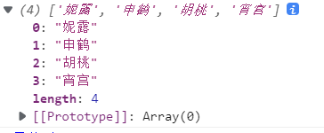

##### 2、数组的克隆	**浅拷贝**

```js
const wife1 = ['妮露','申鹤'];
const wife = [...wife1];
console.log(wife);
```

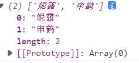

##### 3、将伪数组转为真正的数组

```js
const divs = document.querySelectorAll('div');
const divArr = [...divs];
console.log(divArr);    //  [div,div,div]
```

## symbol

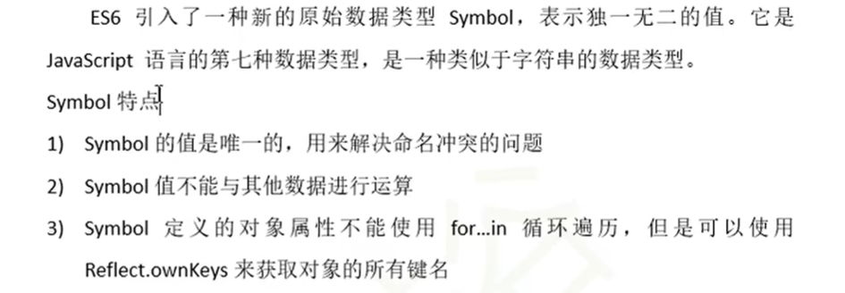

#### 1、创建

```
let s = Symbol();
let s1 = Symbol('妮露');
let s2 = Symbol.for('胡桃');
```

- 不能与其他数据进行运算

#### 2、使用

- 给**对象**添加**方法和属性**

```js
//  向对象中添加方法 up down
let game = {
    up: function() {
        console.log("上升!");
    },
    name: '妮露',
    down: function() {
        console.log("下降!");
    }
}
//  声明一个对象
let methods = {
    up: Symbol(),
    down: Symbol()
}
//  添加方式
game[methods.up] = function() {
    console.log("上升~!");
}
game[methods.down] = function() {
    console.log("下降~!");
}
console.log(game);
```

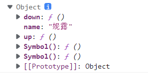

```
let game = {
    name: '妮露',
    [Symbol('up')]: function() {
        console.log("上升~");
    },
    [Symbol('down')]: function() {
        console.log("下降~");
    }
}
console.log(game);
```

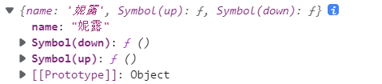

#### 3、内置属性


## 迭代器iterator

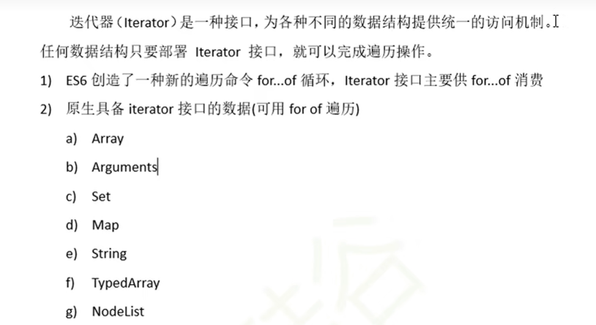

- iterator接口——就是对象里面的一个属性

#### for-of和for-in区别

- for-of——保存的键值
- for-in——保存的键名

#### 工作原理


```
const wife = ['妮露','胡桃','宵宫','申鹤'];
let iterator = wife[Symbol.iterator]();
// 调用对象的next方法
console.log(iterator.next());
console.log(iterator.next());
console.log(iterator.next());
console.log(iterator.next());
console.log(iterator.next());
```

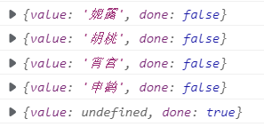

#### 实例

```js
// 声明一个对象
const wife = {
    name: "原神",
    stus:['妮露','胡桃','宵宫','申鹤'],
    [Symbol.iterator](){
        // 索引变量
        let index = 0;
        // this 指向wife，这里作为保存，以防止后面的this发生改变时使用
        let _this = this;
        return {
            next: function(){
                // 现在这个this指向的式 return 里面的对象的,所以需要在外声明一个变量作为保存
                // 以确保this指向的是 wife 这个对象
                if(index <_this.stus.length) {
                    // 返回 属性值  done：false 表示没有完成，需要继续指向  true，完成，表示结束    
                    const result = {value: _this.stus[index], done: false};
                    // 下标自增
                    index++;
                    // 返回结果
                    return result;
                }else {
                    return {value: undefined, done: true};
                }
            }
        }
    }
};

// 遍历这个对象
for (let v of wife) {
    console.log(v);
}

结果:
妮露
胡桃
宵宫
申鹤
```

## 生成器Generator

传统的编程语言，早有异步编程的解决方案（其实是多任务的解决方案）。其中有一种叫做"协程"（coroutine），意思是多个线程互相协作，完成异步任务。

协程有点像函数，又有点像线程。它的运行流程大致如下。

- 第一步，协程`A`开始执行。
- 第二步，协程`A`执行到一半，进入暂停，执行权转移到协程`B`。
- 第三步，（一段时间后）协程`B`交还执行权。
- 第四步，协程`A`恢复执行。

上面流程的协程`A`，就是异步任务，因为它分成两段（或多段）执行。

> Generator 函数是协程在 ES6 的实现，最大特点就是可以交出函数的执行权（即暂停执行）

整个 Generator 函数就是一个封装的异步任务，或者说是异步任务的容器。异步操作需要暂停的地方，都用`yield`语句注明。Generator 函数的执行方法如下。

```js
// 关键字yield可以让生成器停止和开始
function* gen() {	//	* 固定存在
//   console.log(111);
  yield 'qeer'; //	yield  函数代码的分隔符
//   console.log(222);
  yield 'asdf';
//   console.log(333);
  yield 'zxcv';
//   console.log(444);
}
let iterator = gen();
iterator.next();    //  必须使用next调用才能运行
iterator.next(); 
iterator.next(); 
iterator.next(); 
// 遍历
for (const v of gen()) {
    console.log(v);
}
// 返回的结果为
// qeer
// asdf
// zxcv
```

```js
function * gen(x) {
  var y = yield x + 2;
  return y;
};

var g = gen(1);
console.log(g.next()); // { value: 3, done: false }
console.log(g.next()); // { value: undefined, done: true }
```

上面代码中，调用 Generator 函数，会返回一个内部指针（即遍历器）`g`。这是 Generator 函数不同于普通函数的另一个地方，即执行它不会返回结果，返回的是指针对象。调用指针`g`的`next`方法，会移动内部指针（即执行异步任务的第一段），指向第一个遇到的`yield`语句，上例是执行到`x + 2`为止。

换言之，`next`方法的作用是分阶段执行`Generator`函数。每次调用`next`方法，会返回一个对象，表示当前阶段的信息（`value`属性和`done`属性）。`value`属性是`yield`语句后面表达式的值，表示当前阶段的值；`done`属性是一个布尔值，表示 Generator 函数是否执行完毕，即是否还有下一个阶段。

#### 实例1

```
// 异步编程 文件操作 网络操作(ajax,request) 数据库操作
// 1s后控制台输出111 2s后输出222 3秒后输出333   总共6秒
// 回调地狱 一直回调,一层套一层,不断往前缩进
// setTimeout(() => {
//     console.log(111);
//     setTimeout(() => {
//         console.log(222);
//         setTimeout(() => {
//             console.log(333);
//         },3000)
//     }, 2000)
// }, 1000)

        // 解决方法
        function one() {
            setTimeout(() => {
                console.log(111);
                iterator.next();
            }, 1000)
        }
        function two() {
            setTimeout(() => {
                console.log(222);
                iterator.next();
            }, 2000)
        }
        function three() {
            setTimeout(() => {
                console.log(333);
                iterator.next();
            }, 3000)
        }
        // 生成器
        function* gen(){
            yield one();
            yield two();
            yield three();
        }
        // 调用生成器函数
        let iterator = gen();
        // 这样只会执行第一个,但后面的不能执行,因为有 yiled 它会停止生成器的运行
        // 所以需要在每个方法里面添加 iterator.next(); 以确保生成器运行
        iterator.next();
```

#### 实例2

```js
// 模拟获取 用户数据 订单数据 商品数据 
        function getUsers() {
            setTimeout(() => {
                let data = '用户数据';
                iterator.next(data);
            }, 1000)
        }
        function getOrders() {
            setTimeout(() => {
                let data = '订单数据';
                iterator.next(data);
            }, 1000)
        }
        function getGoods() {
            setTimeout(() => {
                let data = '商品数据';
                iterator.next(data);
            }, 1000)
        }
        // 生成器
        function* gen(){
            let users = yield getUsers();
            console.log(users);
            let orders = yield getOrders();
            console.log(orders);
            let goods = yield getGoods();
            console.log(goods);
        }
        // 调用生成器函数
        let iterator = gen();
        iterator.next();
```

- 和同步很像,但实际上是异步的

## Promise

- Promise是ES6引入的**异步编程的新解决方案**
- `Promise`对象代表一个异步操作，有三种状态：`pending`（进行中）、`fulfilled`（已成功）和`rejected`（已失败）

> 语法上，Promise是一个**构造函数**，用来封装异步操作并可以获取其成功或失败的结果

```
Promise 构造函数:Promise(excutor) {}
Promise.prototype.then 方法
Promise.prototype.catch 方法
```

```js
// 实例化 Promise 对象
const p = new Promise(function(resolve,reject) {	
    setTimeout(function() {
        // let data = '数据库中的用户数据';
        // resolve(data);

        let err = '读取数据失败';
        reject(err);
    },1000)
});
// 调用 Promise 对象的 thne 方法
p.then(function(value){
    console.log(value);
},function(reason){
    console.error(reason);
}) 
```

- resolve——将`Promise`对象的状态从“未完成”变为“成功”（即从 pending 变为 resolved），在异步操作**成功**时调用，并将异步操作的结果，作为参数传递出去
- reject——将`Promise`对象的状态从“未完成”变为“失败”（即从 pending 变为 rejected），在异步操作**失败**时调用，并将异步操作报出的错误，作为参数传递出去。
- `Promise`实例生成以后，可以用`then`方法分别指定`resolved`状态和`rejected`状态的回调函数。`then`方法可以接受**两个回调函数**作为参数
- 第一个回调函数是`Promise`对象的状态变为`resolved`时调用。默认写`value`
- 二个回调函数是`Promise`对象的状态变为`rejected`时调用。默认写`reason`

### 读取文件1

```js
// 1.引入 fs 模块	node.js
const fs = require('fs');

// 2.调用方法读取文件
fs.readFile('为学.md',(err, data) =>{
    // 如果失败,则抛出错误
    if(err) throw err;
    // 如果没有出错,则输出内容
    console.log(data.toString());
});
```

### Promise封装获取文件2

```js
// 1.引入 fs 模块
const fs = require('fs');

// 3.使用 Promise 封装
const p = new Promise(function(resolve,reject){
    fs.readFile('为学.md',(err, data) =>{
        // 判断如果失败,则改变 Promise 的状态为失败,失败的值为这个错误对象
        if(err) reject(err);
        // 如果成功
        resolve(data);
    })
});
p.then(function(value){
    console.log(value.toString());
}, function(reason){
    console.log("读取失败");
})
```

### ajax请求

```js
// 1.创建对象
const xhr = new XMLHttpRequest();

// 2.初始化
xhr.open("GET","http://api.apiopen.top/getJoke");
        
// 3.发送
xhr.send();

// 4.绑定事件,处理响应结果
xhr.onreadystatechange = function() {
	// 判断
    if(xhr.readyState == 4){
    	// 判断响应状态码 200-299
        if(xhr.status >= 200 && xhr.status < 300) {
        		// 表示成功
            	console.log(xhr.response);
            }else{
            	// 如果失败
                console.error(xhr.status);
            }
	}
}
```

### Promise封装ajax请求

```js
const p = new Promise((resolve, reject) => {
    // 1.创建对象
    const xhr = new XMLHttpRequest();

    // 2.初始化
    xhr.open("GET", "https://api.apiopen.top/getJoke");

    // 3.发送
    xhr.send();

    // 4.绑定事件,处理响应结果
    xhr.onreadystatechange = function () {
        // 判断
        if (xhr.readyState == 4) {
            // 判断响应状态码 200-299
            if (xhr.status >= 200 && xhr.status < 300) {
                // 表示成功
                resolve(xhr.response);
            } else {
                // 如果失败
                reject(xhr.status);
            }
        }
    }
})
// 指定回调
p.then(function(value){
    console.log(value);
}, function(reason){
    console.error(reason);
})
```

### Promise.prototype.then()

```js
// 创建 Promise 对象
const p = new Promise((resolve,reject) => {
    setTimeout(() => {
        resolve('用户数据');
        // reject('错误!');
    }, 1000);
});
// 调用 then 方法   then返回结果是 Promise对象,对象状态由回调函数的执行结果决定
// 省略function,直接箭头函数
const result = p.then(value => {
    console.log(value);
    // 1.返回的是 非Promise 类型,状态为成功,放回值为对象的成功的值
    // return '成功~'
    // 2.返回的是 Promise 对象
    // return new Promise((resolve, reject) => {
    //     // resolve('ok');
    //     reject('error');
    // })
    // 3.抛出错误
    throw '错误~';
}, reason => {
    console.error(reason);
})
console.log(result);
```

- 返回的是 非Promise 类型，fulfilled就是成功

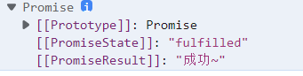

- 返回的是 Promise 对象，对象的状态为成功


- 返回的是 Promise 对象，对象的状态为失败

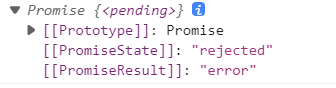

- 抛出错误


### 链式调用

```js
p.then(value =>{

}).then(value => {

});
```

- 解决回调地狱问题
- 错误reason可以不写

### 读取多个文件

```js
const fs = require("fs");

// 但这个文件一多,就会下陷,产生回调地狱,而且函数形参重名,不易发现,这个是回调地狱的问题
fs.readFile('为学.md',(err, data1) =>{
    fs.readFile('李白.md',(err, data2) =>{
        fs.readFile('杜甫.md',(err, data3) =>{
            // 因为做了运算(+) 就会自动转换字符串
            let result = data1 + '\r\n' + data2 + '\r\n' + data3;
            console.log(result);
        });
    });
});
```

### Promise多个文件

```js
const fs = require("fs");

// 使用 Promise 实现
const p = new Promise((reslove, reject) => {
    fs.readFile('为学.md', (err, data) => {
        reslove(data);
    });
});


p.then(value => {
    return new Promise((reslove, reject) => {
        fs.readFile('李白.md', (err, data) => {
            reslove([value, data]);
        });
    })
}).then(value => {
    return new Promise((reslove, reject) => {
        fs.readFile('杜甫.md', (err, data) => {
            // 压入
            value.push(data);
            reslove(value);
        });
    })
}).then(value => {
    console.log(value.join('\r\n'));
});
```

### catch方法

```js
const p = new Promise((resolve, reject) => {
    setTimeout(() => {
        // 设置 p 对象的状态为失败,并设置失败的值
        reject("错误~");
    }, 1000);
})
p.then(function(value){}, function(reason){
    console.error(reason);
})
p.catch(function(reason){
    console.warn(reason);
});
```

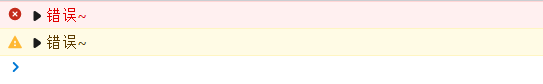

## 集合Set


- `Set`本身是一个构造函数，用来生成 Set 数据结构
- Set  执行完返回一个对象

```js
// 声明一个 set
let s = new Set();
// 可迭代数据   一般传入数组    自动去重
let s2 = new Set(['妮露','胡桃','申鹤','宵宫','胡桃']);

//  元素个数
console.log(s2.size);   //  4
// 添加新的元素
s2.add('莫娜');     // {'妮露', '胡桃', '申鹤', '宵宫', '莫娜'}
// 删除元素
s2.delete('莫娜');  //  {'妮露', '胡桃', '申鹤', '宵宫'}
// 检测
console.log(s2.has('妮露'));    //  true
// 清空
s2.clear();     //  Set(0)
console.log(s2);    // {'妮露', '胡桃', '申鹤', '宵宫'}
console.log(s, typeof s);   //  object
```

## Map


- 它类似于对象，也是键值对的集合，但是“键”的范围不限于字符串，各种类型的值（包括对象）都可以当作键

```js
// 声明 Map
let m = new Map();

// 添加元素
m.set('name','妮露');
m.set('change', function(){
    console.log("改变~");
});
let key = {
    school : '提瓦特'
};
m.set(key,['蒙德','璃月','稻妻']);

// size
console.log(m.size);    //  3
// 删除
// m.delete('name');
// 获取
console.log(m.get('change'));   //  f() { console.log("改变~"); }
console.log(m.get(key));    //  ['蒙德', '璃月', '稻妻']
// 清空
// m.clear();
// 遍历
for (let v of m) {
    console.log(v);     //  键值对
}
// console.log(m);
```


## 数值扩展

```js
// 0、Number.EPSILON 是 JavaScript 表示的最小精度
function equal(a, b) {
    if(Math.abs(a - b) < Number.EPSILON){
        return true;
    }else{
        return false;
    }
}
console.log(0.1 + 0.2 === 0.3); //false
console.log(equal(0.1 + 0.2, 0.3)); //true

// 1、二进制和八进制
let a = 0b1010; //  二进制  0b前缀
let b = 0o222;  //  八进制  0o前缀
// 如果要将0b和0o前缀的字符串数值转为十进制，要使用Number方法
console.log(a); //  10
console.log(b); //  146

// 2、Number.isFinite   检测一个数值是否为有限数
console.log(Number.isFinite(100));  //  true
console.log(Number.isFinite(100/0));    //  false
console.log(Number.isFinite(Infinity)); //  false

// 3、Number.isNaN  检测一个数值是否为NaN
console.log(Number.isNaN(123));  //  false

// 4、Number.parseInt  Number.parseFloat  字符串转整数
console.log(Number.parseInt('1223da')); //  1223
console.log(Number.parseFloat('3.214深'));   //  3.214

// 5、Number.isInteger  检测一个数值是否为整数
console.log(Number.isInteger(4)); //  true
console.log(Number.isInteger(2.3));   //  false

// 6、Math.trunc 将数字的小数部分抹去
console.log(Math.trunc(2.1));   //  2

// 7、Math.sign 判断一个是是正数    负数    还是零
console.log(Math.sign(19)); //  1
console.log(Math.sign(0));  //  0
console.log(Math.sign(-21));    //  -1
```

## 对象方法扩展

```js
// 1、Object.is 判断两个值是否完全相等
console.log(Object.is(120,120));    //  true 
// 相当于全等号 ===     不过有区别
console.log(NaN === NaN);   //  false
console.log(Object.is(NaN,NaN));    //  true 

// 2、Object.assign 对象的合并
const wife1 = {
    name: '妮露',
    age: 20,
    test: 'test'
}
const wife2 = {
    name: '胡桃'
}
//  后面的会覆盖前面的，也就说wife2会覆盖wife1相同属性的
console.log(Object.assign(wife1,wife2));    
//{name: '胡桃', age: 20, test: 'test'}

// 3、Object.setPrototypeOf 设置原型对象    Object.getPrototypeOf
// 不建议这样做
const wife = {
    name: '妮露'
}
const ele = {
    yuanshu: ['火','水','雷']
}
Object.setPrototypeOf(wife,ele);
console.log(Object.getPrototypeOf(wife));
console.log(ele);
```

## 模块化

模块化是指将一个大的程序文件，拆分成许多小的文件，然后将小文件组合起来 

优势:

- 防止命名冲突
- 代码复用
- 高维护性

模块功能主要由两个命令构成：`export`和`import`

- export——用于规定模块的对外接口
- import——用于输入其他模块提供的功能

### **使用**

**m1.js	//文件名**

```js
export let wife = '妮露';

export function dance() {
	console.log("花神之舞~~~");
}
```

**index.htm	//文件名**

```html
<body>
    <script type="module">
        // 引入 m1.js 模块内容
        import * as m1 from "./src/js/m1.js";	//	这里要注意路径
        console.log(m1);
    </script>
</body>
```


### 暴露数据语法

**统一暴露**

```js
let wife = '妮露';
function dance() {
	console.log("花神之舞~~~");
}
export {wife,dance};
```

**默认暴露**

```js
export default {
	wife : '妮露',
	dance: function() {
		console.log("花神之舞~~~");
	}
}
```

### 引入

```js
// 1、通用
// 引入 m1.js 模块内容
import * as m1 from "./src/js/m1.js";

// 2、解构赋值形式
import {name, dance} from "./src/js/m1.js";
// 名字重复，可以设置别名
import {name as nilu, dance as tiaowu} from "./src/js/m2.js";
// 针对默认暴露 必须设置别名
import {default as m3} from "./src/js/m3.js";

// 3、简便形式  只能针对默认暴露
import m3 from "../src/js/m3.js";
```

### 入口文件

当引入过多时，我们可以单独写一个js文件作为模块引入的入口文件，这样我们只需要引入一个js文件即可

```js
<script src="./src/js/app.js" type="module"></script>
```

app.js	//文件名

```
import * as m1 from "./src/js/m1.js";
import * as m2 from "./src/js/m2.js";
import m3 from "./src/js/m3.js";
```

### 项目实际
