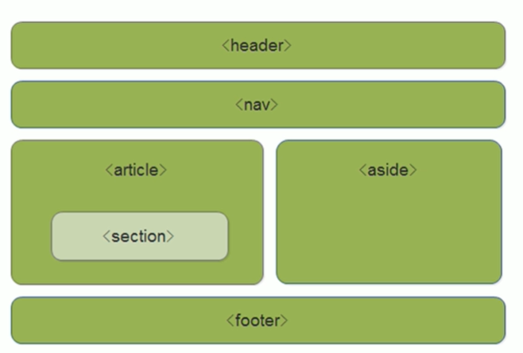

# html

## 基本标签

### 1.标题标签

#### 功能

分行，加粗

```html
 <h1>标题</h1>
 <h2>标题</h2>
 <h3>标题</h3>
 <h4>标题</h4>
 <h5>标题</h5>
 <h6>标题</h6>
```


### 2.段落标签

#### 功能

是内容成段分行展示，独占一行

```html
<p>成段</p>
```


### 3.字体标签

#### 下斜线

```html
<ins>下斜线</ins>
```

#### 加粗

```html
<strong>加粗</strong>
```

#### 斜体

```html
<em>斜体</em>
```

#### 划掉

```html
<del>划掉</del>
```


### 4.地址标签

```html
 <address></address>
```


### 5.容器

#### div

独占一行，行级元素

```html
<div></div>
```

#### sqan

```html
<span></span>
```


### 6.特殊符号

&lt为<   &gt为>

```
&lt;
&gt;
```
### 7.html编码

&nbsp;==一个空格文本

```html
你好&nbsp;&nbsp;&nbsp;&nbsp;&nbsp;&nbsp;呀
```

### 8.单标签

#### br

回车==<br>换行 单独出现，单标签

```html
a<br><br><br><br>b<br>
```


### 9.列表

#### 有序列表

不常用，或者基本用不到

- reversed  --  倒排序
- type  --  显示
- start   --  从哪一个开始，为阿拉伯数字

**type属性值**

- 1 -- 数字1、2

- a -- 小写字母a、b

- A -- 大写字母A、B

- i -- 小写罗马数字

- I -- 大写罗马数字

```html
<ol>
     	<li>内容</li>
        <li>内容</li>
        <li>内容</li>
     </ol>
```

#### 无序列表

最常用的列表，只能放`li`

**type数字值**

- disc  -- 原点（默认）

- square -- 正方形

- circle --  空心圆

```html
 <ul>
          <li>内容</li>
          <li>内容</li>
          <li>内容</li>
     </ul>
```
#### 自定义列表
```html
// dl里面只能有dt和dd 	一个dt对应多个dd
<dl>
    <dt>名词1</dt>
    <dd>名词1解释1</dd>
    <dd>名词1解释2</dd>
</dl>
```
### 10.img属性

##### src

- 网上url  


- 本地的绝对路径:\
- 本地的相对路径
- 下一级路径：/
- 上一级路径：../

```html

```

##### alt

图片占位符，替换文版，图像不能显示的文字

##### title

图片提示符，提示文本，鼠标放在图像上，显示的文字

##### width

给图像设置宽度

##### height

给图像设定高度

##### border

给图像设定边框


### 11.超链接

#### 属性

##### href

- 超文本引用，目标地址
- 也可以#id名称，类似于导航栏
- href="#"，空链接
- href=""，文件或者压缩包，点击就会下载该文件或压缩包

```html
<a href="">超链接</a>
```

##### target属性值

- _blank  ： 在新窗 口中打开

- parent ： 在当前的父窗口中打开，如果不存在父窗口，此选项的行为方式与 self 等同

- _self ： 当前窗口打开（默认）

- _top ： 在整个窗口中打开

- framename ： 在指定的框架中打开

#### 功能

1.超链接

2.锚点：设置属性值为#名字，同时也要设置id=名字

3.打电话和发邮箱

- tel：电话号码
- mailto：邮箱地址

4.协议限定符
## 表单

### 表格

table：表格整体

tr：表格每行

td：表格单元格

```html
<table>
    <tr>
        <td>单元格内的文字</td><td>单元格内的文字</td>
    </tr>
</table>
```
##### 表头单元格标签

加粗并居中显示

```html
<th>姓名</th>
```

##### 表格结构标签


```html
// <thead>内部必须拥有<tr>标签，一般是位于第一行
<thead>表格的头部标签</thead>
<tbody>表格的主体标签</tbody>
<tfoot>表格的底部标签</tfoot>
```
##### 合并单元格

```html
<td colspan="2">跨列合并，两个合并为一个</td>
<td rowspan="2">跨行合并，两个合并为一个</td>
```


### form

```html
<form method="get" action="">
		<p>
			username:<input type="text" name="username">
		</p>
		<p>
			 password:<input type="password" name="password">
		</p>
		<input type="submit">
	</form>
```

发送数据

#### method

发送数据的方式

- get    
- post

#### action

发送给谁的地址
### input标签

```html
<input type="类型属性" name="名称"...>
```

#### text  --  文本域

- name：文本域名称

- maxlength：指定用户输入最大字符长度

- size：指定文本框宽度，以字符个数为单位

- value：指定文本框的默认值

- placeholder：规定用户填写输入字段的提示，占位符

  

#### password  --   密码域

```html
<input type="password" name="密码" value=".."   checked/>
```

在控制台查看输入的密码**（不懂）**

```
var div = document.getElementsByTagName('input')[1];
```

#### checkbox --  复选域

```html
<input type="checkbox" name="名字" value="名字">
```

#### radio --  单选域

```html
<input type="radio" name="名字" value="名字">
```

```html
<input type="radio" name="sex" value="male" checked="checked">
<input type="radio" name="sex" value="female">
 <input type="submit">
```

checked="checked"  --  默认选这个 

#### button  --  按钮

```html
<input type="button">
```

#### submit  --  提交按钮

```html
<input type="submit">
```

#### reset-  --  重置按钮

```html
<input type="reset">
```

#### label -- 定义标注

name——分组


```html
<input type="radio" name="sex" id="sex" />
<label for="sex">男</label>
```


#### hidden  --  隐藏域

#### image  --  图像域

#### file  --  文件域
属性名：

- multiple——多文件选择

```html
<input type="checkbox" name="多选" value=".."   checked/>
```

#### button标签

type属性

- submit——提交
- reset——重置
- button——普通按钮，一般不用写

### select标签

select——下拉菜单的整体

option——下拉菜单的每一项

```html
<select>
	<option value="...">选项1</option>
	<option value="...">选项2</option>
	<option value="...">选项3</option>
</select>
```

#### **select** 下拉菜单和列表标签

- name ： 设置下拉菜单和列表名称

- multiple ： 设置可选择多个选项

- size ： 设置列表中可见选项的数目

  

#### **option** 下拉菜单和列表项目标签

- selected ： 设置选项初始选中状态，默认选中

- value ： 定义送往服务器的选项值

  

#### **optgroup** 下拉菜单和列表项目分组标签


#### textarea -- 多行文本输入

cols——可见宽度

rows——可见行数

**一般使用css设置**

```html
<textarea name=" " rows=" " cols=" ">内容</textarea>
```


## 行内元素

**常用标签**
a(锚点)

b(粗体）

span(常用内联容器，定义文本内区块)

img(图片)

input(输入框)

select(项目选择)

strong(粗体强调)

label(表格标签)

cite (引用)

big（字体加大）

i（斜体）

small（字体变小）

tt（等宽文本效果）

abbr（缩写）

acronym（首字母缩写）

code（引用）

dfn（定义字段）

em（强调）

kbd（定义文本）

samp（标识计算机程序输出）

var（变量）

br（换行）

q（引用短文本）

sub（下标）

sup（上标）

button（按钮）

textarea（多行文本输入框）

## 块状元素

**常用标签**

ul(无序列表)

ol(有序列表)

dl(定义列表)

table(表格)

form(表单)

h1-6 (标题)

p(段落)

pre(预格式化)

blockquote（块引用）

address（联系方式信息）

dd（定义列表中定义条目描述）

div（文档分区）

fieldset（表单元素分组）

hr（水平分割线）

noscript（不支持脚本或禁用脚本时显示的内容）

tfoot（表脚注）

## 区别

|                           行内元素                           |                           块状元素                           |                          行内块元素                          |
| :----------------------------------------------------------: | :----------------------------------------------------------: | :----------------------------------------------------------: |
|                            不换行                            |                             换行                             |                            不换行                            |
|                           默认宽高                           |                可设宽高，若不设则默认父级100%                |                           可设宽高                           |
## 转换

**行**

通过display：inline标签转换

**块**

通过display：block标签转换

**行内块**

通过display：inline-block标签转换

# html5

## 结构标签

1. **article**
   article 标签用于定义一篇文章，与页面其它部分无关。

1. **aside**
   aside 标签定义侧边栏，通常是网页的说明、提示、引用、附加注释、相关链接、广告等内容。

1. **data**
   data 标签将一个指定内容和机器可读的翻译联系在一起。

1. **details**
   details 标签用于定义用户可见的或者隐藏的需求的补充细节。

> details 元素的内容对用户是不可见的，除非设置了 open 属性。
> 与 `<summary>` 标签配合使用可以为 details 定义标题。标题是可见的，用户点击标题时，会显示出 details。

## 语义化标签

- header——头部标签
- nav——导航标签
- article——内容标签
- section——定义文档某个区域
- aside——侧边栏标签
- footer——尾部标签

1. **dialog**
   dialog 标签定义一个对话框、确认框或窗口。

```html
<dialog open>我是一个对话框</dialog>
```

> open：规定 dialog 元素是有效的，用户可以与它进行交互。

1. **footer**
   footer 标签定义文档或节的页脚。

1. **header**
   header 标签用于定义文档的页眉（介绍信息）。

1. **main**
   main 标签用于定义文档或应用的主体部分。

1. **nav**
   nav 标签用于定义页面主导航功能。

1. **section**
   section 标签用于定义定义文档中的节。

1. **summary**

   summary 标签定义 

> summary 和 details 元素配合使用可以为 details 定义标题。标题是可见的，用户点击标题时，会显示出 details。


```html
    <details>
        <summary>标题</summary>
        <p>展开框1</p>
        <p>展开框2</p>
    </details>
```

**常见页面布局**

## 多媒体

### 声音&音乐

audio 标签定义声音，比如音乐或其他音频流。支持的3种文件格式：MP3、Wav、Ogg。

```html
    <audio controls>
        <source src="音乐.mp3" >
        您的浏览器不支持 audio 元素。
    </audio>
```

> autoplay:如果指定该属性，则音频在就绪后马上播放。
>
> controls:如果指定该属性，则向用户显示播放控件（比如播放/暂停按钮）。
>
> loop:如果指定该属性，将循环播放音频。

> muted:如果指定该属性，则音频输出为静音。
>
> preload:auto/metadata/none;
> 指定音频在页面加载时，是否进行预加载。注意：如果同时指定了
> autoplay 属性，则忽略该属性。
> 其中：
> auto：要求浏览器尽快加载整个音频，默认行为
> metadata：只加载音频的元数据
> none：在用户点击开始播放之前不会加载音频

### 字幕

track 标签用于为 HTML5 的媒体文件添加字幕。

> 注：track 元素可以直接添加字幕，而无需额外编写脚本或其他程序实现。

```html
<track src="地址.vtt" srclang="en" label="English" kind="subtitles" default>
```

> default：指定该字幕为默认字幕（如果用户没有选择其他字幕，则自动使用该字幕）。
>
> label：text；指定字幕的标题。
>
> srclang：language_code；指定字幕文本所使用的语言（如果 kind 属性的值是 “subtitles”，则该属性是必需的）。
>
> kind：captions / chapters / descriptions / metadata / subtitles；
> 指定该字幕的文本类型。
> captions：对话或音效的字幕
> chapters：章节标题
> descriptions：视频内容的文本描述
> metadata：元数据
> subtitles：字幕

### 视频

video 标签定义视频，比如电影片段或其他视频流。

```html
<video sre="文件地址" controls="controls"></video>

<!-- 有些浏览器不支持，所以可以加source解决 -->
	<video width="640" height="360" controls>
        <source src="地址.mp4"  type="video/mp4">
        您的浏览器不支持 HTML5 video 标签。
    </video>
```

> autoplay:如果指定该属性，则视频在就绪后将自动播放。
>
> controls:如果指定该属性，则向用户显示控件，比如播放/暂停按钮。
>
> loop:如果指定该属性，将循环播放视频。
>
> muted:如果指定该属性，则将视频的音频输出为静音。
>
> poster:指定视频正在下载时显示的图像。后面加地址
>
> preload:auto/metadata/none;
> 指定视频在页面加载时，是否进行预加载。注意：如果同时指定了
> autoplay 属性，则忽略该属性。
> auto：要求浏览器尽快加载整个视频，默认行为
> metadata：只加载视频的元数据（宽度、高度、第一帧影像和视频总长度等）
> none：在用户点击开始播放之前不会加载视频

### source

source 标签为 picture , audio 或者 video 元素指定多个媒体资源。source 元素是一个空元素。它通常用于以不同浏览器支持的多种格式提供相同的媒体内容。

```html
    <audio controls>
        <source src="地址.mp3" >
        您的浏览器不支持 audio 元素。
    </audio>
```

> srcset:仅当source元素是picture元素的直接子元素时，srcset属性才有效。
>
> media:规定媒体资源的类型。
>
> sizes:表示源大小的列表，用于描述源代表的图像的最终渲染宽度。
>
> type:规定媒体资源的 MIME 类型。

## 状态标签

### meter

meter 标签定义一个范围内的测量值/分数值。仅用于已知最大和最小值的度量，比如：磁盘使用情况，查询结果的相关性等。

```html
    <meter value="3" min="0" max="10">显示</meter>
    <meter value="0.6">60%</meter>
```

> form：指定该元素所属的一个或多个表单
>
> high：指定被界定为高的值的范围
>
> low：指定被界定为低的值的范围
>
> max：指定范围的最大值
>
> min：指定范围的最小值
>
> optimum：指定最优值
>
> value：必需，指定当前值

### progress

progress 标签定义运行中的任务进度（进程）。

```html
 进度：<progress value="22" max="100"></progress>
```

> max:规定需要完成的值。
> value:规定进程的当前值。

## 列表标签

### datalist

datalist 标签规定了 input 标签可能的选项列表。

> 请使用 input 标签的 list 属性来绑定 datalist 标签的ID值，
> 样便可为 input 标签提供”自动完成”的功能。用户能看到一个下拉
> 表，里边的选项是预先定义好的，将作为用户的输入数据。

```html
    <label>
        宣言：<input list="myDatalist" name="datalist">
    </label>
    <datalist id="myDatalist">
        <option>我</option>
        <option>爱</option>
        <option>学</option>
        <option>习</option>
    </datalist>
```

### details

上面有。。

## 注释标签

### ruby

ruby 标签定义注音符号。

> ruby 元素需要与 rt 元素和 rp 元素搭配使用。
> 其中，rt 元素用来标记注音符号，rp 元素则用来标记当浏览器不支持
> ruby 元素时所显示的内容。

```html
    <ruby>
        1 <rp>(</rp><rt>huáng</rt><rp>)</rp>
        2 <rp>(</rp><rt>chuàng</rt><rp>)</rp>
        3 <rp>(</rp><rt>jìng</rt><rp>)</rp>
    </ruby>
```

### rt

rt 标签与 ruby 标签搭配中使用，用于定义注音符号。

### rp

rp 标签与 ruby 标签搭配中使用，用于定义不支持 ruby 元素的浏览器所显示的内容。

## 其他标签
### mark

mark 标签用于定义带有标记的文本。

> 在需要突出显示某部分文本时使用该标签。

```html
<p>我是<mark>内容</mark></p>
```

### output

output 标签将计算结果输出显示（比如执行脚本的输出）。

```html
    <form oninput="result.value=parseInt(a.value)+parseInt(b.value)">
        <input type="range" name="b" value="50" /> +
        <input type="number" name="a" value="33" /> =
        <output name="result"></output>
    </form>
```

### input

表单

表单属性
 


