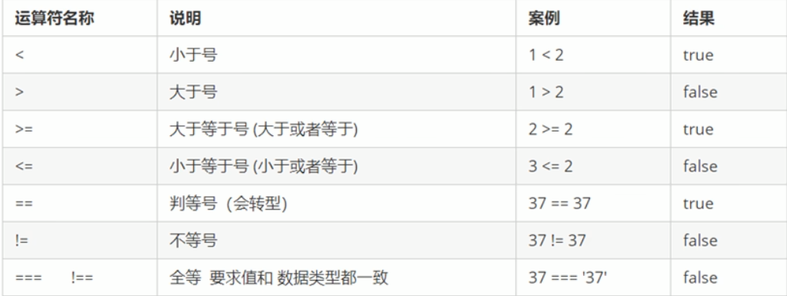
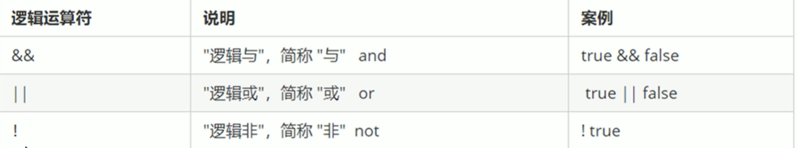
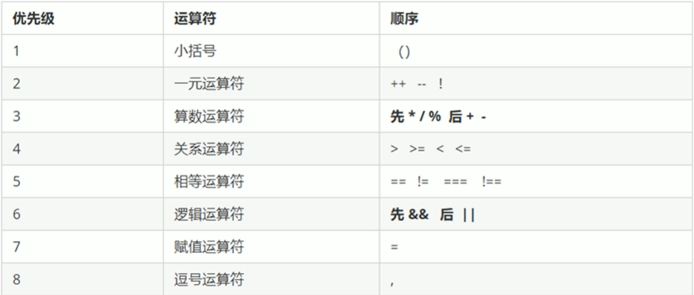
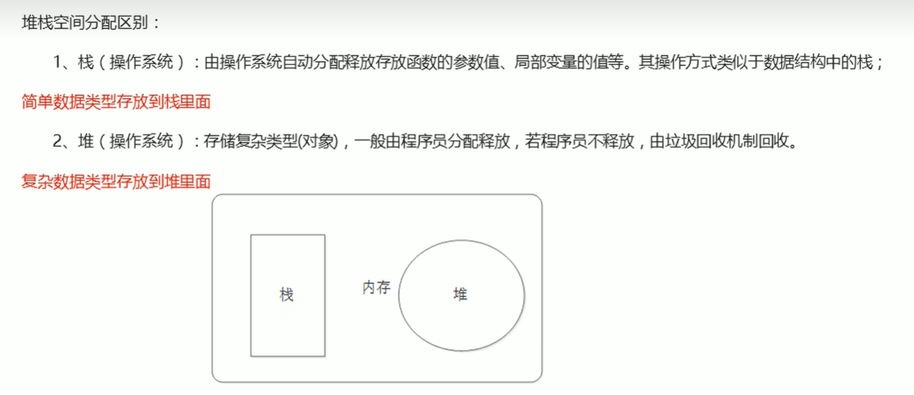

# JavaScript

[TOC]

### JS组成

- ECMAScript——JavaScript语法
- DOM——页面文档对象模型
- BOM——浏览器对象模型

### 书写位置

1. 行内式

   直接写在元素的内部

   很少使用，比较少见，一般在特殊情况下使用

2. 内嵌式

   ```
   写在<script></script>内部
   ```

   最常用的写法

3. 外部式

   和css一样，写在一个js文件中，通过

   ```html
   <script src="文件名"></script>
   ```
   
   引用，一般适用于代码量较大的情况下

## 注释

```
//  单行注释   ctrl+/

/*
    多行注释   shift + alt + a
*/
```

## 输入和输出

### alert(msg)

控制浏览器弹出一个警告框

### console.log(msg)

向控制台输出一个内容

### prompt(info)

浏览器弹出输入框，用户可以输入

获得的数据是字符串类型


## 变量

存放数据的容器
内存里的一块空间，用于存放数据

### 声明变量与赋值

基本上都是 **var**

```javascript
var age;  //声明了age变量
age = 10;  //age变量赋值
or
var age = 10； //声明并赋值（变量的初始化）
```

### 使用变量为存储用户输入的信息

先获得输入框内用户输入的信息

```javascript
var myName = prompt('请输入您的名字：');
```

输出用户输入的信息

```javascript
alert(myName + '，你好！');
```

**注意**

1. 更新变量后原有值会给覆盖
2. 可同时声明多个变量，多个变量名之间使用英文逗号隔开
3. 声明不赋值，输出**undefined** 即未定义
4. 不声明不赋值，使用报错
5. 赋值不声明，可以使用，但不提倡

### 命名规范

- 由字母、数字、下划线、美元符号组成
- 严格区分大小写，var app 和 var APP 是两个不同的变量
- 不能以数字开头，18age是错误的
- 不能以关键字、保留字，比如：var、for、while
- 变量名必须有意义，
- 遵守驼峰命名发，首字母小写，后面单词的首字母需要大写，myFirstName

## 数据类型

不同数据占用内存的空间是不同的，把数据分为存储空间不同的数据，以充分利用存储空间，这便是不同的数据类型

**JS 的变量数据类型是只有在程序运行过程中，根据等号右边的值来确定的**

**JS 是动态语言，这意味着不用提前声明变量的类型，也就是相同的变量可用作不同的类型**

简单数据类型（基本数据类型）：Number、Boolean、String、Undefined、Null

### Number

#### 数字型进制

```javascript
//输出时默认转换为十进制
var num1 = 010  //数字8，数字前面加0，表示八进制
var num2 = 0xa  //数字10，数字前面加0x，表示十六进制（0~f）
```

#### 数字型范围（最大值&最小值）

```javascript
console.log(Number.MAX_VALUE);  //输出最大值
console.log(Number.MIN_VALUE);  //输出最小值
```

#### 特殊值

无穷大：Infinity；超过最大值范围
无穷大：-Infinity；超过最小值范围
NaN：非数值

##### isNaN()方法

用来判断非数字，是数字返回false，不是数字返回true

### String

字符串类型，在js里，字符串都带双引号或者单引号， 默认值为""

#### 引号嵌套

可以用双引号在外，单引号在内进行镶嵌（反过来也可以）

#### 转义字符

以 \ 开头，且写在引号里面

- 换行：  \n
- 斜杠：  \\\
- 单引号：  \\'
- 双引号：  \\"
- 缩进：   \t
- 空格：  \b

#### 长度

检测获取字符串长度用length

```javascript
a = str.length;  //a的数值为str字符串长度
```

#### 拼接

字符串 ＋ 其他类型 = 新的字符串

```javascript
alert(myname + '早上好' + 233);

alert(123 + 233);               //这样输出的数字之和
alert('12' + 12);               //这样输入的是1212，因为第一个是字符串，第二个是数字类型
```

###  Boolean

仅有两个值，true和false

布尔型数字型相加的时候，true的值为1.false的值为0

### **Undefined**

未定义值

```javascript
var a;
console.log(a + 'a');   //输出字符串 undefineda
console.log(a + 1);     //输出NaN ，非数字
```

###  **Null**

空值 (学习对象时会深入)

```javascript
var a = null;
console.log(a + 'a');   //输出字符串 nulla
console.log(a + 1);     //输出1
```

### typeof检测

typeof 可以检测获取变量的数据类型

```javascript
console.log(typeof num); //输出变量类型

var a = null;
console.log(typeof a); //输出的不是null，而是object。
```

> 控制台颜色也可以看出变量类型，数字：蓝色，字符串：黑色，布尔：淡蓝色，undefined和null为灰色

### 数据类型的转换

#### 转字符串

1. toString（）

```javascript
//数字转字符串
var num =10;
var str = num.toString();
```

1. String（）	//强制转换

```javascript
//数字转字符串
var num =10;
console.log(String(num));
```

1. 加号拼接字符串   //隐式转换

```javascript
//数字转字符串
var num =10;
console.log(num + '');
```

#### 转数字

1、parseInt（）	转整数
转整数,不会进1，会去掉后面字母，若前面有字母则输出NaN

```javascript
var str = '10';
console.log(parseInt(a));
```

2、parseFloat（）	
转浮点,会去掉后面字母，若前面有字母则输出NaN

```javascript
var str = '1.9';
console.log(parseFloat(a));
```

3、Number（）	转数值

```javascript
var str = '10';
console.log(Number(a));
```

4、隐式转换 （- / *）

```javascript
var str = '10';
console.log(a - 0); 
console.log(a * 1); 
console.log(a / 1);
```

#### 转布尔

Boolean（）

表示空、否定的值会被转换为false

```javascript
//输出false

console.log(Boolean(''));   
console.log(Boolean(0));    
console.log(Boolean(NaN));  
console.log(Boolean(null)); 
console.log(Boolean(undefined));

//其余的均输出true
```

## 运算符

也被成为操作符，是用于实现赋值、比较和执行算数运算等功能的符号

### 算数运算符

就是加减乘除以及取余

### 递增和递减运算符

```js
num = num +1;
num++;
++num;
```

### 比较运算符



### 逻辑运算符



### 赋值运算符


### 运算符优先级



## 流程控制

### if语句

```javascript
if(条件表达式) {
    执行语句
}  else {
    执行语句
}
```

### 三元表达式

如果表达式结果为真则返回表达式1的值， 如果为假，则返回表达式2的值

```javascript
条件表达式 ？ 表达式1 : 表达式2
```

### switch语句

```javascript
switch(表达式) {
   case value1:
       执行语句1;
       break;
   case value1:
       执行语句1;
       break;
   ...
   default:
       执行最后的语句;
}
```

## 循环导读

### for循环  双重for循环

其实循环和java的一样

```javascript
for(初始化变量; 条件表达式; 操作表达式){
  循环体;
}
```

### while循环  do while循环

```javascript
while(条件表达式) {
   循环体;
}
```

### continue break

continue是退出本次循环，继续下一次循环，

而break则是退出循环

## 数组

### 创建方式

```javascript
var arr = new Array();
var arr = [];
```

#### 数组的索引

数组可以通过索引来访、设置、修改对应的数组元素，我们可以通过**数组名[索引]**的形式来获取数组中的元素。

**数组的长度：数组名.length**

### 数组新增元素

1. 修改length长度

   ```
   数组名.length = 长度;
   ```

2. 修改索引号，追加数组元素

   如果数组索引原有，追加的就会变成替换其中的元素

   ```javascript
   arr[i] = 元素;
   ```

## 函数

函数就是封装了一段可被重复调用执行的代码块，通过代码块可以实现大量代码的重复使用

#### 函数使用

```javascript
function 函数名(形参) {  //声明函数
   函数体;
}
var 变量名 = function() {  //匿名函数	函数没有名字
   函数体; 
}
函数名(实参);   //调用函数
```

形参是接收方，实参是传递方

函数表达式声明方式跟声明变量差不多，只不过变量里面存的是值，而函数表达式里面存的是函数

函数名一般是动词

#### return语句

函数需要有返回值，最终的结果需要返回给函数的调用者

函数名（）通过return 实现

### arguments的使用

当我们不确定有多少个参数传递的时候，可以用arguments来获取。在JavaScript在，arguments实际上它是当前函数的一个内置对象，索引函数都内置了一个arguments对象，arguments对象中存储了传递的**所有实参**。

**arguments展示形式是一个伪数组**，因此可以进行遍历。伪数组具有如下特点：

具有length属性

按索引方式储存数据

不具有数组的push、pop等方法

## 作用域

作用域的使用提高了程序逻辑的局部性，增强了程序的可靠性，减少了名字冲突。

#### 全局变量

在全局作用域下的变量，在全局下都可以使用

整个script标签，或者单独一个js文件

#### 局部变量

在局部作用域下的变量，只能在函数内部使用，或者在一个局部域中

## 预解析

js引擎运行js分两步：	预解析	代码执行

- 预解析：js引擎会把js里面所有的var和function提升到当前作用域的最前面
- 代码执行：按顺序，从上到下

#### 预解析

1. 变量预解析（变量提升）：把所有的变量声明提升到当前作用域的最前面，但不提升赋值操作
2. 函数预解析（函数提升）：把所有的函数声明提升到当前作用域的最前面

## 对象

### 创建对象

1. 利用字面量创建对象

   对象字面量：就是花括号{ }里面包含了表达这个具体事物（对象）的属性和方法。

   ```js
   var obj = {
       uname: '张三',
       age: 18,
       sex:'男',
       sayHi:function(){
           表达式;
       }
   }
   ```

   多个属性或者方法中间使用逗号分开

   方法冒号后面跟的是一个匿名函数

   **使用对象：**

   1. 对象名.属性名
   2. 对象名['属性名']
   3. 对象名.方法名()

2. 利用new Object创建对象

   ```js
   var obj = new Object();
   obj.uname = '张三';
   obj.age = 18;
   ```

3. 利用构造函数创建对象

   是一种特殊的函数，主要用来初始化对象，即为对象成员变量赋初始值，它总与new运算符一起使用，我们可以把对象中的一些公共属性和方法抽取出来，然后封装到这个函数中。

```js
function 构造函数名(){
this.属性 = 值;
this.方法 = function(){}
}
new 沟站函数名();//调用时需要加new
```

- 构造函数名字首字母需要大写
- 不需要return就可以返回结果
- 调用构造函数时需要加new

### 遍历对象

```
for(var k in obj){
console.log(k);//k 遍历 输出 得到的是属性名
console.log(obj[k]);//obj[k] 得到的是属性值
}
```

### new关键字

执行过程

1. 在内存中创建一个新的空对象
2. 让this指向这个新的对象
3. 执行构造函数里面的代码，给这个新对象添加属性和方法
4. 返回这新对象（所以构造函里面不需要添加return）

## 内置对象

就是js语言自带的一些对象，这些对象供开发者使用，并提供了一些常用的或是最基本而必要的功能（属性和方法）

### Math对象

Math对象不是一个构造函数，所以我们不需要new来调用，而是直接使用里面的属性和方法即可

### Date对象

Date() 日期对象是一个构造函数，必须使用new来调用

```js
var date = new Date();  //没有参数，放回当前系统的当前时间
var date = new Date('2020-10-1 5:5:5'); //返回参数里面的时间
```

> 月份注意：从0开始，也就是输入1月，但输出为2月，所以需要减1

#### 方法

- getFullYear()  --  返回当前日期的年

- getMonth()  --  返回月份小1个月，也就是如果是7月则返回6月，所以需要+1

- getDate()  --  返回的是几号

- getDay()  --  返回的是星期，周一返回1，周六返回6，周日返回0

- getHours()  --  获取当前小时

- getMinutes()  --  获取当前分钟

- getSeconds()  --  获取当前秒钟


> 时间戳
>
> ```
> 倒计时：
> var nowTime = +new Date();	//返回的是当前时间总的毫秒数
> var inputTime = +new Date(time);	//返回的是输入时间总的毫秒数
> var times = (inputTime - nowTime) / 1000;	//剩余时间总的秒数
> var d = parseInt(times / 60 / 60 / 24);	//天
> var h = parseInt(times / 60 / 60 % 24);	//时
> var m = parseInt(times / 60 % 60);	//分
> var d = parseInt(times % 60);	//秒
> 
> ```
>
> 

### 数组对象

##### 检测是否为数组

- instanceof    运算符  它可以用来检测是否为数组

```javascript
console.log(arr instanceof Array);
```

- Array.isArray()  函数

```javascript
console.log(Array.isArray(arr));
```

##### 添加删除数组元素

- push()——在数组的末尾添加一个或者多个元素，在push的()中直接写需要添加的数组元素
- unshift()——在数组的开头添加一个或者多个数组元素
- pop()——删除数组的最后一个元素，但只能删除一个，同时，返回的是被删除的元素
- shift()——删除数组的第一个元素，但只能删除一个，同时，返回的是被删除的元素

##### 数组排序

- reverse()  翻转数组
- sort()  冒泡排序，进行数组排序

但存在缺陷。所以需要新增参数

```javascript
arr.sort(function(a , b){
  return a-b;//按照升序的顺序排序
  return b-a;//按照降序的顺序排序
});
```

##### 数组索引方法

- indexOf()  数组中查找给定元素的第一个索引

如果存在返回索引号，如果不存在，则返回-1

- lastindexOf() 在数组的最后一个的索引

如果存在返回索引号，如果不存在，则返回-1

##### 数组转换为字符串

- tostring()  将数组转换为字符串，都好分隔每一项
- join(f分隔符)，把数组所有元素转换成一个字符串（添加分隔符）

### 字符串对象

#### 包装类型

基本包装类型，就是简单数据类型包装成为了复杂数据类型

#### 根据字符返回位置

- indexOf()  返回指定内容在元字符串中的位置，如果找不到就返回-1

  开始的位置是index索引号

- lastindexOf() 从后往前找，只找第一个匹配的

#### 根据位置返回字符

- charAt(index)  返回指定位置的字符(index字符串的索引号)
- charCodeAt(index)   获取指定位置处字符的ASCI码(index索引号)
- str[index]   获取指定位置处字符

#### 字符串操作方法

- concat(str1, str2, str3, ...)  用于连接两个或多个字符串，拼接字符串，等效于+，+更常用
- substr(start, length)   从start位置开始(索引号)，length 取的个数
- slice(start, end)  从start位置开始，截取到end位置，但end取不到
- substring(start, end)   从start位置开始，截取到end位置，但end取不到，基本个slice一样，但不接受负值

#### 替换字符replace

- replace(str1,str2)	将第一个字符替换成第二个字符

#### 字符转换为数组split

- split(分隔符)	将字符分割成数组，根据字符中原有的分隔符进行分割

## 简单类型与复杂类型

### 简单类型与复杂类型

> 简单类型又叫做基本数据类型或者值类型，复杂类型又叫做引用类型

值类型：简单数据类型/基本数据类型，在存储时变量中存储的是值本身

string、number、boolean、undefined、null

引用类型：复杂数据类型，在存储时变量中存储的仅仅是地址

通过new关键字创建的对象（系统、自定义对象）

Object、Array、Date

### 堆和栈



### 内存分配

简单类型：存放到栈里面，里面直接开辟一个空间存放的值

复杂类型：首先在栈里面存放地址，十六进制表示，然后这个地址指向堆里面的数据

### 传参

简单类型：函数的形参可以看作是一个变量，当我们把一个值类型变量作为参数传给函数的形参时，其实是把变量在栈空间里面的值**复制**一份给形参，那么在方法内部对形参做任何修改，都不会影响到外部变量。

复杂类型：函数的形参可以看作是一个变量，当我们把一个值类型变量作为参数传给函数的形参时，其实是把变量在栈空间里面的堆地址**复制**一份给形参，形参和实参其实保存的是同一个堆地址，所以操作的是同一个对象。