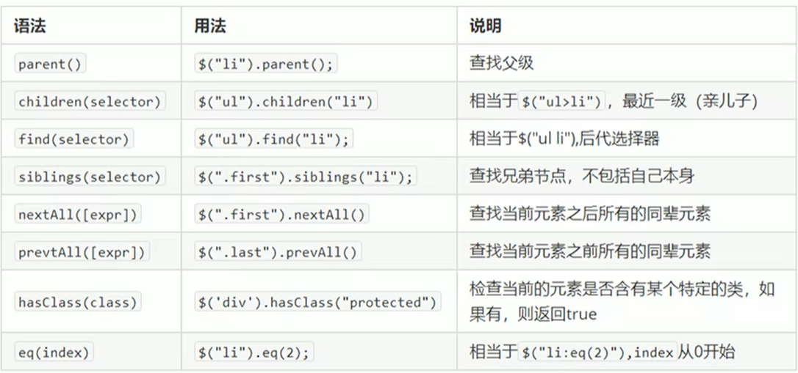
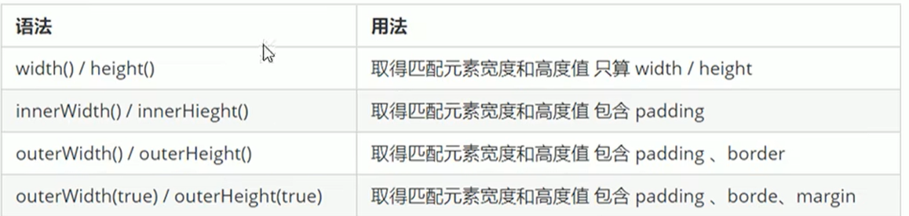

# jQuery

## 1、概述

### 1、JavaScript库

> JavaScript库：即library，是一个封装好的特定的集合（方法和函数）。从封装一大堆函数的角度理解，就是在这个库中，封装了很多预先定义好的函数在里面，比如动画animate、hide、show，比如获取元素等

- 简单理解：就是一个js文件，里面对我们原生js代码进行了封装，存放到里面，这样我们可以快速高效的使用这些封装好的功能了。

常见JavaScript库

> jQuery、Prototype、YUI、Dojo、Ext JS、移动端的zepto

### 2、jQuery概念

- jQuery是一个快速、简洁的JavaScript库，其宗旨是write less，Do More	即提倡写更少的代码，做更多的事情

> j就是JavaScript，Query查询；意思 就是查询js，把js中的DOM操作做了封装，我们可以快速的查询使用里面的功能
>
> jQuery封装了JavaScript常用的功能代码，优化了DOM操作、事件处理、动画设计和Ajax交互
>
> 学习jQuery本质：学习调用这些函数（方法）

**优点：**


## 2、jQuery使用

引入

```html
<head>
	<script src="jquery-1.10.2.min.js"></script>
</head>
```

**语法**

jQuery 语法是通过选取 HTML 元素，并对选取的元素执行某些操作。

基础语法： **$(selector).action()**

- 美元符号定义 jQuery，一般用$，也可以用jQuery
- 选择符（selector）"查询"和"查找" HTML 元素
- jQuery 的 action() 执行对元素的操作

```js
$(this).hide() - 隐藏当前元素

$("p").hide() - 隐藏所有 <p> 元素

$("p.test").hide() - 隐藏所有 class="test" 的 <p> 元素

$("#test").hide() - 隐藏 id="test" 的元素
```

为了防止文档在完全加载（就绪）之前运行 jQuery 代码，即在 DOM 加载完成后才可以对 DOM 进行操作。

```
$(document).ready(function(){
 
   // 开始写 jQuery 代码...
 
});
或
$(function(){
 
   // 开始写 jQuery 代码...
 
});
```

- 等着DOM结构渲染完毕即可执行内部代码，不必等到所有外部资源加载完成，jQuery帮我们完成了封装
- 相当于原生js中的DOMContenLoaded
- 不同于原生js中的load事件是等页面文档、外部的js文件、css文件、图片加载完毕才执行内部代码

### jQuery对象和DOM对象

- 用原生js获取过来的对象就是DOM对象
- jQuery方法获取过来的对象就是jQuery对象
- jQUery对象本质是：利用$对DOM对象包装后产生的对象（伪数组形式存储）
- jQuery对象不能使用**原生js的属性和方法**

### **相互转换**

#### 1、DOM对象转换为jQuery对象

```
$(DOM对象)
$('div')
```

#### 2、jQuery对象转换为DOM对象

```
$(DOM对象)[index]	//index是索引号
$(DOM对象).get(index)	//index是索引号

$('div')[0]
```

## 3、jQuery常用API

### 1、jQuery选择器

#### 1、基础选择器

```
$("选择器")	//里面选择器直接写css选择器即可，但是要加引号  
```


#### 2、jQuery层级选择器


#### 3、隐式迭代

> jQuery设置样式

```
$("div").css('属性','值');
```

便利内部DOM元素（伪数组形式存储）的过程叫做**隐式迭代**

> 简单理解：给匹配的所有元素进行循环遍历，执行相应的方法，而不用我们再进行循环，简化我们的操作，方便我们调用

#### 4、jQuery筛选选择器


#### 5、jQuery筛选方法



#### 6、jQuery排他思想

1. 隐式迭代	给所有的按钮都绑定了点击事件
2. 当前的元素变化背景颜色
3. 其余的兄弟去掉背景颜色   隐式迭代

### 2、jQuery样式操作

####  1、操作css方法

- jQuery可以使用css方法来修改简单元素样式，也可以操作类，修改多个样式

1、参数只写属性名，则返回属性值

```
$(this).css("color");
```

2、参数值属性名，属性值，逗号分隔，是一组样式，属性必须要加引号，值如果是数字可以不用写单位和引号

```
$(this).css("color","red");
```

3、参数是对象形式，方便设置多组样式，属性名和属性值用冒号隔开，属性可以不用加引号

```
$(this).css({"color":"red","font-size":"20px"});
$(this).css({color:red,font-size:20px});
```

#### 2、设置类样式方法

> 作用等同于以前的classList，可以操作类样式，注意操作类里面的参数不要加点

1、添加类

```
$("div").addClass("current");
```

2、移除类

```
$("div").removeClass("current");
```

3、切换类

```
$("div").toggleClass("current");
```

### 3、类操作与className区别

- 原生 JS 中 className 会覆盖元素原先里面的类名
- jQuery里面类操作只是对指定类进行操作，不影响原先的类名（相当于追加类名，但以前的仍保留）

## 4、jQuery效果


### 1、显示、隐藏效果

#### 1、显示语法规范

```
show([speed],[easing],[fn]);
```

- 参数都可以省略，无动画直接显示
- speed：三种预定速度之一的字符串（”slow“，”normal“，”fast“）或表示动画时长的毫秒数值
- easing：（Optional）用来指定切换效果，默认是”swing“，可以用参数”linear“
- fn：回调函数，在动画完成时执行的函数，每个元素执行一次

#### 2、隐藏语法规范

```
hide([speed],[easing],[fn]);
hide(1000);
hide(1000, function() {
	alert(1);
})
```

- 参数都可以省略，无动画直接显示
- speed：三种预定速度之一的字符串（”slow“，”normal“，”fast“）或表示动画时长的毫秒数值
- easing：（Optional）用来指定切换效果，默认是”swing“，可以用参数”linear“
- fn：回调函数，在动画完成时执行的函数，每个元素执行一次

#### 3、切换

- 通过 jQuery，您可以使用 toggle() 方法来切换 hide() 和 show() 方法。

```
 $("p").toggle();
```

### 2、淡入淡出

Fading 方法：

通过 jQuery，您可以实现元素的淡入淡出效果。

jQuery 拥有下面四种 fade 方法：

- fadeIn()
- fadeOut()
- fadeToggle()
- fadeTo()

#### 1、fadeIn() 方法

- jQuery fadeIn() 用于淡入已隐藏的元素。

```
fadeIn([speed],[easing],[fn]);
```

#### 2、fadeOut() 方法

- jQuery fadeOut() 方法用于淡出可见元素。

```
fadeOut([speed],[easing],[fn]);
```

#### 3、fadeToggle() 方法

- jQuery fadeToggle() 方法可以在 fadeIn() 与 fadeOut() 方法之间进行切换。

- 如果元素已淡出，则 fadeToggle() 会向元素添加淡入效果。

- 如果元素已淡入，则 fadeToggle() 会向元素添加淡出效果。

```
fadeToggle([speed],[easing],[fn]);
```

#### 4、fadeTo() 方法

- jQuery fadeTo() 方法允许渐变为给定的不透明度（值介于 0 与 1 之间）。

```
fadeTO([speed],[easing],opacity,[fn]);
```

- opacity透明度必须写，取值0~1之间

### 3、滑动

通过 jQuery，您可以在元素上创建滑动效果。

jQuery 拥有以下滑动方法：

- slideDown()
- slideUp()
- slideToggle()

#### 1、slideDown() 方法

- jQuery slideDown() 方法用于向下滑动元素。

```
slideDown([speed],[easing],[fn]);
```

#### 2、slideUp() 方法

- jQuery slideUp() 方法用于向上滑动元素。

```
slideUp([speed],[easing],[fn]);
```

#### 3、slideToggle() 方法

- jQuery slideToggle() 方法可以在 slideDown() 与 slideUp() 方法之间进行切换。

- 如果元素向下滑动，则 slideToggle() 可向上滑动它们。

- 如果元素向上滑动，则 slideToggle() 可向下滑动它们。

```
slideToggle([speed],[easing],[fn]);
```

### 4、动画

#### 1、语法

```
animate(params,[speed],[easing],[fn]);
```

- params:想要更改的样式属性，以对象形式传递，**必须写**。属性名可以不用带引号，如果时复合属性则需要采取驼峰命名法borderLeft。其余参数可以省略

```
$("button").click(function(){
  $("div").animate({left:'250px'});
});
```

可以多个属性

```
$("button").click(function(){
  $("div").animate({
    left: 250px,
    opacity: 0.5,
    height: 150px,
    width: 150px
  });
});
```

### 5、停止动画

jQuery stop() 方法用于停止动画或效果，在它们完成之前。

- stop() 方法适用于所有 jQuery 效果函数，包括滑动、淡入淡出和自定义动画。

```
stop(stopAll,goToEnd);
```

- 可选的 stopAll 参数规定是否应该清除动画队列。默认是 false，即仅停止活动的动画，允许任何排入队列的动画向后执行。

- 可选的 goToEnd 参数规定是否立即完成当前动画。默认是 false。

> 因此，默认地，stop() 会清除在被选元素上指定的当前动画。

## 5、jQuery属性操作

#### 1、prop()

- 设置或获取元素固有属性值

```
prop()
```

#### 2、attr()

- 设置或获取自定义属性

```
attr("属性")	//类似原生getAttribute
attr("属性","属性值")	//类似原生setAttribute
```

#### 3、data()

- 数据缓存 data()  这个里面吗的数据是存放在元素的内存里面
- 这个方法获取data-index   h5自定义属性  第一个 不用写data-   而且返回的是数字型

```
data("index")
```

## 6、jQuery内容文本值

- 主要针对元素的内容还有表单的值操作

### 1、普通元素内容html()	

- 相当于原生innerHTML

```
html()	//获取元素的内容
html("内容")	//设置元素的内容
```

### 2、普通元素文本内容text()	

- 相当于原生innerText

```
text()	//获取元素的内容
text("内容")	//设置元素的内容
```

### 3、表单值

```
val()	//获取元素的值
val("值")	//设置元素的值
```

## 7、jQuery元素操作

- 主要是遍历、创建、添加、删除元素操作

### 1、遍历元素

#### **语法1**

```
$("div").each(function (index, domEle) {
	操作;
})
```

- each()方法遍历匹配的每一个元素。主要用DOM处理，each每一个
- 里面的回调函数有2个参数：idea是每个元素的索引号，domEle是每隔DOM元素对象，不是jQuery对象
- 所以想要使用jQuery方法，需要给这个dom元素转换为jQuery对象    **$(domEle)**

```html
<script>
        $(function() {
            var sum = 0;
            var arr = ["red","green","blue"];
            $("div").each(function(i,domEle) {
                // 回调函数第一个参数一定是索引号   可以指定
                console.log(i);
                // 回调函数第二个参数一定是 dom 元素对象
                console.log(domEle);
                $(domEle).css("color",arr[i]);
                sum += parseInt($(domEle).text());
            })
            console.log(sum);
        })
    </script>
```

#### **语法2**

```
$.each(object,function (index, element) {
	操作;
})

$.each($("div"),function (i, ele) {
	console.log(i);
	console.log(ele);
})
```

- $.each()方法可以用于遍历任何对象，主要用于数据处理，比如数组、对象
- index：每个元素的索引号
- element：遍历内容

## 8、jQuery尺寸、位置操作

### 1、尺寸




#### 1、width()和height() 方法

- width() 方法设置或返回元素的宽度（不包括内边距、边框或外边距）。
- height() 方法设置或返回元素的高度（不包括内边距、边框或外边距）。

```js
$("button").click(function(){
  var txt="";
  txt+="div 的宽度是: " + $("#div1").width() + "</br>";
  txt+="div 的高度是: " + $("#div1").height();
  $("#div1").html(txt);
});
```

#### 2、innerWidth() 和 innerHeight() 方法

- innerWidth() 方法返回元素的宽度（包括内边距）。
- innerHeight() 方法返回元素的高度（包括内边距）。

```js
$("button").click(function(){
  var txt="";
  txt+="div 宽度，包含内边距: " + $("#div1").innerWidth() + "</br>";
    txt+="div 高度，包含内边距: " + $("#div1").innerHeight();
  $("#div1").html(txt);
});
```

#### 3、outerWidth() 和 outerHeight() 方法

- outerWidth() 方法返回元素的宽度（包括内边距和边框）。

- outerHeight() 方法返回元素的高度（包括内边距和边框）。

```js
$("button").click(function(){
  var txt="";
  txt+="div 宽度，包含内边距和边框: " + $("#div1").outerWidth() + "</br>";
  txt+="div 高度，包含内边距和边框: " + $("#div1").outerHeight();
  $("#div1").html(txt);
});
```

### 2、位置

1、offset()

- 设置或获取元素偏移

1. offset()方法设置会返回被选元素相对于文档的偏移坐标，跟父级没有关系
2. 该方法有2个属性left、top。**left**：距离文档左侧的距离；**top**：距离文档顶部的距离
3. 可以设置元素的偏移

```
offset({top:10,left30})
```

2、position()

- 获取距离带有定位的父级位置（偏移）	如果父级没有定位，则以文档为准
- 只能获取不能设置

3、scrollTop()/scrollLeft()

- 设置或获取元素被卷去的头部和左侧

## 9、jQuery事件

### 1、jQuery事件注册

```
element.事件(function() { })
$("div").clock(function() { 事件处理程序 })
```

其他事件和原生基本一致

### 2、jQuery事件处理

#### 1、on()绑定事件

- 在匹配元素上绑定一个或多个事件的事件处理函数

```
element.on(events,[selector],fn)

$("div").on({ 
	mouseenter:function() {
		$(this).css("background","red");
	},
    click:function() {
    	$(this).css("background","red");
    }
})
```

- events：一个或多个用空格分隔的事件类型，如”click“或”keydown“
- selector：元素的子元素选择器

**on()优势**

- 可以绑定多个事件，多个处理事件程序
- 如果事件处理程序相同

```
$("div").on("mouseenter mouseover", function() { })
```

- 可以事件委派操作。事件委派的定义是，把原来嫁给子元素身上的事件绑定在父元素身上，就是把事件委派给父元素

```
$("div").on("mouseenter","li", function() { })
```

- 动态创建的元素，click()没有办法绑定事件，on()可以给动态生成的元素绑定事件

#### 2、off()解绑事件

- off()方法可以移除通过on()方法添加的事件处理程序

```
$("p").off()	//解绑p元素所有的事件处理程序
$("p").off("click")	//解绑p元素的点击事件	后面的foo是侦听函数名
$("p").off("click","li")	//解绑事件委托
```

#### 3、trigger()自动触发事件

- 有些事件希望自动触发，如轮播图。可以利用定时器自动触发右侧按钮点击事件，不必鼠标点击触发

```
element.click()	//第一种简写
element.trigger("type")	//第二种自动触发模式
element.triggerHandler(type)	//第三种	不会触发元素的默认行为
```

### 3、jQuery事件对象

- 事件被触发，就会有事件对象的产生

```
element.on(events,[selector],function(event) {})
```

- 阻止默认行为：event.preventDefault()或者return flase
- 阻止冒泡：event.stopPropagation()

## 10、jQuery其他方法

### 1、jQuery拷贝对象

- 如果想要把某个对象拷贝（合并）给另外一个对象使用，此时可以使用`$.extend()`方法
- 如果目的对象原有属性和值，那么拷贝后会覆盖原有的属性值

语法：

```
$.extend([deep],target,object1,[objectN])
```

- deep：如果设为true为深拷贝，默认为false 浅拷贝
  - 浅拷贝：把原来对象里面吗的复杂数据类型中的地址拷贝给目的对象，修改目的对象会影响被拷贝对象
  - 深拷贝：拷贝的是对象，不是地址，修改目的对象不会影响被拷贝对象
- target：要拷贝的目标对象
- object1：待拷贝到第一个对象的对象

### 2、多库共存

- jQuery使用$作为标识符，随着jQuery的流行，其他js库也会用这个$作为标识符，这样一起使用就会引起冲突

> 问题：让jQuery和其他js库不存在冲突，可以同时存在，这个就叫做多库共存

解决方案：

- 把里面的$符号同一改为jQuery
- jQuery遍历规定新的名称：`$.noConflict()`