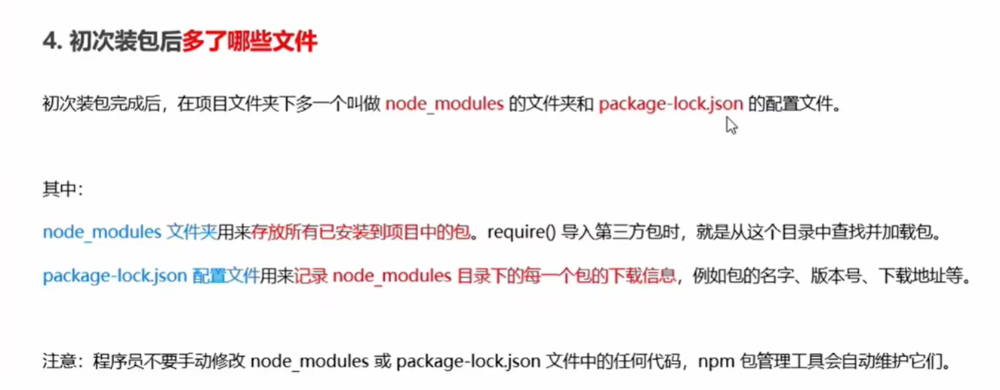
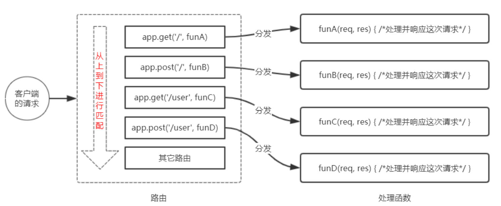
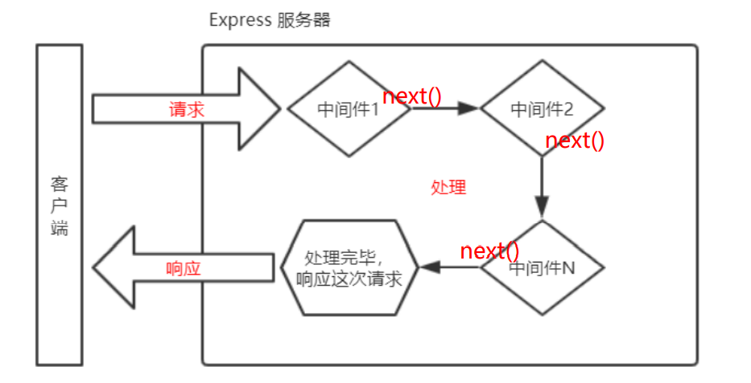
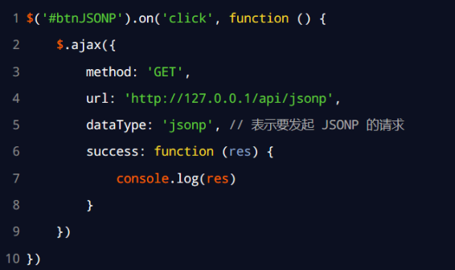

# Node.js

> Node.js是一个基于Chrome V8引擎的JavaScript运行环境

1. 浏览器是JavaScript的前端运行环境
2. Node.js是JavaScript的后端运行环境
3. Node.js中无法调用DOM和BOM等浏览器内置API

- 基于 [Express 框架 (opens new window)](http://www.expressjs.com.cn/)，可以快速构建 Web 应用
- 基于 [Electron 框架 (opens new window)](https://electronjs.org/)，可以构建跨平台的桌面应用
- 基于 [restify 框架 (opens new window)](http://restify.com/)，可以快速构建 API 接口项目
- 读写和操作数据库、创建实用的命令行工具辅助前端开发

## fs文件系统模块

### 1、fs.readFile()

#### 简单文件读取

语法格式：

```js
fs.readFile(path[, options], callback)
```

- `path`：文件路径
- `options`：配置选项，若是字符串则指定编码格式
  - `encoding`：编码格式
  - `flag`：打开方式
- `callback`：回调函数
  - `err`：错误信息
  - `data`：读取的数据，如果未指定编码格式则返回一个 Buffer

```js
const fs = require('fs')

fs.readFile('./files/1.txt', 'utf-8', function(err, data) => {
  if(err) {
    return console.log('failed!' + err.message)
  }
  console.log('content:' + data)
})


// 复制文件内容
fs.readFile("C:/Users/笔记.mp3", function(err, data) {
	if(!err) {
		console.log(data);
		// 将data写入到文件中
		fs.writeFile("C:/Users/hello.jpg", data, function(err){
			if(!err){
				console.log("文件写入成功");
			}
		} );
	}
});
```

#### 流式文件读取

- 简单文件读取的方式会一次性读取文件内容到内存中，若文件较大，会占用过多内存影响系统性能，且读取速度慢
- 大文件适合用流式文件读取，它会分多次将文件读取到内存中

```js
var fs = require('fs')

// 创建一个可读流
var rs = fs.createReadStream('C:/Users/笔记.mp3')
// 创建一个可写流
var ws = fs.createWriteStream('a.mp3')

// 监听流的开启和关闭
// 这几个监听不是必须的
rs.once('open', function () {
  console.log('可读流打开了~~')
})

rs.once('close', function () {
  console.log('可读流关闭了~~')
  //数据读取完毕，关闭可写流
  ws.end()
})

ws.once('open', function () {
  console.log('可写流打开了~~')
})

ws.once('close', function () {
  console.log('可写流关闭了~~')
})

//要读取一个可读流中的数据，要为可读流绑定一个data事件，data事件绑定完毕自动开始读取数据
rs.on('data', function (data) {
  console.log(data)
  //将读取到的数据写入到可写流中
  ws.write(data)
})
```

简便方式：

```js
var fs = require('fs')

var rs = fs.createReadStream('C:/Users/lilichao/Desktop/笔记.mp3')
var ws = fs.createWriteStream('b.mp3')

// pipe()可以将可读流中的内容，直接输出到可写流中
rs.pipe(ws)
```

### 2、fs.writeFile()

#### 简单文件写入

语法格式：

```js
fs.writeFile(file, data[, options], callback)
```

- `file`：文件路径
- `data`：写入内容
- `options`：配置选项，包含 `encoding, mode, flag`；若是字符串则指定编码格式
- `callback`：回调函数

```js
const fs = require('fs')
fs.writeFile('./files/2.txt', 'Hello Nodejs', function (err) {
  if (err) {
    return console.log('failed!' + err.message)
  }
  console.log('success!')
})

fs.writeFile('C:/Users/hello.txt', '通过 writeFile 写入的内容', { flag: 'w' }, function (err) {
  if (!err) {
    console.log('写入成功！')
  } else {
    console.log(err)
  }
})
```

#### 流式文件写入

```js
// 同步、异步、简单文件的写入都不适合大文件的写入，性能较差，容易导致内存溢出
var fs = require('fs')

// 创建一个可写流
var ws = fs.createWriteStream('hello3.txt')

ws.once('open', function () {
  console.log('流打开了~~')
})

ws.once('close', function () {
  console.log('流关闭了~~')
})

// 通过ws向文件中输出内容
ws.write('通过可写流写入文件的内容')
ws.write('1')
ws.write('2')
ws.write('3')
ws.write('4')

// 关闭流
ws.end()
```

### 路径动态拼接问题 `__dirname`

- 在使用 fs 模块操作文件时，如果提供的操作路径是以 `./` 或 `../` 开头的相对路径时，容易出现路径动态拼接错误的问题
- 原因：代码在运行的时候，会以执行 node 命令时所处的目录，动态拼接出被操作文件的完整路径
- 解决方案：在使用 fs 模块操作文件时，直接提供完整的路径，从而防止路径动态拼接的问题
- `__dirname` 获取文件所处的绝对路径

```js
fs.readFile(__dirname + '/files/1.txt', 'utf8', function(err, data) {
  ...
})
```

### 其它操作

验证路径是否存在：

- `fs.exists(path, callback)`
- `fs.existsSync(path)`

获取文件信息：

- `fs.stat(path, callback)`
- `fs.stat(path)`

删除文件：

- `fs.unlink(path, callback)`
- `fs.unlinkSync(path)`

列出文件：

- `fs.readdir(path[,options], callback)`
- `fs.readdirSync(path[, options])`

截断文件：

- `fs.truncate(path, len, callback)`
- `fs.truncateSync(path, len)`

建立目录：

- `fs.mkdir(path[, mode], callback)`
- `fs.mkdirSync(path[, mode])`

删除目录：

- `fs.rmdir(path, callback)`
- `fs.rmdirSync(path)`

重命名文件和目录：

- `fs.rename(oldPath, newPath, callback)`
- `fs.renameSync(oldPath, newPath)`

监视文件更改：

- `fs.watchFile(filename[, options], listener)`

## path路径模块

path 模块是 Node.js 官方提供的、用来处理路径的模块。它提供了一系列的方法和属性，用来满足用户对路径的处理需求。

### 路径拼接 `path.join()`

```js
const path = require('path')
const fs = require('fs')

// 注意 ../ 会抵消前面的路径
// ./ 会被忽略
const pathStr = path.join('/a', '/b/c', '../../', './d', 'e')
console.log(pathStr) // \a\d\e

fs.readFile(path.join(__dirname, './files/1.txt'), 'utf8', function (err, dataStr) {
  if (err) {
    return console.log(err.message)
  }
  console.log(dataStr)
})
```

### 获取路径中文件名 `path.basename()`

使用 `path.basename()` 方法，可以获取路径中的最后一部分，常通过该方法获取路径中的文件名

```js
path.basename(path[, ext])
```

- path: 文件路径
- ext: 文件扩展名

```js
const path = require('path')

// 定义文件的存放路径
const fpath = '/a/b/c/index.html'

const fullName = path.basename(fpath)
console.log(fullName) // index.html

const nameWithoutExt = path.basename(fpath, '.html')
console.log(nameWithoutExt) // index
```

### 获取路径中文件扩展名 `path.extname()`

```js
const path = require('path')

const fpath = '/a/b/c/index.html'

const fext = path.extname(fpath)
console.log(fext) // .html
```

### 时钟案例


```js
// 1.1 导入 fs 模块
const fs = require('fs')
// 1.2 导入 path 模块
const path = require('path')

// 1.3 定义正则表达式，分别匹配 <style></style> 和 <script></script> 标签
const regStyle = /<style>[\s\S]*<\/style>/
const regScript = /<script>[\s\S]*<\/script>/

// 2.1 调用 fs.readFile() 方法读取文件
fs.readFile(path.join(__dirname, '../素材/index.html'), 'utf8', function(err, dataStr) {
  // 2.2 读取 HTML 文件失败
  if (err) return console.log('读取HTML文件失败！' + err.message)
  // 2.3 读取文件成功后，调用对应的三个方法，分别拆解出 css, js, html 文件
  resolveCSS(dataStr)
  resolveJS(dataStr)
  resolveHTML(dataStr)
})

// 3.1 定义处理 css 样式的方法
function resolveCSS(htmlStr) {
  // 3.2 使用正则提取需要的内容
  const r1 = regStyle.exec(htmlStr)
  // 3.3 将提取出来的样式字符串，进行字符串的 replace 替换操作
  const newCSS = r1[0].replace('<style>', '').replace('</style>', '')
  // 3.4 调用 fs.writeFile() 方法，将提取的样式，写入到 clock 目录中 index.css 的文件里面
  fs.writeFile(path.join(__dirname, './clock/index.css'), newCSS, function(err) {
    if (err) return console.log('写入 CSS 样式失败！' + err.message)
    console.log('写入样式文件成功！')
  })
}

// 4.1 定义处理 js 脚本的方法
function resolveJS(htmlStr) {
  // 4.2 通过正则，提取对应的 <script></script> 标签内容
  const r2 = regScript.exec(htmlStr)
  // 4.3 将提取出来的内容，做进一步的处理
  const newJS = r2[0].replace('<script>', '').replace('</script>', '')
  // 4.4 将处理的结果，写入到 clock 目录中的 index.js 文件里面
  fs.writeFile(path.join(__dirname, './clock/index.js'), newJS, function(err) {
    if (err) return console.log('写入 JavaScript 脚本失败！' + err.message)
    console.log('写入 JS 脚本成功！')
  })
}

// 5.1 定义处理 HTML 结构的方法
function resolveHTML(htmlStr) {
  // 5.2 将字符串调用 replace 方法，把内嵌的 style 和 script 标签，替换为外联的 link 和 script 标签
  const newHTML = htmlStr.replace(regStyle, '<link rel="stylesheet" href="./index.css" />').replace(regScript, '<script src="./index.js"></script>')
  // 5.3 写入 index.html 这个文件
  fs.writeFile(path.join(__dirname, './clock/index.html'), newHTML, function(err) {
    if (err) return console.log('写入 HTML 文件失败！' + err.message)
    console.log('写入 HTML 页面成功！')
  })
}
```

## http 模块

http 模块是 Node.js 官方提供的、用来创建 web 服务器的模块。

### 创建基本 Web 服务器

1. 导入http模块
2. 创建web服务器实例
3. 为服务器实例绑定request事件，监听客户端的请求
4. 启动服务器

```js
// 1. 导入 http 模块
const http = require('http')
// 2. 创建 web 服务器实例
const server = http.createServer()
// 3. 为服务器实例绑定 request 事件，监听客户端的请求
server.on('request', function (req, res) {
  console.log('Someone visit our web server.')
})
// 4. 启动服务器
server.listen(8080, function () {  
  console.log('server running at http://127.0.0.1:8080')
})
```

### req请求对象、res响应对象

```js
const http = require('http')
const server = http.createServer()
// req 是请求对象，包含了与客户端相关的数据和属性
server.on('request', (req, res) => {
  // req.url 是客户端请求的 URL 地址
  const url = req.url
  // req.method 是客户端请求的 method 类型
  const method = req.method
  const str = `Your request url is ${url}, and request method is ${method}`
  console.log(str)
  // 调用 res.end() 方法，向客户端响应一些内容
  res.end(str)
})
server.listen(80, () => {
  console.log('server running at http://127.0.0.1')
})
```

### 中文乱码

```js
const http = require('http')
const server = http.createServer()

server.on('request', (req, res) => {
  // 定义一个字符串，包含中文的内容
  const str = `您请求的 URL 地址是 ${req.url}，请求的 method 类型为 ${req.method}`
  // 调用 res.setHeader() 方法，设置  -Type 响应头，解决中文乱码的问题
  res.setHeader('Content-Type', 'text/html; charset=utf-8')
  // res.end() 将内容响应给客户端
  res.end(str)
})

server.listen(80, () => {
  console.log('server running at http://127.0.0.1')
})
```

### 根据不同的url响应不同的html内容

- 核心实现步骤
  - 获取请求的url地址
  - 设置默认的响应内容为 404 No Found
  - 判断用户请求是否为  /  或  /index.html首页
  - 判断用户请求是否为/ablout.html
  - 设置Content-Type 响应头，防止中文乱码
  - 使用res.end() 把内容响应给客户端

```js
const http = require('http')
const server = http.createServer()

server.on('request', (req, res) => {
  // 1. 获取请求的 url 地址
  const url = req.url
  // 2. 设置默认的响应内容为 404 Not found
  let content = '<h1>404 Not found!</h1>'
  // 3. 判断用户请求的是否为 / 或 /index.html 首页
  // 4. 判断用户请求的是否为 /about.html 关于页面
  if (url === '/' || url === '/index.html') {
    content = '<h1>首页</h1>'
  } else if (url === '/about.html') {
    content = '<h1>关于页面</h1>'
  }
  // 5. 设置 Content-Type 响应头，防止中文乱码
  res.setHeader('Content-Type', 'text/html; charset=utf-8')
  // 6. 使用 res.end() 把内容响应给客户端
  res.end(content)
})

server.listen(80, () => {
  console.log('server running at http://127.0.0.1')
})
```

### 实现clock时钟的web服务器

- 实现步骤
  - 导入需要的模块
  - 创建基本的web服务器
  - 将资源的请求url地址映射为文件的存放地址
  - 读取文件内容并响应给客户端
  - 优化资源的路径

```js
// 1.1 导入 http 模块
const http = require('http')
// 1.2 导入 fs 模块
const fs = require('fs')
// 1.3 导入 path 模块
const path = require('path')

// 2.1 创建 web 服务器
const server = http.createServer()
// 2.2 监听 web 服务器的 request 事件
server.on('request', (req, res) => {
  // 3.1 获取到客户端请求的 URL 地址
  //     /clock/index.html
  //     /clock/index.css
  //     /clock/index.js
  const url = req.url
  // 3.2 把请求的 URL 地址映射为具体文件的存放路径
  // const fpath = path.join(__dirname, url)
  // 5.1 预定义一个空白的文件存放路径
  let fpath = ''
  if (url === '/') {
    fpath = path.join(__dirname, './clock/index.html')
  } else {
    //     /index.html
    //     /index.css
    //     /index.js
    fpath = path.join(__dirname, '/clock', url)
  }

  // 4.1 根据“映射”过来的文件路径读取文件的内容
  fs.readFile(fpath, 'utf8', (err, dataStr) => {
    // 4.2 读取失败，向客户端响应固定的“错误消息”
    if (err) return res.end('404 Not found.')
    // 4.3 读取成功，将读取成功的内容，响应给客户端
    res.end(dataStr)
  })
})
// 2.3 启动服务器
server.listen(80, () => {
  console.log('server running at http://127.0.0.1')
})
```


## 模块化

### 模块化概念

- 模块化是指解决一个复杂问题时，自顶向下逐层把系统划分为若干模块的过程，模块是可组合、分解和更换的单元。
- 模块化可提高代码的复用性和可维护性，实现按需加载。
- 模块化规范是对代码进行模块化拆分和组合时需要遵守的规则，如使用何种语法格式引用模块和向外暴露成员。

### Node.js 中模块的分类

- 内置模块（官方提供的，如fs、path、http等）
- 自定义模块（用户创建每个 .js 文件，都是自定义模块）
- 第三方模块（第三方开发出来的模块。需要下载）

### Node.js 中的模块作用域

- 和函数作用域类似，在自定义模块中定义的变量、方法等成员，只能在当前模块内被访问，这种模块级别的访问限制，叫做模块作用域
- 防止全局变量污染

### 模块作用域的成员	module对象

- 自定义模块中都有一个 `module` 对象，存储了和当前模块有关的信息
- 在自定义模块中，可以使用 `module.exports` 对象，将模块内的成员共享出去，供外界使用。导入自定义模块时，得到的就是 `module.exports` 指向的对象。
- 默认情况下，`exports` 和 `module.exports` 指向同一个对象。最终共享的结果，以 `module.exports` 指向的对象为准。
- ES6中使用`export`代替`module.exports`

### CommonJS 模块化规范

- 每个模块内部，`module` 变量代表当前模块
- `module` 变量是一个对象，`module.exports` 是对外的接口
- 加载某个模块即加载该模块的 `module.exports` 属性

### 模块加载机制

- 模块第一次加载后会**被缓存**，即多次调用 `require()` 不会导致模块的代码被执行多次，提高模块加载效率。
- ES6中使用`import`代替`require()`

#### 内置模块加载

- 内置模块加载优先级最高。

#### 自定义模块加载

加载自定义模块时，路径要以 `./` 或 `../` 开头，否则会作为内置模块或第三方模块加载。

导入自定义模块时，若省略文件扩展名，则 Node.js 会按顺序尝试加载文件：

- 按确切的文件名加载
- 补全 `.js` 扩展名加载
- 补全 `.json` 扩展名加载
- 补全 `.node` 扩展名加载
- 报错

####  第三方模块加载

- 若导入第三方模块， Node.js 会从**当前模块的父目录**开始，尝试从 `/node_modules` 文件夹中加载第三方模块。
- 如果没有找到对应的第三方模块，则移动到再**上一层父目录**中，进行加载，直到**文件系统的根目录**。

例如，假设在 `C:\Users\bruce\project\foo.js` 文件里调用了 `require('tools')`，则 Node.js 会按以下顺序查找：

- `C:\Users\bruce\project\node_modules\tools`
- `C:\Users\bruce\node_modules\tools`
- `C:\Users\node_modules\tools`
- `C:\node_modules\tools`

#### 目录作为模块加载

当把目录作为模块标识符进行加载的时候，有三种加载方式：

- 在被加载的目录下查找 `package.json` 的文件，并寻找 `main` 属性，作为 `require()` 加载的入口
- 如果没有 `package.json` 文件，或者 `main` 入口不存在或无法解析，则 Node.js 将会试图加载目录下的 `index.js` 文件。
- 若失败则报错

## npm和包

### 1、什么是包

- Node.js 中的第三方模块叫做包

### 2、包的作用

- 由于Node.js的内置模块仅提供了一些底层API，导致在基于内置模块进行项目开发时，效率很低
- 包是基于内置模块封装出来的，提供了更高级、更方便的API，极大的提高了效率
- 包和内置模块的关系，相当于jQuery和浏览器内置API的关系



### 3、npm

- 安装

```
npm install <Module Name>
npm i <Module Name>
//	这个自动安装最新版本

npm install express@2.2.1	#指定版本
npm install express          # 本地安装
npm install express -g   	# 全局安装	
```

- 卸载	

```
npm uninstall <Module Name>

npm uninstall express
//	会从dependencies节点中删除
npm uninstall express -g	#卸载全局包
```

- 更新

```
npm update <Module Name>

npm update express
```

- 搜索

```
npm search <Module Name>

npm search express
```

### 4、包管理配置文件

- npm规定，在项目根目录中，必须提供一个叫做 `package.json` 的包管理配置文件，用来记录与项目相关的一些配置信息
- 例如
  - 项目的名称、版本号、描述等
  - 项目中都用到了哪些包
  - 哪些包只在开发期间会用到
  - 哪些包在开发和部署时都需要用到

#### 创建package.json

```
//	作用：在执行命令所处的目录中，快速新建 package.json 文件
npm init -y
```

- 项目文件夹的名称不能使用中文，不能有空格

#### dependencies节点

- 记录使用npm install 命令安装了哪些包

如果有些包只在项目开发阶段用到，上线之后用不到，就把这些包放到devDependencies节点中

如果有些包在项目开发和上线阶段用到，就把这些包放到dependencies节点中

```
//	安装指定的包，并记录到 devDependencies 节点中
npm i 包名 -D
//	等价于,完整写法	包名和-D顺序不重要
npm install 包名 --save-dev
```

```
npm config set registry=https://registry.npm.taobao.org/
```

#### 一次性安装所有的包

可以运行 `npm install` 或`npm i` 一次性安装所有的依赖包

```
//	执行npm install 命令时，npm 包管理工具先读取 package.json 中的 dependencies 节点
//	读取到记录的所有依赖包名称和版本号后，npm 包管理工具会把这些包一次性下载到项目中
npm install
npm i
```

#### 包的分类

##### 1.项目包

那些被安装到项目的 node_modules 目录的包都是项目包

- 开发依赖包	(devDependencies)
- 核心依赖包     (dependencies)

##### 2.全局包

在 `C:\Users\用户目录\AppData\Roaming\npm\node_modules`目录下

- 工具性质的包，才有全局安装的必要性
- 参考官方提供的使用说明

##### ３.i5ting_toc

可以把md文档转为html页面的小工具

```
i5ting_toc -f 要转换的md文件路径 -o
// -o 转换完后使用默认浏览器打开
```

### 5、规范的包结构

一个规范的包，它的组成结构，必须符合以下３点要求：

- 包必须以单独的目录而存在
- 包的顶级目录下要必须包含 这个包管理配置文件
- `package.json` 中必须包含 name，verson，main 这个是三个属性，分别代表包的名字、版本号、包的入口

###  6、开发属于自己的包

初始化包的基本结构

- 新建itheima-tools文件夹，作为包的根目录
- 在itheima-tools文件夹中，新建如下三个文件：
  - package.json	(包管理配置文件)
  - index.js   (包的入口文件)
  - README.md   (包的说明文档)

### 7、发布npm包

# express

## Express 初体验

- 官方给出的概念：Express 是基于 Node.js 平台，快速、开放、极简的 Web 开发框架。

- 通俗的理解：Express 的作用和 Node.js 内置的 http 模块类似，是专门用来创建 Web 服务器的。
-  Express 的本质：就是一个 npm 上的第三方包，提供了快速创建 Web 服务器的便捷方法。

### Express和http

- `http` 内置模块用起来很复杂，开发效率低；`Express` 是基于内置的 `http` 模块进一步封装出来的，能够极大的提高开发效率。
- 类似于浏览器中 Web API 和 jQuery 的关系。`Express`是基于`http`进一步封装出来的。

> 对于前端程序员来说，最常见的两种服务器，分别是： 

-  Web 网站服务器：专门对外提供 Web 网页资源的服务器。 

- API 接口服务器：专门对外提供 API 接口的服务器。 

使用 Express，我们可以方便、快速的创建 Web 网站的服务器或 API 接口的服务器

### 基本使用

安装 Express：

```bash
npm install express
```

创建服务器，监听客户端请求，并返回内容：

```js
// 1. 导入 express
const express = require('express')
// 2. 创建 web 服务器
const app = express()

// 4. 监听客户端的 GET 和 POST 请求，并向客户端响应具体的内容
//	参数1：客户端请求的url地址		参数2：请求对应的处理函数
//	req：请求对象	res：响应对象
app.get('/user', (req, res) => {
  // 调用 express 提供的 res.send() 方法，向客户端响应一个 JSON 对象
  res.send({ name: 'zs', age: 20, gender: '男' })
})
app.post('/user', (req, res) => {
  // 调用 express 提供的 res.send() 方法，向客户端响应一个 文本字符串
  res.send('请求成功')
})
app.get('/', (req, res) => {
  // 通过 req.query 可以获取到客户端发送过来的 查询参数
  // 客户端使用 ？name=zs&age=20 这种查询字符串形式，发送到服务器的参数
  // 注意：默认情况下，req.query 是一个空对象
  console.log(req.query)
  res.send(req.query)
})
// 注意：这里的 :id 是一个动态的参数
app.get('/user/:ids/:username', (req, res) => {
  // req.params 是动态匹配到的 URL 参数，默认也是一个空对象
  // 里面存放着通过 : 动态匹配到的参数值
  console.log(req.params)
  res.send(req.params)
})

// 3. 启动 web 服务器
app.listen(80, () => {
  console.log('express server running at http://127.0.0.1')
})
```

- 监听 GET 请求——通过 app.get() 方法，可以监听客户端的 GET 请求
- 监听 POST 请求——通过 app.post() 方法，可以监听客户端的 POST 请求
- 把内容响应给客户端——通过 res.send() 方法，可以把处理好的内容，发送给客户端
- 获取 URL 中携带的查询参数——通过 req.query 对象，可以访问到客户端通过查询字符串的形式，发送到服务器的参数
- 获取 URL 中的动态参数——通过 req.params 对象，可以访问到 URL 中，通过 : 匹配到的动态参数

### 托管静态资源

- 通过 `express.static()` 方法可创建**静态资源服务器**，向外开放访问静态资源。
- Express 在指定的静态目录中查找文件，并对外提供资源的访问路径，存放静态文件的目录名不会出现在 URL 中
- 访问静态资源时，会根据托管顺序查找文件
- 可为静态资源访问路径添加**前缀**

```js
const express = require('express')
const app = express()

// 在这里，调用 express.static() 方法，快速的对外提供静态资源
app.use('/files', express.static('./files'))
app.use(express.static('./clock'))

app.listen(80, () => {
  console.log('express server running at http://127.0.0.1')
})
```

### nodemon

- 当基于 Node.js 编写了一个网站应用的时候，传统的方式，是运行 node app.js 命令，来启动项目。
  - 这样做的坏处是： 代码被修改之后，需要手动重启项目。 

- 现在，我们可以将 node 命令替换为 nodemon 命令，使用 nodemon app.js 来启动项目。
  - 这样做的好处是：代码 被修改之后，会被 nodemon 监听到，从而实现自动重启项目的效果。

## Express路由

- 广义上来讲，路由就是映射关系
- 在 Express 中，路由指的是**客户端的请求与服务器处理函数之间的映射关系**
- Express 中的路由分 3 部分组成，分别是**请求的类型、请求的 URL 地址、处理函数**

格式如下:

```
app.METHOD(PATH, HANDLER)
```

### 路由的匹配过程

- 每当一个请求到达服务器之后，需要先经过路由的匹配，只有匹配成功之后，才会调用对应的处理函数。

- 在匹配时，会按照路由的顺序进行匹配，如果请求类型和请求的 URL 同时匹配成功，则 Express 会将这次请求，转 交给对应的 function 函数进行处理。
- 可以简单理解为switch语句



路由匹配的注意点：

- 按照定义的先后顺序进行匹配
- **请求类型和请求的URL同时匹配成功**， 才会调用对应的处理函数

### 使用

```js
const express = require('express')
const app = express()

// 挂载路由
app.get('/', (req, res) => {
  res.send('hello world.')
})
app.post('/', (req, res) => {
  res.send('Post Request.')
})

app.listen(80, () => {
  console.log('http://127.0.0.1')
})
```

### 模块化路由

为了方便对路由进行模块化的管理，Express 不建议将路由直接挂载到 app 上，而是推荐将路由抽离为单独的模块。 将路由抽离为单独模块的步骤如下：

1. 创建路由模块对应的 .js 文件
2.  调用 express.Router() 函数创建路由对象
3. 向路由对象上挂载具体的路由
4. 使用 module.exports 向外共享路由对象
5. 使用 app.use() 函数注册路由模块

**创建路由模块**

```js
const express = require('express')
const app = express()

// app.use('/files', express.static('./files'))

// 1. 导入路由模块
const router = require('./03.router')
// 2. 注册路由模块
app.use('/api', router)

// 注意： app.use() 函数的作用，就是来注册全局中间件

app.listen(80, () => {
  console.log('http://127.0.0.1')
})
```

## Express中间件

- 中间件（Middleware ），特指业务流程的**中间处理环节**

### 概念

#### **调用流程**

- 当一个请求到达 Express 的服务器之后，可以连续调用多个中间件，从而对这次请求进行预处理


#### 中间件的格式

Express 的中间件，本质上就是一个 function 处理函数，Express 中间件的格式如下：


- 注意：中间件函数的形参列表中，必须包含 next 参数。而路由处理函数中只包含 req 和 res

#### next 函数的作用

- next 函数是实现多个中间件连续调用的关键，它表示把流转关系转交给下一个中间件或路由。



### 使用

```js
// 定义一个最简单的中间件函数
const mw = function (req, res, next) {
  console.log('这是最简单的中间件函数')
  // 把流转关系，转交给下一个中间件或路由
  next()
}
```

### 全局生效的中间件

- 客户端发起的任何请求，到达服务器之后，都会触发的中间件，叫做全局生效的中间件
- 通过调用 app.use(中间件函数)，即可定义一个全局生效的中间件
- 可以使用 `app.use()` 连续定义多个全局中间件。客户端请求到达服务器之后，会按照中间件定义的**先后顺序依次进行** 调用

```js
const express = require('express')
const app = express()

// 定义第一个全局中间件
app.use((req, res, next) => {
  console.log('调用了第1个全局中间件')
  next()
})
// 定义第二个全局中间件
app.use((req, res, next) => {
  console.log('调用了第2个全局中间件')
  next()
})

app.get('/user', (req, res) => {
  res.send('User page.')
})

app.listen(80, () => {
  console.log('http://127.0.0.1')
})
```

### 中间件的作用

多个中间件之间，共享同一份 `req` 和 `res`。

基于这样的特性，我们可以在上游的中间件中，**统一为 req 或 res 对象添 加自定义的属性或方法**，供下游的中间件或路由进行使用。


### 局部生效的中间件

- 不使用 app.use() 定义的中间件，叫做局部生效的中间件
- 可以在路由中，通过如下两种等价的方式，使用多个局部中间件

```js
const express = require('express')
const app = express()

// 定义中间件函数
const mw1 = (req, res, next) => {
  console.log('调用了第一个局部生效的中间件')
  next()
}

const mw2 = (req, res, next) => {
  console.log('调用了第二个局部生效的中间件')
  next()
}

// 两种定义局部中间件的方式
app.get('/hello', mw2, mw1, (req, res) => res.send('hello page.'))
app.get('/about', [mw1, mw2], (req, res) => res.send('about page.'))

app.get('/user', (req, res) => res.send('User page.'))

app.listen(80, function () {
  console.log('Express server running at http://127.0.0.1')
})
```

### 注意事项

- 一定要在**路由之前注册中间件**
- 客户端发送过来的请求，可以连续调用多个中间件进行处理
- 执行完中间件的业务代码之后，不要忘记调用 **next()** 函数
- 为了防止代码逻辑混乱，**调用 next() 函数后不要再写额外的代码**
- 连续调用多个中间件时，多个中间件之间，**共享 req 和 res 对象**

### 中间件的分类

#### 1、应用级别的中间件

- 通过 app.use() 或 app.get() 或 app.post() ，绑定到 app 实例上的中间件，叫做应用级别的中间件

#### 2、路由级别的中间件

- 绑定到 `express.Router()` 实例上的中间件，叫做路由级别的中间件。用法和应用级别中间件没有区别。应用级别中间件是绑定到 `app` 实例上，路由级别中间件绑定到 `router` 实例上。

```js
const app = express()
const router = express.Router()

router.use(function (req, res, next) {
  console.log(1)
  next()
})

app.use('/', router)
```

#### 3、错误级别的中间件

- 用来捕获整个项目中发生的异常错误，从而防止项目异常崩溃的问题
- 错误级别中间件的处理函数中，必须有 4 个形参，形参顺序从前到后分别是 `(err, req, res, next)` 。
- **错误级别的中间件必须注册在所有路由之后**

```js
const express = require('express')
const app = express()

app.get('/', (req, res) => {
  throw new Error('服务器内部发生了错误！')
  res.send('Home page.')
})

// 定义错误级别的中间件，捕获整个项目的异常错误，从而防止程序的崩溃
app.use((err, req, res, next) => {
  console.log('发生了错误！' + err.message)
  res.send('Error：' + err.message)
})

app.listen(80, function () {
  console.log('Express server running at http://127.0.0.1')
})
```

#### 4、Express 内置的中间件

自 Express 4.16.0 版本开始，Express 内置了 3 个常用的中间件，极大的提高了 Express 项目的开发效率和体验：

- `express.static` 快速托管静态资源的内置中间件，例如： HTML 文件、图片、CSS 样式等（无兼容性）
- `express.json` 解析 JSON 格式的请求体数据（有兼容性，仅在 4.16.0+ 版本中可用）
- `express.urlencoded` 解析 URL-encoded 格式的请求体数据（有兼容性，仅在 4.16.0+ 版本中可用）

```js
// 导入 express 模块
const express = require('express')
// 创建 express 的服务器实例
const app = express()

// 注意：除了错误级别的中间件，其他的中间件，必须在路由之前进行配置
// 通过 express.json() 这个中间件，解析表单中的 JSON 格式的数据
app.use(express.json())
// 通过 express.urlencoded() 这个中间件，来解析 表单中的 url-encoded 格式的数据
app.use(express.urlencoded({ extended: false }))

app.post('/user', (req, res) => {
  // 在服务器，可以使用 req.body 这个属性，来接收客户端发送过来的请求体数据
  // 默认情况下，如果不配置解析表单数据的中间件，则 req.body 默认等于 undefined
  console.log(req.body)
  res.send('ok')
})

app.post('/book', (req, res) => {
  // 在服务器端，可以通过 req,body 来获取 JSON 格式的表单数据和 url-encoded 格式的数据
  console.log(req.body)
  res.send('ok')
})

// 调用 app.listen 方法，指定端口号并启动web服务器
app.listen(80, function () {
  console.log('Express server running at http://127.0.0.1')
})
```

#### 5、第三方的中间件

- 非 Express 官方内置的，而是由第三方开发出来的中间件，叫做第三方中间件。在项目中，大家可以按需下载并配置 第三方中间件，从而提高项目的开发效率。

例如：在 express@4.16.0 之前的版本中，经常使用 body-parser 这个第三方中间件，来解析请求体数据。使用步 骤如下： 

1. 运行 npm install body-parser 安装中间件 
2. 使用 require 导入中间件 
3. 调用 app.use() 注册并使用中间件

```js
// 导入 express 模块
const express = require('express')
// 创建 express 的服务器实例
const app = express()

// 1. 导入解析表单数据的中间件 body-parser
const parser = require('body-parser')
// 2. 使用 app.use() 注册中间件
app.use(parser.urlencoded({ extended: false }))
// app.use(express.urlencoded({ extended: false }))

app.post('/user', (req, res) => {
  // 如果没有配置任何解析表单数据的中间件，则 req.body 默认等于 undefined
  console.log(req.body)
  res.send('ok')
})

// 调用 app.listen 方法，指定端口号并启动web服务器
app.listen(80, function () {
  console.log('Express server running at http://127.0.0.1')
})
```

### 自定义中间件

自己手动模拟一个类似于 express.urlencoded 这样的中间件，来解析 POST 提交到服务器的表单数据。 实现步骤： 

1. 定义中间件 
   - 使用 app.use() 来定义全局生效的中间件
2. 监听 req 的 data 事件 
   - 在中间件中，需要监听 req 对象的 data 事件，来获取客户端发送到服务器的数据
   - 如果数据量比较大，无法一次性发送完毕，则客户端会把数据切割后，分批发送到服务器。所以 data 事件可能会触 发多次，每一次触发 data 事件时，获取到数据只是完整数据的一部分，需要手动对接收到的数据进行拼接
3. 监听 req 的 end 事件 
   - 当请求体数据接收完毕之后，会自动触发 req 的 end 事件。 
   - 因此，我们可以在 req 的 end 事件中，拿到并处理完整的请求体数据
4. 使用 querystring 模块解析请求体数据 
   - Node.js 内置了一个 querystring 模块，专门用来处理查询字符串。通过这个模块提供的 parse() 函数，可以轻松把 查询字符串，解析成对象的格式
5. 将解析出来的数据对象挂载为 req.body 
   - 上游的中间件和下游的中间件及路由之间，共享同一份 req 和 res。因此，我们可以将解析出来的数据，挂载为 req  的自定义属性，命名为 req.body，供下游使用
6. 将自定义中间件封装为模块
   - 为了优化代码的结构，我们可以把自定义的中间件函数，封装为独立的模块

```js
// 导入 express 模块
const express = require('express')
// 创建 express 的服务器实例
const app = express()
// 导入 Node.js 内置的 querystring 模块
const qs = require('querystring')

// 这是解析表单数据的中间件
app.use((req, res, next) => {
  // 定义中间件具体的业务逻辑
  // 1. 定义一个 str 字符串，专门用来存储客户端发送过来的请求体数据
  let str = ''
  // 2. 监听 req 的 data 事件
  req.on('data', (chunk) => {
    str += chunk
  })
  // 3. 监听 req 的 end 事件
  req.on('end', () => {
    // 在 str 中存放的是完整的请求体数据
    // console.log(str)
    // TODO: 把字符串格式的请求体数据，解析成对象格式
    const body = qs.parse(str)  //调用qs.parse()方法，把查询字符串解析为对象
    req.body = body //将解析出来的请求对象，挂载为req.body对象
    next()  //最后，next()函数，执行后续的业务逻辑
  })
})

app.post('/user', (req, res) => {
  res.send(req.body)
})

// 调用 app.listen 方法，指定端口号并启动web服务器
app.listen(80, function () {
  console.log('Express server running at http://127.0.0.1')
})
```

**封装**

```js
// 导入 express 模块
const express = require('express')
// 创建 express 的服务器实例
const app = express()

// 1. 导入自己封装的中间件模块
const customBodyParser = require('./14.custom-body-parser')
// 2. 将自定义的中间件函数，注册为全局可用的中间件
app.use(customBodyParser)

app.post('/user', (req, res) => {
  res.send(req.body)
})

// 调用 app.listen 方法，指定端口号并启动web服务器
app.listen(80, function () {
  console.log('Express server running at http://127.0.0.1')
})

--------------------------------------------------------------
// custom-body-parser.js
// 导入 Node.js 内置的 querystring 模块
const qs = require('querystring')

const bodyParser = (req, res, next) => {
  // 定义中间件具体的业务逻辑
  // 1. 定义一个 str 字符串，专门用来存储客户端发送过来的请求体数据
  let str = ''
  // 2. 监听 req 的 data 事件
  req.on('data', (chunk) => {
    str += chunk
  })
  // 3. 监听 req 的 end 事件
  req.on('end', () => {
    // 在 str 中存放的是完整的请求体数据
    // console.log(str)
    // TODO: 把字符串格式的请求体数据，解析成对象格式
    const body = qs.parse(str)
    req.body = body
    next()
  })
}

module.exports = bodyParser
```

## 使用Express写接口

### CORS 跨域资源共享

#### 1、接口的跨域问题

解决接口跨域问题的方案主要有两种： 

1. CORS（主流的解决方案，推荐使用） 
2. JSONP（有缺陷的解决方案：只支持 GET 请求）

#### 2、使用 cors 中间件解决跨域问题

cors 是 Express 的一个第三方中间件。通过安装和配置 cors 中间件，可以很方便地解决跨域问题。 使用步骤分为如下 3 步：  

1. 运行 `npm install cors` 安装中间件 
2. 使用 `const cors = require('cors')` 导入中间件 
3. 在路由之前调用 `app.use(cors())` 配置中间件

#### 3、什么是 CORS

- CORS （Cross-Origin Resource Sharing，跨域资源共享）由一系列 HTTP 响应头组成，这些 HTTP 响应头决定 **浏览器是否阻止前端 JS 代码跨域获取资源**
- 浏览器的同**源安全策略**默认会阻止网页“跨域”获取资源。但如果接口服务器配置了 CORS 相关的 HTTP 响应头， 就可以解除浏览器端的跨域访问限制


#### 4、CORS 的注意事项

- CORS 主要在服务器端进行配置。客户端浏览器无须做任何额外的配置，即可请求开启了 CORS 的接口
- CORS 在浏览器中有兼容性。只有支持 XMLHttpRequest Level2 的浏览器，才能正常访问开启了 CORS 的服 务端接口（例如：IE10+、Chrome4+、FireFox3.5+）

#### 5、CORS 常见响应头

##### 1、CORS 响应头部\- Access-Control-Allow-Origi

响应头部中可以携带一个 Access-Control-Allow-Origin 字段，其语法如下: 

```
Access-Control-Allow-origin:<origin> | *
```

其中，origin 参数的值指定了允许访问该资源的外域 URL。

例如，下面的字段值将只允许来自 http://itcast.cn 的请求

```
res.setHeader('Access-Control-Allow-origin','http://itcast.cn')
```

如果指定了 Access-Control-Allow-Origin 字段的值为通配符 *，表示允许来自任何域的请求

```
res.setHeader('Access-Control-Allow-origin','*')
```

##### 2、CORS 响应头部 - Access-Control-Allow-Headers

默认情况下，CORS 仅支持客户端向服务器发送如下的 9 个请求头：

- `Accept`、`Accept-Language`、`Content-Language`、`DPR`、`Downlink`、`Save-Data`、`Viewport-Width`、`Width` 、 `Content-Type` （值仅限于 `text/plain`、`multipart/form-data`、`application/x-www-form-urlencoded` 三者之一） 

- 如果客户端向服务器发送了额外的请求头信息，则需要在服务器端，通过 Access-Control-Allow-Headers 对额外 的请求头进行声明，否则这次请求会失败！

```js
//允许客户端额外向服务器发送 Content-Type 请求头和 X-Custom-Header 请求头
//多个请求头之间使用逗号进行分隔
res.setHeader('Access-Control-Allow-Headers', 'Content-Type, X-Custom-Header')
```

##### 3、CORS 响应头部 - Access-Control-Allow-Methods

- 默认情况下，CORS 仅支持客户端发起 GET、POST、HEAD 请求
- 如果客户端希望通过 PUT、DELETE 等方式请求服务器的资源，则需要在服务器端，通过 `Access-Control-Alow-Methods` 来指明实际请求所允许使用的 HTTP 方法

```js
//只允许 GET、POST、HEAD DELETE  请求方式
res.setHeader('Access-Control-Allow-Methods', 'POST, GET, DELETE, HEAD')
//允许所有的 HTTP请求方式
res.setHEader('Access-Control-Allow-Methods', '*')
```

#### 6、CORS请求的分类

客户端在请求 CORS 接口时，根据请求方式和请求头的不同，可以将 CORS 的请求分为两大类

- 简单请求
- 预检请求

##### 1、简单请求

同时满足以下两大条件的请求，就属于简单请求

- 请求方式：GET、POST、HEAD 三者之一
- HTTP 头部信息不超过以下几种字段：无自定义头部字段、Accept、Accept-Language、Content-Language、DPR、 Downlink、Save-Data、Viewport-Width、Width 、Content-Type（只有三个值application/x-www-formurlencoded、multipart/form-data、text/plain

##### 2、预检请求

只要符合以下任何一个条件的请求，都需要进行预检请求： 

- 请求方式为 GET、POST、HEAD 之外的请求 Method 类型 
- 请求头中包含自定义头部字段 
- 向服务器发送了 application/json 格式的数据

**在浏览器与服务器正式通信之前，浏览器会先发送 `OPTION` 请求进行预检，以获知服务器是否允许该实际请求，所以这一 次的 OPTION 请求称为“预检请求”。服务器成功响应预检请求后，才会发送真正的请求，并且携带真实数据**

##### 3、简单请求和预检请求的区别

- 简单请求的特点：客户端与服务器之间只会发生一次请求。

- 预检请求的特点：客户端与服务器之间会发生两次请求，OPTION 预检请求成功之后，才会发起真正的请求。

### JSONP 接口

#### 1、JSONP 的概念与特点

**概念**：浏览器端通过 <script> 标签的 src 属性，请求服务器上的数据，同时，服务器返回一个函数的调用。这种请求数据 的方式叫做 JSONP。

**特点**： 

1. JSONP 不属于真正的 Ajax 请求，因为它没有使用 XMLHttpRequest 这个对象。 
2. JSONP 仅支持 GET 请求，不支持 POST、PUT、DELETE 等请求

#### 2、JSONP 接口

**创建 JSONP 接口的注意事项**

- 如果项目中已经配置了 CORS 跨域资源共享，为了防止冲突，必须在配置 CORS 中间件之前声明 JSONP 的接口。否则 JSONP 接口会被处理成开启了 CORS 的接口。


#### 3、实现 JSONP 接口的步骤

1. 获取客户端发送过来的回调函数的名字 
2. 得到要通过 JSONP 形式发送给客户端的数据 
3. 根据前两步得到的数据，拼接出一个函数调用的字符串 
4. 把上一步拼接得到的字符串，响应给客户端的 

#### 4、实现 JSONP 接口的具体代码

```js
// 导入 express
const express = require('express')
// 创建服务器实例
const app = express()

// 配置解析表单数据的中间件
app.use(express.urlencoded({ extended: false }))

// 必须在配置 cors 中间件之前，配置 JSONP 的接口
app.get('/api/jsonp', (req, res) => {
  // TODO: 定义 JSONP 接口具体的实现过程
  // 1. 得到函数的名称
  const funcName = req.query.callback
  // 2. 定义要发送到客户端的数据对象
  const data = { name: 'zs', age: 22 }
  // 3. 拼接出一个函数的调用
  const scriptStr = `${funcName}(${JSON.stringify(data)})`
  // 4. 把拼接的字符串，响应给客户端
  res.send(scriptStr)
})

// 一定要在路由之前，配置 cors 这个中间件，从而解决接口跨域的问题
const cors = require('cors')
app.use(cors())

// 导入路由模块
const router  = require('./16.apiRouter')
// 把路由模块，注册到 app 上
app.use('/api', router)

// 启动服务器
app.listen(80, () => {
  console.log('express server running at http://127.0.0.1')
})
```

#### 5、在网页中使用 jQuery 发起 JSONP 请求

- 调用 $.ajax() 函数，提供 JSONP 的配置选项，从而发起 JSONP 请求



```js
$('#btnJSONP').on('click', function () {
          $.ajax({
            type: 'GET',
            url: 'http://127.0.0.1/api/jsonp',
            dataType: 'jsonp',
            success: function (res) {
              console.log(res)
            },
          })
        })
```

# 数据库和身份认证

# 大事件后台API项目