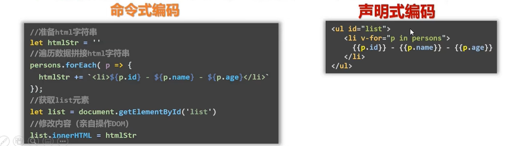
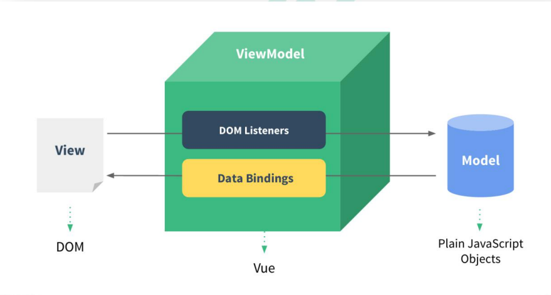
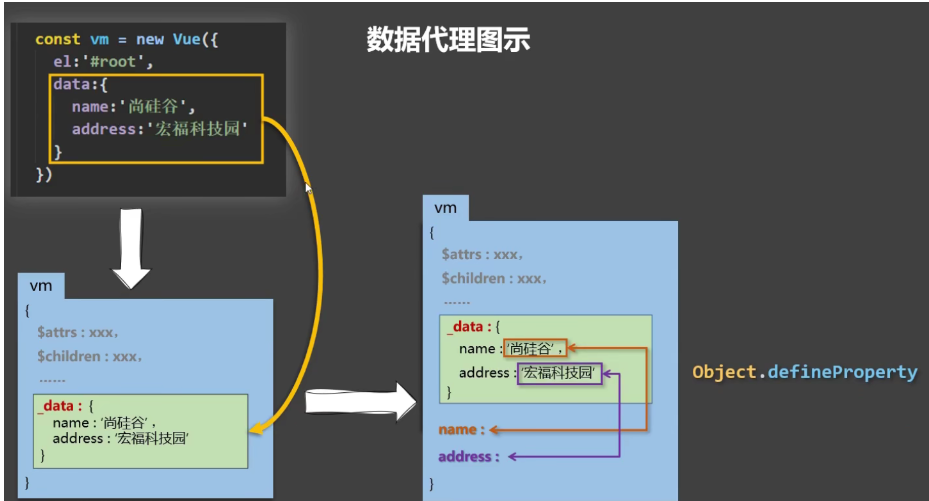
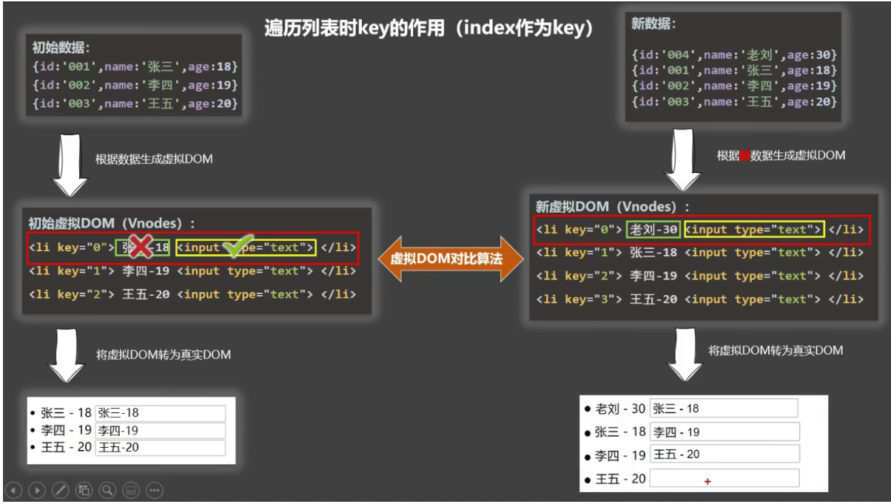
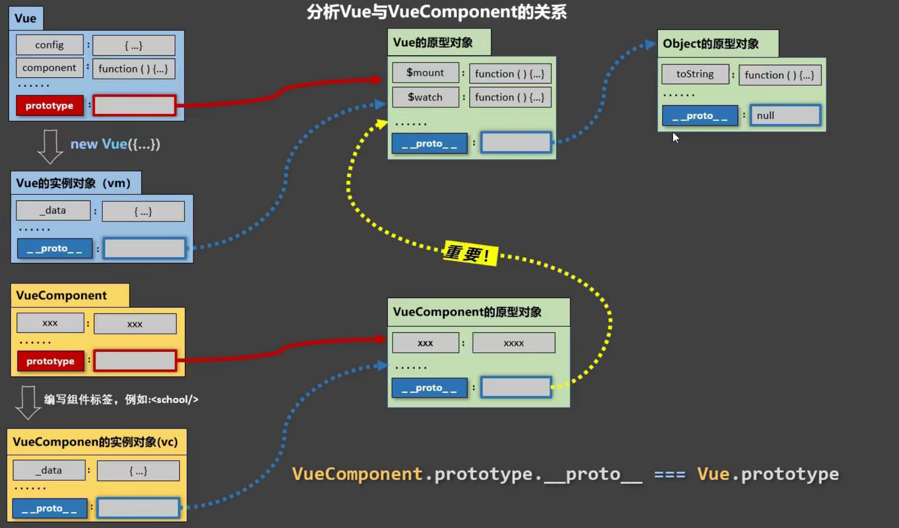
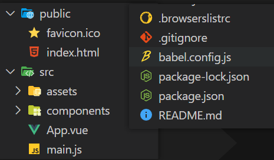
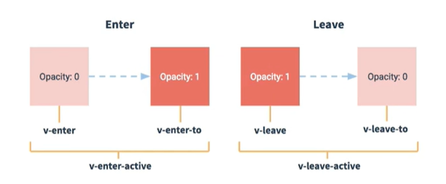
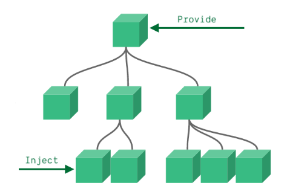

学习资源

[尚硅谷Vue2+3](https://www.bilibili.com/video/BV1Zy4y1K7SH/)


# Vue核心

## vue简介

- 一套用于构建用户界面的**渐进式**JavaScript框架


### vue的特点

- 采用组件化模式，提高代码复用率，且让代码更好维护
- 声明式编码，让编码人员无需直接操作DOM，提高开发效率



- 使用虚拟DOM+优秀的Diff算法，尽量复用DOM节点

### 与其他JS框架的关联

- 借鉴 Angular 的模板和数据绑定技术
- 借鉴 React 的组件化和虚拟 DOM 技术

### 周边库

- vue-cli: vue 脚手架
- vue-resource
- axios 
- vue-router: 路由 
- vuex: 状态管理 
- element-ui: 基于 vue 的 UI 组件库(PC 端）

## 初体验Vue

- 想让Vue工作，就必须创建一个Vue实例，且要传入一个配置对象；
- root容器里的代码依然符合html规范，只不过混入了一些特殊的Vue语法；
- root容器里的代码被称为【Vue模板】；
- **Vue实例和容器是一一对应的**；
- 真实开发中只有一个Vue实例，并且会配合着组件一起使用；
- {{xxx}}中的xxx要写**js表达式**，且xxx可以自动读取到data中的所有属性；
- 一旦data中的数据发生改变，那么**页面**中用到该数据的地方也会自动更新；

注意区分：**js表达式 和 js代码****(语句)**

1.表达式：**一个表达式会产生一个值**，可以放在任何一个需要值的地方：

- (1). a
- (2). a+b
-  (3). demo(1)
- (4). x === y ? 'a' : 'b'

2.js代码(语句)

- (1). if(){}
- (2). for(){}        

```html
<body>
    <!-- 准备好一个容器 -->
    <div id="demo">
        <h1>Hello，{{name.toUpperCase()}}，{{address}}</h1>
    </div>

    <script type="text/javascript" >
        Vue.config.productionTip = false //阻止 vue 在启动时生成生产提示。

        //创建Vue实例
        new Vue({
            el:'#demo', //el用于指定当前Vue实例为哪个容器服务，值通常为css选择器字符串。
            data:{ //data中用于存储数据，数据供el所指定的容器去使用，值我们暂时先写成一个对象。
                name:'atguigu',
                address:'广州'
            }
        })
    </script>
</body>
```

## 模板语法

Vue模板语法有2大类：

### 1、插值语法

- 功能：用于解析标签体内容
- 写法：{{xxx}}，xxx是js表达式，且可以直接读取到data中的所有属性

### 2、指令语法

- 功能：用于解析标签（包括：标签属性、标签体内容、绑定事件.....）
- *举例：v-bind:href="xxx" 或  简写为 :href="xxx"，xxx同样要写js表达式，且可以直接读取到data中的所有属性
- v-bind 可以简写为 ：
- 备注：Vue中有很多的指令，且形式都是：v-????，此处我们只是拿v-bind举个例子

```html
<body>
    <!-- 准备好一个容器-->
    <div id="root">
        <h1>插值语法</h1>
        <h3>你好，{{name}}</h3>
        <hr/>
        <h1>指令语法</h1>
        <!-- 大写-->
        <a v-bind:href="school.url.toUpperCase()" x="hello">点我去{{school.name}}学习1</a>
        <a :href="school.url" x="hello">点我去{{school.name}}学习2</a>
    </div>
</body>

<script type="text/javascript">
    Vue.config.productionTip = false //阻止 vue 在启动时生成生产提示。

    new Vue({
        el:'#root',
        data:{
            name:'jack',
            school:{
                name:'尚硅谷',
                url:'http://www.atguigu.com',
            }
        }
    })
</script>
```

## 数据绑定

Vue中有2种数据绑定的方式：

### 1、单向绑定(v-bind)

- 语法：`v-bind:href ="xxx"` 或简写为 `:hre = "xxx"`

- 数据只能从data流向页面

### 2、双向绑定(v-model)

- 语法：`v-mode:value="xxx"` 或简写为 `v-model="xxx"`

- 数据不仅能从data流向页面，还可以从页面流向data
- `v-model`只能应用在**表单类元素（输入类元素）**

```html
<body>
    <!-- 准备好一个容器-->
    <div id="root">
        <!-- 普通写法 -->
        <!-- 单向数据绑定：<input type="text" v-bind:value="name"><br/>
        双向数据绑定：<input type="text" v-model:value="name"><br/> -->

        <!-- 简写 -->
        单向数据绑定：<input type="text" :value="name"><br/>
        双向数据绑定：<input type="text" v-model="name"><br/>

        <!-- 如下代码是错误的，因为v-model只能应用在表单类元素（输入类元素）上 -->
        <!-- <h2 v-model:x="name">你好啊</h2> -->
    </div>
</body>

<script type="text/javascript">
    Vue.config.productionTip = false //阻止 vue 在启动时生成生产提示。

    new Vue({
        el:'#root',
        data:{
            name:'尚硅谷'
        }
    })
</script>
```

### data与el的2种写法

#### 1、el有2种写法

(1).new Vue时候配置el属性。

(2).先创建Vue实例，随后再通过vm.$mount('#root')指定el的值

#### 2、data有2种写法

(1).对象式

(2).函数式	后面学到组件时，必须使用函数式

> 重要的原则：由Vue管理的函数，一定不要写**箭头函数**，一旦写了箭头函数，this就不再是Vue实例了。

```html
<script type="text/javascript">
    //el的两种写法
    /* const v = new Vue({
        //el:'#root', //第一种写法
        data:{
            name:'尚硅谷'
        }
    })
    console.log(v)
    v.$mount('#root') //第二种写法 */

    //data的两种写法
    new Vue({
        el:'#root',
        //data的第一种写法：对象式
        /* data:{
            name:'尚硅谷'
        } */

        //data的第二种写法：函数式
        data(){
            console.log('@@@',this) //此处的this是Vue实例对象
            return{
                name:'尚硅谷'
            }
        }
    })
</script>
```

### MVVM模型

- M：模型(Model) ：对应 data 中的数据 
- V：视图(View) ：模板 
- VM：视图模型(ViewModel) ： Vue 实例对象



- data中所有的属性，最后都出现在了vm身上(创建Vue实例时用wm接收)
- **vm身上所有的属性 及 Vue原型上所有属性，在Vue模板中都可以直接使用**

## 数据代理

#### `Object.defineProperty()` 的使用

```js
let person = {
  name: 'Vue',
  sex: 'none',
}
let number = 19

// 配置一
// 参数：对象、属性名、配置
Object.defineProperty(person, 'age', {
  // 属性值
  value: 21,
  // 属性是否可修改
  writable: true,
  // 属性是否可枚举（遍历）
  enumerable: true,
  // 属性是否可删除
  configurable: true,
})

Object.keys(person)

// 配置二
// getter、setter 不能和 value、writable 同时指定
Object.defineProperty(person, 'age', {
  enumberable: true,
  configurable: true,

  //当有人读取person的age属性时，get函数(getter)就会被调用，且返回值就是age的值
  get() {
    console.log('age 属性被读取')
    return number
  }
  //当有人修改person的age属性时，set函数(setter)就会被调用，且会收到修改的具体值
  set(value) {
    console.log('age 属性被修改', value)
    number = value
  }
})
```

### 何为数据代理

- 数据代理：通过一个对象对另一个对象的属性进行操作

```js
let obj = { a: 21 }
let obj2 = { b: 10 }

Object.defineProperty(obj2, 'a', {
  get() {
    return obj.a
  }
  set(value) {
    obj.a = value
  }
})

obj2.a // 21
obj2.a = 1000
obj.a // 1000
```

### Vue 中的数据代理

#### 1.Vue中的数据代理：

- 通过vm对象来代理data对象中属性的操作（读/写）

#### 2.Vue中数据代理的好处：

- 更加方便的操作data中的数据

#### 3.基本原理：

- 通过Object.defineProperty()把data对象中所有属性添加到vm上。

- 为每一个添加到vm上的属性，都指定一个getter/setter。

- 在getter/setter内部去操作（读/写）data中对应的属性。



- Vue 中通过 vm 实例对象代理对 data 对象属性的操作，让我们更方便操作 data 中的数据。

- data 中的数据实际上被存在 `vm._data` 属性上，如果不进行代理，使用起来很不方便。

- 通过 `Object.defineProperty()` 给 vm 添加属性，并且指定 getter 和 setter，通过 getter 和 setter 访问和修改 data 对应是属性。

## 事件处理 

### 事件的基本使用

- 使用v-on:xxx 或 @xxx 绑定事件，其中xxx是事件名；

- 事件的回调需要配置在methods对象中，最终会在vm上；

- methods中配置的函数，不要用箭头函数！否则this就不是vm了；

- methods中配置的函数，都是被Vue所管理的函数，this的指向是vm 或 组件实例对象；

- @click="demo" 和 @click="demo($event)" 效果一致，但后者可以传参；

```html
<body>
    <!-- 准备好一个容器-->
    <div id="root">
        <h2>欢迎来到{{name}}学习</h2>
        <!-- <button v-on:click="showInfo">点我提示信息</button> -->
        <button @click="showInfo1">点我提示信息1（不传参）</button>
        // 默认事件形参: event	隐含属性对象: $event  占位，否则传参的时候会把event搞丢
        <button @click="showInfo2($event,66)">点我提示信息2（传参）</button>
    </div>
</body>

<script type="text/javascript">
    Vue.config.productionTip = false //阻止 vue 在启动时生成生产提示。

    const vm = new Vue({
        el:'#root',
        data:{
            name:'尚硅谷',
        },
        methods:{
            showInfo1(event){
                // console.log(event.target.innerText)
                // console.log(this) //此处的this是vm
                alert('同学你好！')
            },
            showInfo2(event,number){
                console.log(event,number)
                // console.log(event.target.innerText)
                // console.log(this) //此处的this是vm
                alert('同学你好！！')
            }
        }
    })
</script>
```

- 如果事件处理函数没有传参，则默认会传一个时间参数对象 `$event` ，通过它可以获取触发事件的元素，并进行相关操作。

- 如果事件处理函数传递参数了，则默认的 `$event` 会被覆盖，需要手动进行传递。

### 事件修饰符

| 事件修饰符   | 说明                                                   |
| ------------ | ------------------------------------------------------ |
| **.prevent** | 阻止默认行为，如 a 链接跳转、表单提交                  |
| **.stop**    | 阻止事件冒泡                                           |
| .once        | 绑定的事件只触发 1 次                                  |
| .capture     | 以捕获模式触发事件处理函数                             |
| .self        | 只有在 `event.target` 是当前元素自身时触发事件处理函数 |
| .passive     | 事件的默认行为立即执行，无需等待事件回调执行完毕       |

```html
<body>
    <!-- 准备好一个容器-->
    <div id="root">
        <h2>欢迎来到{{name}}学习</h2>
        <!-- 阻止默认事件（常用） -->
        <a href="http://www.atguigu.com" @click.prevent="showInfo">点我提示信息</a>

        <!-- 阻止事件冒泡（常用） -->
        <div class="demo1" @click="showInfo">
            <button @click.stop="showInfo">点我提示信息</button>
            <!-- 修饰符可以连续写 -->
            <!-- <a href="http://www.atguigu.com" @click.prevent.stop="showInfo">点我提示信息</a> -->
        </div>

        <!-- 事件只触发一次（常用） -->
        <button @click.once="showInfo">点我提示信息</button>

        <!-- 使用事件的捕获模式 -->
        <div class="box1" @click.capture="showMsg(1)">
            div1
            <div class="box2" @click="showMsg(2)">
                div2
            </div>
        </div>

        <!-- 只有event.target是当前操作的元素时才触发事件； -->
        <div class="demo1" @click.self="showInfo">
            <button @click="showInfo">点我提示信息</button>
        </div>

 <!-- .passive ：如 `onwheel` 鼠标滚轮事件，是先执行事件的回调再进行滚动。 -->
<!-- 如果回调比较耗时，那么会等一段时间才发生滚动。 添加 .passive 后，则先进行滚动再执行回调。-->
        <!-- 事件的默认行为立即执行，无需等待事件回调执行完毕； -->
        <ul @wheel.passive="demo" class="list">
            <li>1</li>
            <li>2</li>
            <li>3</li>
            <li>4</li>
        </ul>

    </div>
</body>


```

### 按键修饰符

#### 1、Vue中常用的按键别名：

- 回车 => enter

- 删除 => delete (捕获“删除”和“退格”键)

- 退出 => esc

- 空格 => space

- 换行 => tab (特殊，必须配合keydown去使用)

- 上 => up

- 下 => down

- 左 => left

- 右 => right

#### 2、 Vue未提供别名的按键

- 可以使用按键原始的key值去绑定，但注意要转为kebab-case（短横线命名）

#### 3、系统修饰键（用法特殊）：ctrl、alt、shift、meta

- 配合keyup使用：按下修饰键的同时，再按下其他键，随后释放其他键，事件才被触发。

- 配合keydown使用：正常触发事件。

#### 4、也可以使用keyCode去指定具体的按键（不推荐）

#### 5、Vue.config.keyCodes.自定义键名 = 键码

- 可以去定制按键别名

#### 6、修饰符可以连续写

```html
<input type="text" @keyup.enter="submit" />
<input type="text" @keyup.esc="back" />
<input type="text" @keydown.tab="showInfo" />
<input type="text" @keyup.caps-lock="showInfo" />

<input type="text" @keyup.huiche="showInfo" />
<input type="text" @keyup.13="showInfo" />
<script>
  Vue.config.keyCodes.huiche = 13
</script>
```

## 计算属性

### 插值语法实现

```html
<body>
    <!-- 准备好一个容器-->
    <div id="root">
        姓：<input type="text" v-model="firstName"> <br/><br/>
        名：<input type="text" v-model="lastName"> <br/><br/>
        全名：<span>{{firstName}}-{{lastName}}</span>
    </div>
</body>

<script type="text/javascript">
    new Vue({
        el:'#root',
        data:{
            firstName:'张',
            lastName:'三'
        }
    })
</script>
```

### methods实现

```html
<body>
    <!-- 准备好一个容器-->
    <div id="root">
        姓：<input type="text" v-model="firstName"> <br/><br/>
        名：<input type="text" v-model="lastName"> <br/><br/>
        全名：<span>{{fullName()}}</span>
    </div>
</body>

<script type="text/javascript">
    new Vue({
        el:'#root',
        data:{
            firstName:'张',
            lastName:'三'
        },
        methods: {
            fullName(){
                console.log('@---fullName')
                return this.firstName + '-' + this.lastName
            }
        },
    })
</script>
```

### 计算属性computed实现

**计算属性：**

#### 1.定义

- 要用的属性不存在，要通过已有属性计算得来。

#### 2.原理

- 底层借助了Objcet.defineproperty方法提供的getter和setter。

#### 3.get函数什么时候执行？

- 初次读取时会执行一次。

- 当**依赖的数据**发生改变时会被再次调用。

#### 4.优势

- 与methods实现相比，内部有缓存机制（复用），效率更高，调试方便。

#### 5.备注

- 计算属性最终会出现在**vm**上，直接读取使用即可。

- 如果计算属性要被修改，那必须写**set函数去响应修改**，且set中要引起计算时依赖的数据发生改变。

```html
<body>
    <!-- 准备好一个容器-->
    <div id="root">
        姓：<input type="text" v-model="firstName"> <br/><br/>
        名：<input type="text" v-model="lastName"> <br/><br/>
        全名：<span>{{fullName}}</span> <br/><br/>
    </div>
</body>

<script type="text/javascript">
    Vue.config.productionTip = false //阻止 vue 在启动时生成生产提示。

    const vm = new Vue({
        el:'#root',
        data:{
            firstName:'张',
            lastName:'三',
        },
        computed:{
            fullName:{
                //get有什么作用？当有人读取fullName时，get就会被调用，且返回值就作为fullName的值
                //get什么时候调用？1.初次读取fullName时。2.所依赖的数据发生变化时。
                get(){
                    console.log('get被调用了')
                    // console.log(this) //此处的this是vm
                    return this.firstName + '-' + this.lastName
                },
                //set什么时候调用? 当fullName被修改时。
                set(value){
                    console.log('set',value)
                    const arr = value.split('-')
                    this.firstName = arr[0]
                    this.lastName = arr[1]
                }
            }
        }
    })
</script>
```

#### **简写**

- 只读不修改
- 对象格式变成了函数格式，但fullName依旧是一个属性值

```
//简写
fullName(){
    console.log('get被调用了')
    return this.firstName + '-' + this.lastName
}
```

## 侦听器watch

`watch` 侦听器允许开发者监视数据的变化，针对数据的变化做特定的操作

### 侦听器watch

1、当被监视的属性变化时, 回调函数自动调用, 进行相关操作

2、监视的属性必须存在，才能进行监视！！

3、监视的两种写法：

- new Vue时传入watch配置（明确要监视哪个）

- 通过vm.$watch监视（未明确要监视哪个，用户自己添加）

```html
<body>
	<!-- 准备好一个容器-->
	<div id="root">
		<h2>今天天气很{{info}}</h2>
		<button @click="changeWeather">切换天气</button>
	</div>
</body>

<script type="text/javascript">
	Vue.config.productionTip = false //阻止 vue 在启动时生成生产提示。

	const vm = new Vue({
		el: '#root',
		data: {
			isHot: true,
		},
		computed: {
			info() {
				return this.isHot ? '炎热' : '凉爽'
			}
		},
		methods: {
			changeWeather() {
				this.isHot = !this.isHot
			}
		},
		watch: {
			isHot: {
				immediate: true, //初始化时让handler调用一下
				//handler什么时候调用？当isHot发生改变时。
				handler(newValue, oldValue) {
					console.log('isHot被修改了', newValue, oldValue)
				}
			}
		}
	})

	vm.$watch('isHot', {
		immediate: true, //初始化时让handler调用一下
		//handler什么时候调用？当isHot发生改变时。
		handler(newValue, oldValue) {
			console.log('isHot被修改了', newValue, oldValue)
		}
	})
</script>
```

- 默认情况下，组件在初次加载完毕后不会调用 `watch` 侦听器。如果想让 `watch` 侦听器立即被调用，需要使用 `immediate` 选项

### 深度监视

```js
const vm = new Vue({
	el:'#root',
	data:{
		isHot:true,
		numbers:{
			a:1,
			b:1,
		}
	},
	computed:{
		info(){
			return this.isHot ? '炎热' : '凉爽'
		}
	},
	methods: {
		changeWeather(){
			this.isHot = !this.isHot
		}
	},
	watch:{
		isHot:{
			// immediate:true, //初始化时让handler调用一下
			//handler什么时候调用？当isHot发生改变时。
			handler(newValue,oldValue){
				console.log('isHot被修改了',newValue,oldValue)
			}
		},
		//监视多级结构中某个属性的变化
		'numbers.a':{	// 这里一定要加引号，否则会报错，因为a不属于wm的属性，number才算
			handler(){
				console.log('a被改变了')
			}
		} 
		//监视多级结构中所有属性的变化
		numbers:{
			deep:true,	// 默认为false，需要修改才能运用
			handler(){
				console.log('numbers改变了')
			}
		}
	}
})
```

### 简写

只有hadler() 才能简写

```js
watch:{
	//正常写法
	/* isHot:{
		// immediate:true, //初始化时让handler调用一下
		// deep:true,//深度监视
		handler(newValue,oldValue){
			console.log('isHot被修改了',newValue,oldValue)
		}
	}, */
	//简写
	isHot(newValue,oldValue){
		console.log('isHot被修改了',newValue,oldValue,this)
	}
}

//正常写法
vm.$watch('isHot',{
	immediate:true, //初始化时让handler调用一下
	deep:true,//深度监视
	handler(newValue,oldValue){
		console.log('isHot被修改了',newValue,oldValue)
	}
})

//简写
vm.$watch('isHot',function(newValue,oldValue){
	console.log('isHot被修改了',newValue,oldValue,this)
})
```

### watch和computed区别

1.computed能完成的功能，watch都可以完成。

2.watch能完成的功能，computed不一定能完成，例如：watch可以进行异步操作。

**两个重要的小原则**：

1.所有被Vue管理的函数，最好写成普通函数，这样**this的指向才是vm 或 组件实例对象**。

2.所有**不被Vue所管理的函数**（定时器的回调函数、`ajax`的回调函数等、`Promise`的回调函数），最好写成箭头函数，这样**this的指向才是vm 或 组件实例对象**。

## class与style绑定

通过动态绑定 `class` 属性和行内 `style` 样式，可动态操作元素样式。

### 动态绑定 class 类名

写法——:class="xxx" xxx可以是字符串、对象、数组

- 字符串写法：类名不确定，要动态获取
- 对象写法：要绑定多个样式，个数不确定，名字也不确定
- 数组写法：要绑定多个样式，个数确定，名字也确定，但不确定用不用

```css
<style>
  .happy {
    ...;
  }
  .sad {
    ...;
  }
</style>
```

```html
<div class="basic" :class="mood" @click="changeMood">字符串写法</div>
<div class="basic" :class="arr">数组写法</div>
<div class="basic" :class="classObj">对象写法</div>
```

```js
export default {
  data() {
    return {
      mood: 'happy',
      arr: ['happy', 'sad'],
      classObj: {
        happy: true,
        sad: false,
      },
    }
  },
  methods: {
    changeMood() {
      this.mood = 'sad'
    },
  },
}
```

### 动态绑定 style 样式

- `css` 属性名既可以用驼峰形式，也能用短横线形式（需要使用引号括起来）
- :style="{fontSize: xxx}"其中xxx是动态值
- :style="[a,b]"其中a、b是样式对象

```html
<div :style="{color: active, fontSize: fsize + 'px', 'background-color': bgcolor}">对象写法</div>
<div :style="styleObj">对象写法</div>

<div :style="[styleObj, styleObj2]">数组写法（用得少）</div>
```

```js
data() {
  return {
    active: 'red',
    fsize: 30,
    bgcolor: 'yellow',
    styleObj: {
      color: 'active',
      'font-size': '20px'
    },
    styleObj2: {
      backgroundColor: 'yellow'
    }
  }
}
```

## 条件渲染

### 基础用法

- v-if可以和:v-else-if、v-else一起使用，但要求结构不能被“打断”
- 使用v-if的时，元素可能无法获取到，而使用v-show一定可以获取到
- `template`模板 不会破坏结构

```html
<p v-if="status === 200">success</p>
<p v-else-if="status === 201">xxx</p>
<p v-else>yyy</p>

<p v-show="status === 404">error</p>

<!-- template 只能和 v-if 搭配使用 -->
<template v-if="status === 200">
  <p>111</p>
  <p>222</p>
  <p>333</p>
</template>
```

### v-if 和 v-show 的区别

实现原理不同：

- `v-if` 通过创建或删除 DOM 元素来控制元素的显示与隐藏
- `v-show` 通过添加或删除元素的 `style="display: none"` 样式来控制元素的显示与隐藏

性能消耗不同：

- `v-if` 切换开销更高，如果运行时条件很少改变，使用 `v-if` 更好
- `v-show` 初始渲染开销更高，如果切换频繁，使用 `v-show` 更好

## 列表渲染

### v-for指令

- 用于展示列表数据

- 语法：v-for="(item, index) in xxx" :key="yyy"

- 可遍历：数组、对象、字符串（用的很少）、指定次数（用的很少）

```html
<!-- 遍历数组 -->
<h2>人员列表（遍历数组）</h2>
<ul>
	<li v-for="(p,index) of persons" :key="index">
		{{p.name}}-{{p.age}}
	</li>
</ul>
<!-- 遍历对象 -->
<h2>汽车信息（遍历对象）</h2>
<ul>
	<li v-for="(value,k) of car" :key="k">
		{{k}}-{{value}}
	</li>
</ul>

<!-- 遍历字符串 -->
<h2>测试遍历字符串（用得少）</h2>
<ul>
	<li v-for="(char,index) of str" :key="index">
		{{char}}-{{index}}
	</li>
</ul>

<!-- 遍历指定次数 -->
<h2>测试遍历指定次数（用得少）</h2>
<ul>
	<li v-for="(number,index) of 5" :key="index">
		{{index}}-{{number}}
	</li>
</ul>
```

### key的作用和原理

#### 1、**`key` 的作用：**

- 当列表的数据变化时，默认情况下，vue 会尽可能的**复用已存在的 DOM 元素**，从而提升渲染的性能。但这种默认的性能优化策略，会导致有状态的列表无法被正确更新。
- 为了给 vue 一个提示，以便它能**跟踪每个节点的身份**，从而在保证有状态的列表被正确更新的前提下，提升渲染的性能。此时，`key` 的作用：
  - 当列表的数据变化时，默认情况下，vue 会尽可能的复用已存在的 DOM 元素，从而提升渲染的性能。但这种默认的性能优化策略，会导致有状态的列表无法被正确更新。
  - 为了给 vue 一个提示，以便它能跟踪每个节点的身份，从而在保证有状态的列表被正确更新的前提下，提升渲染的性能。此时，需要为每项提供一个唯一的 key 属性。
  - `key` 是虚拟 DOM 对象的标识，可提高页面更新渲染的效率。当数据变化时，Vue 会根据新数据生成新的虚拟 DOM，随后进行新旧虚拟 DOM 的差异比较

#### 2、**比较规则diff**

- 旧虚拟 DOM 找到和新虚拟 DOM **相同的 key**：
  - 若内容没变，直接复用真实 DOM
  - 若内容改变，生成新的真实 DOM，替换旧的真实 DOM
- 旧虚拟 DOM 未找到和新虚拟 DOM **相同的 key**：
  - 创建新的真实 DOM，渲染到页面

#### 3、index作为key可能会引发的问题

1、若对数据进行：逆序添加、逆序删除等破坏顺序操作

- 会产生没有必要的真实DOM更新 ==> 界面效果没问题, 但效率低。

2、如果结构中还包含输入类的DOM

- 会产生错误DOM更新 ==> 界面有问题。

#### 4、**`key` 的注意事项：**

- key 的值只能是**字符串**或**数字**类型
- key 的值必须具有唯一性（即：key 的值不能重复）
- 建议把**数据项 id 属性**的值作为 key 的值（因为 id 属性的值具**有唯一性**）
- 使用 i**ndex 的值**当作 key 的值没有意义（因为 index 的值不具有**唯一性**）
- 建议使用 v-for 指令时一定要**指定 key 的值**（既提升性能、又防止列表状态紊乱）



## 列表过滤

### wacth实现

```js
new Vue({
    el:'#root',
    data:{
        keyWord:'',
        persons:[
            {id:'001',name:'马冬梅',age:19,sex:'女'},
            {id:'002',name:'周冬雨',age:20,sex:'女'},
            {id:'003',name:'周杰伦',age:21,sex:'男'},
            {id:'004',name:'温兆伦',age:22,sex:'男'}
        ],
        filPerons:[]
    },
    watch:{
        keyWord:{
            immediate:true,
            handler(val){
                this.filPerons = this.persons.filter((p)=>{
                    return p.name.indexOf(val) !== -1
                })
            }
        }
    }
})
```

### computed实现

```js
new Vue({
    el:'#root',
    data:{
        keyWord:'',
        persons:[
            {id:'001',name:'马冬梅',age:19,sex:'女'},
            {id:'002',name:'周冬雨',age:20,sex:'女'},
            {id:'003',name:'周杰伦',age:21,sex:'男'},
            {id:'004',name:'温兆伦',age:22,sex:'男'}
        ]
    },
    computed:{
        filPerons(){
            return this.persons.filter((p)=>{
                return p.name.indexOf(this.keyWord) !== -1
            })
        }
    }
}) 
```

### 列表排序

```js
new Vue({
    el:'#root',
    data:{
        keyWord:'',
        sortType:0, //0原顺序 1降序 2升序
        persons:[
            {id:'001',name:'马冬梅',age:30,sex:'女'},
            {id:'002',name:'周冬雨',age:31,sex:'女'},
            {id:'003',name:'周杰伦',age:18,sex:'男'},
            {id:'004',name:'温兆伦',age:19,sex:'男'}
        ]
    },
    computed:{
        filPerons(){
            const arr = this.persons.filter((p)=>{
                return p.name.indexOf(this.keyWord) !== -1
            })
            //判断一下是否需要排序
            if(this.sortType){
                arr.sort((p1,p2)=>{
                    return this.sortType === 1 ? p2.age-p1.age : p1.age-p2.age
                })
            }
            return arr
        }
    }
}) 
```

## Vue 监测数据的原理

- 监测数据，即 Vue 是如何监听数据发生变化，从而重新解析模板渲染页面的。Vue 会监测 data 中所有层级的数据。

### Vue 监测对象数据

- 原理：通过 `Object.defineProperty()` 为属性添加 `getter`、`setter` ，对属性的读取、修改进行拦截，即**数据劫持**   
- 存在问题：
  - 对象新增加的属性，默认不做响应式处理
  - 对象删除属性，也不是响应式的 
- 解决办法，使用如下API
  - `Vue.set(target, propertyName/index, value)`
  - `vm.$set(target, propertyName/index, value)`
  - `Vue.delete(target, propertyName/index)`
  - `vm.$delete(target, propertyName/index)`
- `Vue.set()` 和 `vm.$set()` 不能给 vm 或 vm 的根数据对象添加属性（即 data）

### 模拟数据监测

```js
let data = {
    name:'尚硅谷',
    address:'北京',
}

//创建一个监视的实例对象，用于监视data中属性的变化
const obs = new Observer(data)		
console.log(obs)	

//准备一个vm实例对象
let vm = {}
vm._data = data = obs

function Observer(obj){
    //汇总对象中所有的属性形成一个数组
    const keys = Object.keys(obj)
    //遍历
    keys.forEach((k)=>{
        Object.defineProperty(this,k,{
            get(){
                return obj[k]
            },
            set(val){
                console.log(`${k}被改了，我要去解析模板，生成虚拟DOM.....我要开始忙了`)
                obj[k] = val
            }
        })
    })
}
```

### Vue 监测数组

- 原理：通过重写数组的 API 实现拦截：`push()、pop()、shift()、unshift()、splice()、sort()、reverse()`
- 7 个 API 之所以是响应式的，是因为 Vue 对这些方法进行了包裹 ，即二次封装。做了两件事：调用对应的原生方法更新数组 、重新解析模板更新页面
- 存在问题：
  - 直接通过数组下标修改是非响应式的
- 解决办法：
  - 使用 7 个 API 修改数组
  - `Vue.set()`、`vm.$set()`
  - `Vue.delete()`、`vm.$delete()`

## 收集表单数据

### 文本框

```html
<input type="text" v-model="account">
```

- 则v-model收集的是value值，用户输入的就是value值

### 密码框

```html
<input type="password" v-model="userInfo.password">
```

- 则v-model收集的是value值，用户输入的就是value值

### 单选按钮

```html
<input type="radio" name="sex" v-model="userInfo.sex" value="male">
<input type="radio" name="sex" v-model="userInfo.sex" value="female">
```

- 则v-model收集的是value值，且要给标签配置value值，不然传给vm的是一个布尔类型数据

### 复选框

```html
<input type="checkbox" v-model="userInfo.hobby" value="study">
<input type="checkbox" v-model="userInfo.hobby" value="game">
<input type="checkbox" v-model="userInfo.hobby" value="eat">
```

- 没有配置input的value属性，那么收集的就是checked（勾选 or 未勾选，是布尔值）

- 配置input的value属性:
  - v-model的初始值是非数组，那么收集的就是checked（勾选 or 未勾选，是布尔值）
  - v-model的初始值是数组，那么收集的的就是value组成的数组

### v-model的三个修饰符

- lazy：失去焦点再收集数据
- number：输入字符串转为有效的数字
- trim：输入首尾空格过滤

```html
<body>
    <!-- 准备好一个容器-->
    <div id="root">
        <form @submit.prevent="demo">
            // 输入首尾空格过滤
            账号：<input type="text" v-model.trim="userInfo.account"> <br/><br/>
            密码：<input type="password" v-model="userInfo.password"> <br/><br/>
            // 输入字符串转为有效的数字 type 也要写成 number
            年龄：<input type="number" v-model.number="userInfo.age"> <br/><br/>
            性别：
            男<input type="radio" name="sex" v-model="userInfo.sex" value="male">
            女<input type="radio" name="sex" v-model="userInfo.sex" value="female"> <br/><br/>
            爱好：
            学习<input type="checkbox" v-model="userInfo.hobby" value="study">
            打游戏<input type="checkbox" v-model="userInfo.hobby" value="game">
            吃饭<input type="checkbox" v-model="userInfo.hobby" value="eat">
            <br/><br/>
            所属校区
            <select v-model="userInfo.city">
                <option value="">请选择校区</option>
                <option value="beijing">北京</option>
                <option value="shanghai">上海</option>
                <option value="shenzhen">深圳</option>
                <option value="wuhan">武汉</option>
            </select>
            <br/><br/>
            其他信息：
            // 失去焦点再收集数据
            <textarea v-model.lazy="userInfo.other"></textarea> <br/><br/>
            <input type="checkbox" v-model="userInfo.agree">阅读并接受<a href="http://www.atguigu.com">《用户协议》</a>
            <button>提交</button>
        </form>
    </div>
</body>

<script type="text/javascript">
    new Vue({
        el:'#root',
        data:{
            userInfo:{
                account:'',
                password:'',
                age:18,
                sex:'female',
                hobby:[],
                city:'beijing',
                other:'',
                agree:''
            }
        },
        methods: {
            demo(){
                console.log(JSON.stringify(this.userInfo))
            }
        }
    })
</script>
```

## 过滤器

- 过滤器常用于文本的格式化，可用在插值表达式和 `v-bind` 属性绑定。
- 过滤器只在 `vue 2.x` 和 `vue 1.x` 中支持，`vue 3.x` 废弃了过滤器，官方建议使用计算属性或方法代替过滤器。

#### 定义

- 对要显示的数据进行特定格式化后再显示（适用于一些简单逻辑的处理）。

#### 语法

- 注册过滤器：Vue.filter(name,callback) 或 new Vue{filters:{}}

- 使用过滤器：{{ xxx | 过滤器名}}  或  v-bind:属性 = "xxx | 过滤器名"

#### 备注

- 过滤器也可以接收额外参数、多个过滤器也可以串联

- 并没有改变原本的数据, 是产生新的对应的数据

```html
<!-- 在 JS 表达式尾部通过管道符进行调用-->
<p>{{ message | capitalize }}</p>

<div :id="rawId | formatId"></div>
```

```js
// 定义私有过滤器	局部
filters: {
  capitalize(str) {
    return str.charAt(0).toUpperCase() + str.slice(1)
  }
}
```

```js
// 在 main.js 中定义全局过滤器
Vue.filter('capitalize', (str) => {
  return str.charAt(0).toUpperCase() + str.slice(1)
})
```

如果私有过滤器和全局过滤器冲突，按照就近原则调用私有过滤器。

### 连续调用多个过滤器

过滤器从左往右调用，前一个过滤器的结果交给下一个过滤器继续处理。

```html
<p>{{ text | capitalize | maxLength }}</p>
```

### 过滤器传参

```html
<p>{{ message | myFilter(arg1, arg2) }}</p>
```

```js
// 第一个参数永远都是管道符前的值
Vue.filter('myFilter', (value, arg1, arg2) => {
  ...
})
```

## 内置指令与自定义指令

### 内置指令

- v-bind   : 单向绑定解析表达式, 可简写为 :xxx

- v-model : 双向数据绑定

- v-for  : 遍历数组/对象/字符串

- v-on   : 绑定事件监听, 可简写为@

- v-if     : 条件渲染（动态控制节点是否存存在）

- v-else  : 条件渲染（动态控制节点是否存存在）

- v-show  : 条件渲染 (动态控制节点是否展示)

#### v-text

- `v-text` 指令会覆盖元素默认值

```html
<p v-text="username">这段内容会被覆盖</p>
```

```js
data() { return { username: "Bruce" } }
```

####  v-html

> v-html 存在安全问题

```html
<p v-html="desc">原本内容被覆盖</p>
```

```js
data() {
  return {
    desc: '<h1 style="color: red">红色标题</h1>'，
    str: '<a href="http://www.baidu.com?"+document.cookie>兄弟我找到你想要的资源了，快来！</a>'
  }
}
```

#### v-cloak

- 本质是一个特殊属性，Vue 实例创建完毕并接管容器后，会删除 `v-cloak` 属性
- 使用 CSS 配合 `v-cloak` 可解决网速慢时页面展示的问题

```css
[v-cloak] {
    display: none;
}
```

```html
<h2 v-cloak>{{ username }}</h2>
```

#### v-once

- `v-once` 所在节点初次渲染后就成为静态内容
- 即数据变化不会引起 `v-once` 所在节点内容的更新，可用于优化性能

```html
<h2 v-once>初次的内容：{{ content }}</h2>
<h2>最新的内容：{{ content }}</h2>
```

#### v-pre

- 跳过所在节点的编译过程
- 没有使用插值语法等特殊语法的节点，可用其跳过编译过程，加快编译

```html
<h2 v-pre>Vue 内置指令</h2>
<p>用户名：{{ username }}</p>
```

### 自定义指令

- 需求1：定义一个v-big指令，和v-text功能类似，但会把绑定的数值放大10倍。

- 需求2：定义一个v-fbind指令，和v-bind功能类似，但可以让其所绑定的input元素默认获取焦点。

### 1、定义语法

#### 1、局部指令

```js
new Vue({ new Vue({
	directives:{指令名:配置对象} 
	或 
	directives{指令名:回调函数}
})})
```

#### 2、全局指令

```js
Vue.directive(指令名,配置对象) 或 Vue.directive(指令名,回调函数)
```

### 2、配置对象中常用的3个回调

- bind：指令与元素成功绑定时调用。

- inserted：指令所在元素被插入页面时调用。

- update：指令所在模板结构被重新解析时调用。

### 3、备注：

1. 指令定义时不加v-，但使用时要加v-
2. 指令名如果是多个单词，要使用kebab-case命名方式，不要用camelCase命名
3. `this ` 指向是window

```js
//定义全局指令
Vue.directive('fbind',{
    //指令与元素成功绑定时（一上来）
    bind(element,binding){
        element.value = binding.value
    },
    //指令所在元素被插入页面时
    inserted(element,binding){
        element.focus()
    },
    //指令所在的模板被重新解析时
    update(element,binding){
        element.value = binding.value
    }
})

new Vue({
    el:'#root',
    data:{
        name:'尚硅谷',
        n:1
    },
    directives:{
        //big函数何时会被调用？1.指令与元素成功绑定时（一上来）。2.指令所在的模板被重新解析时。
        /* 'big-number'(element,binding){
            // console.log('big')
            element.innerText = binding.value * 10
        }, */
        big(element,binding){
            console.log('big',this) //注意此处的this是window
            // console.log('big')
            element.innerText = binding.value * 10
        },
        fbind:{
            //指令与元素成功绑定时（一上来）
            bind(element,binding){
                element.value = binding.value
            },
            //指令所在元素被插入页面时
            inserted(element,binding){
                element.focus()
            },
            //指令所在的模板被重新解析时
            update(element,binding){
                element.value = binding.value
            }
        }
    }
})
```

## 生命周期

### 生命周期

1.又名：生命周期回调函数、生命周期函数、生命周期钩子。

2.是什么：Vue在关键时刻帮我们调用的一些特殊名称的函数。

3.生命周期函数的名字不可更改，但函数的具体内容是程序员根据需求编写的。

4.生命周期函数中的this指向是vm 或 组件实例对象。

```js
Vue.config.productionTip = false //阻止 vue 在启动时生成生产提示。
		
new Vue({
   el:'#root',
   data:{
       a:false,
       opacity:1
   },
   methods: {
       
   },
   //Vue完成模板的解析并把初始的真实DOM元素放入页面后（挂载完毕）调用mounted
   mounted(){
       console.log('mounted',this)
       setInterval(() => {
           this.opacity -= 0.01
           if(this.opacity <= 0) this.opacity = 1
       },16)
   },
})
```

### 生命周期图示

- 除了图中 8 个钩子，还有 `nextTick`，`activated`，`deactivated`


### 生命周期流程

- 创建
- 挂载
- 更新
- 销毁

### 关于销毁过程

- 销毁后借助 Vue 开发者工具看不到任何信息。
- 销毁后自定义事件会失效，但原生 DOM 事件依然有效。
- 一般不在 `beforeDestroy` 操作数据，因为即便操作数据，也不会再触发更新流程

# Vue组件

## 模块与组件、模块化与组件化

### 模块

-  向外提供特定功能的 js 程序, 一般就是一个 js 文件
- 复用 js, 简化 js 的编写, 提高 js 运行效率

### 组件

- 用来实现局部(特定)功能效果的代码集合(html/css/js/image…..)
- 复用编码, 简化项目编码, 提高运行效率

### 模块化

- 当应用中的 js 都以模块来编写的, 那这个应用就是一个模块化的应用

### 组件化

- 当应用中的功能都是多组件的方式来编写的, 那这个应用就是一个组件化的应用

## 非单文件组件

- 非单文件组件即有n个组件

### 使用步骤

- 定义组件：创建组件
  - 使用 `Vue.extend(options)` 创建，和 `new Vue(options)` 的区别
    - `el` 不写，最终所有的组件都要经过 vm 的管理，由 vm 的 `el` 决定服务哪个容器
    - `data` 必须写成函数，避免组件被复用时，数据存在引用关系
    - 使用 `template` 节点可配置组件结构

- 注册组件
  - 局部注册：`components` 选项
  - 全局注册：`Vue.component('组件名',组件)`
- 使用组件：写组件标签
  - `<school></school>`

```html
<body>
	<div id="root">
		<hello></hello>
		<hr>
		<h1>{{msg}}</h1>
		<hr>
		<!-- 第三步：编写组件标签 -->
		<school></school>
		<hr>
		<!-- 第三步：编写组件标签 -->
		<student></student>
	</div>

	<div id="root2">
		<hello></hello>
	</div>
</body>

<script type="text/javascript">
	Vue.config.productionTip = false

	//第一步：创建school组件
	const school = Vue.extend({
		template: `
				<div class="demo">
					<h2>学校名称：{{schoolName}}</h2>
					<h2>学校地址：{{address}}</h2>
					<button @click="showName">点我提示学校名</button>	
				</div>
			`,
		//组件定义时，一定不要写el配置项，因为最终所有的组件都要被一个vm管理，由vm决定服务于哪个容器。
		// el:'#root', 
		data() {
			return {
				schoolName: '尚硅谷',
				address: '北京昌平'
			}
		},
		methods: {
			showName() {
				alert(this.schoolName)
			}
		},
	})

	//第一步：创建student组件
	const student = Vue.extend({
		template: `
				<div>
					<h2>学生姓名：{{studentName}}</h2>
					<h2>学生年龄：{{age}}</h2>
				</div>
			`,
		data() {
			return {
				studentName: '张三',
				age: 18
			}
		}
	})

	//第一步：创建hello组件
	const hello = Vue.extend({
		template: `
				<div>	
					<h2>你好啊！{{name}}</h2>
				</div>
			`,
		data() {
			return {
				name: 'Tom'
			}
		}
	})

	//第二步：全局注册组件
	Vue.component('hello', hello)

	//创建vm
	new Vue({
		el: '#root',
		data: {
			msg: '你好啊！'
		},
		//第二步：注册组件（局部注册）
		components: {
			school,
			student
		}
	})

	new Vue({
		el: '#root2',
	})
</script>
```

### 注意事项

#### 1、组件名

- 一个单词：school, School
- 多个单词：my-school, MySchool(需要 vue-cli 支持)
- 组件名尽可能回避HTML中已有的元素名称，例如：h2、H2都不行
- 可以使用name配置项指定组件在开发者工具中呈现的名字

#### 2、使用组件

- `<school></school>`
- `<school />` (需要 vue-cli 支持)

3、`const school = Vue.extend(options)` 可简写为 `const school = options`。这是脚手架里 `<script>` 代码的简写来源。

```js
// 完整写法
const vc = Vue.extend({
  name: 'App',
  components: {
    HelloWorld
  }
})

const vs = {
  name: 'App',
  components: {
    HelloWorld
  }
}
```

### 组件的嵌套

```js
//定义student组件
const student = Vue.extend({
    name: 'student',
    template: `
        <div>
            <h2>学生姓名：{{name}}</h2>	
            <h2>学生年龄：{{age}}</h2>	
        </div>
    `,
    data() {
        return {
            name: '尚硅谷',
            age: 18
        }
    }
})

//定义school组件
const school = Vue.extend({
    name: 'school',
    template: `
        <div>
            <h2>学校名称：{{name}}</h2>	
            <h2>学校地址：{{address}}</h2>	
            <student></student>
        </div>
    `,
    data() {
        return {
            name: '尚硅谷',
            address: '北京'
        }
    },
    //注册组件（局部）
    components: {
        student
    }
})

//定义hello组件
const hello = Vue.extend({
    template: `<h1>{{msg}}</h1>`,
    data() {
        return {
            msg: '欢迎来到尚硅谷学习！'
        }
    }
})

//定义app组件 app管理所有的组件，这样vm就只用管理app即可
const app = Vue.extend({
    template: `
        <div>	
            <hello></hello>
            <school></school>
        </div>
    `,
    components: {
        school,
        hello
    }
})

//创建vm
new Vue({
    template: '<app></app>',
    el: '#root',
    //注册组件（局部）
    components: { app }
})
```

### VueComponent 构造函数 

1、组件本质是一个名为 `VueComponent` 的**构造函数**，不是程序员定义的，是 `Vue.extend` 生成的

```js
const school = Vue.extend({...})

console.dir(school) //ƒ VueComponent (options)
```

2、使用组件时，Vue 自动创建组件实例对象，即 `new VueComponent(options)` 是 Vue 做的

3、每次调用 `Vue.extend`，返回的都是一个全新的 `VueComponent` 构造函数

```js
const school = Vue.extend({...})
const student = Vue.extend({...})

console.log(school === student) // false
```

4、组件的 `this` 指向 **`VueComponent` 实例对象**，而非 **Vue 实例对象**

5、重要的内置关系：`VueComponent.prototype.__proto__ === Vue.prototype` ，这个改动使得**组件实例对象得以访问 Vue 原型上的属性方法**




6、**Vue的实例对象——vm**	**VueComponent的实例对象——vc**

## 单文件组件

- 单文件组件即只有一个组件，即`.vue` 文件

# Vue-CLI	脚手架

## 初始化脚手架

### 创建Vue项目

- 全局安装 vue 脚手架：`npm i -g @vue/cli`
- 创建项目：`vue create project-name`
- 运行项目：`npm run serve`
- 暴露 webpack 配置：`vue inspect > output.js`

### Vue 脚手架项目结构

```
├── node_modules
├── public
│ ├── favicon.ico: 页签图标
│ └── index.html: 主页面
├── src
│ ├── assets: 存放静态资源
│ │ └── logo.png
│ │── component: 存放组件
│ │ └── HelloWorld.vue
│ │── App.vue: 汇总所有组件
│ │── main.js: 入口文件
├── .gitignore: git 版本管制忽略的配置
├── babel.config.js: babel 的配置文件
├── package.json: 应用包配置文件
├── README.md: 应用描述文件
├── package-lock.json：包版本控制文件
```



`index.html` 代码分析：

```html
<!DOCTYPE html>
<html lang="">
  <head>
    <meta charset="utf-8" />
    <!-- 针对IE浏览器的一个特殊配置，含义是让IE浏览器以最高的渲染级别渲染页面 -->
    <meta http-equiv="X-UA-Compatible" content="IE=edge" />
    <!-- 开启移动端的理想视口 -->
    <meta name="viewport" content="width=device-width,initial-scale=1.0" />
    <!-- <%= BASE_URL %> 表示 public 文件夹路径 -->
    <link rel="icon" href="<%= BASE_URL %>favicon.ico" />
    <!-- 拿 package-lock.json 的 name 作为标题 -->
    <title><%= htmlWebpackPlugin.options.title %></title>
  </head>
  <body>
    <!-- 当浏览器不支持js时noscript中的元素就会被渲染 -->
    <noscript>
      <strong>We're sorry but <%= htmlWebpackPlugin.options.title %> doesn't work properly without JavaScript enabled. Please enable it to continue.</strong>
    </noscript>
    <!-- 容器 -->
    <div id="app"></div>
    <!-- built files will be auto injected -->
  </body>
</html>
```

### 不同版本的 Vue 与 `render` 函数

1、`vue.js` 与 `vue.runtime.xxx.js` 的区别：

- `import Vue from 'vue'` 默认导入 `vue.runtime.esm.js`
- `vue.js` 是完整版的 Vue，包含：核心功能 + 模板解析器
- `vue.runtime.xxx.js` 是**运行版的 Vue**，只包含核心功能，没有模板解析器

2、`vue.runtime.xxx.js` 没有模板解析器，故不能使用 `template` 配置项，需使用 `render` 函数接收到的 `createElement` 函数去指定具体内容

```js
import Vue from 'vue'
import App from './App.js'
Vue.config.productionTip = false

new Vue({
  render: h => h(App),
}).$mount('#app')

// render()
render: function(createElement) {
  // 创建元素
  return createElement('h1', 'Hello Vue')
}
render: createElement => createElement(App)
```

### vue.config.js 配置文件

1. 使用 `vue inspect > output.js` 可以查看到 Vue 脚手架的默认配置。
2. 使用 `vue.config.js` 可以对脚手架进行个性化定制

## ref 与 props

### ref属性

1. 被用来给元素或子组件**注册引用信息**（id的替代者）
2. 应用在html标签上获取的是真实DOM元素，应用在组件标签上是组件实例对象（vc）
3. 每个 vue 实例都有 `$refs` 对象，里面存储着 DOM 元素或子组件的引用。通过该方式可以获取到 DOM 元素或子组件实例。
4. 使用方式：
    1. 打标识：`<h1 ref="xxx">.....</h1>` 或 `<School ref="xxx"></School>`
    2. 获取：`this.$refs.xxx`

### props配置项

1. 功能：让组件接收外部传过来的数据
2. 传递数据：```<Demo name="xxx"/>```
3. 接收数据：

    1. 第一种方式（只接收）：```props:['name'] ```
    2. 第二种方式（限制类型）：```props:{name:String}```
    3. 第三种方式（限制类型、限制必要性、指定默认值）：


```js
//简单声明接收
props: ['name', 'age', 'sex']

//接收的同时对数据进行类型限制
props: {
    name: String,
    age: Number,
    sex: String
}

//接收的同时对数据：进行类型限制+默认值的指定+必要性的限制
props: {
    name: {
    	type: String, //name的类型是字符串
        required: true, //name是必要的
	},
    age: {
        type: Number,
		default: 99 //默认值
    },
    sex: {
        type: String,
        required: true
    }
}
```

> 备注：props是只读的，Vue底层会监测你对props的修改，如果进行了修改，就会发出警告，若业务需求确实需要修改，那么请复制props的内容到data中一份，然后去修改data中的数据。

## mixin(混入)

1. 功能：可以把多个组件**共用的配置**提取成一个混入对象

2. 使用方式：

    第一步定义混合：

    ```
    {
        data(){....},
        methods:{....}
        ....
    }
    ```

    第二步使用混入：

     全局混入：```Vue.mixin(xxx)```
     局部混入：```mixins:['xxx']  ```

## 插件

1. 功能：用于**增强Vue**

2. 本质：包含install方法的一个对象，install的第一个参数是Vue，第二个以后的参数是插件使用者传递的数据。

3. 定义插件：

    ```js
    对象.install = function (Vue, options) {
        // 1. 添加全局过滤器
        Vue.filter(....)
    
        // 2. 添加全局指令
        Vue.directive(....)
    
        // 3. 配置全局混入(合)
        Vue.mixin(....)
    
        // 4. 添加实例方法 
        Vue.prototype.$myMethod = function () {...}
        Vue.prototype.$myProperty = xxxx
    }
    ```

4. 使用插件：```Vue.use()```

## scoped样式

1. 作用：让样式在**局部生效**，防止冲突。
2. 写法：`<style scoped>`

## TodoList案例

1、组件化编码流程 

(1).拆分静态组件：组件要按照**功能点**拆分，命名不要与html元素冲突。

(2).实现动态组件：考虑好数据的存放位置，数据是一个组件在用，还是一些组件在用：

​      1).一个组件在用：放在组件自身即可。

​      2). 一些组件在用：放在他们共同的父组件上（<span style="color:red">状态提升</span>）。

(3).实现交互：从绑定事件开始。

2、props适用于

(1).父组件 ==> 子组件 通信

(2).子组件 ==> 父组件 通信（要求父先给子**一个函数**）

3、使用v-model时要切记：v-model绑定的值不能是props传过来的值，因为props是不可以修改的！

4、props传过来的若是对象类型的值，修改对象中的属性时Vue不会报错，但不推荐这样做。

## webStorage 浏览器本地存储

1. 存储内容大小一般支持5MB左右（不同浏览器可能还不一样）

2. 浏览器端通过 `Window.sessionStorage` 和 `Window.localStorage` 属性来实现本地存储机制。

3. 相关API：

    1. ```xxxxxStorage.setItem('key', 'value');```
                  该方法接受一个键和值作为参数，会把键值对添加到存储中，如果键名存在，则更新其对应的值。

    2. ```xxxxxStorage.getItem('person');```

          ​    该方法接受一个键名作为参数，返回键名对应的值。

    3. ```xxxxxStorage.removeItem('key');```

          ​    该方法接受一个键名作为参数，并把该键名从存储中删除。

    4. ``` xxxxxStorage.clear()```

          ​    该方法会清空存储中的所有数据。

4. 备注：

    1. SessionStorage存储的内容会**随着浏览器窗口关闭而消失**。
    2. LocalStorage存储的内容，**需要手动清除才会消失**。
    3. ```xxxxxStorage.getItem(xxx)```如果xxx对应的value获取不到，那么getItem的返回值是null。
    4. ```JSON.parse(null)```的结果依然是null。

## 组件的自定义事件

1. 一种**组件间通信**的方式，适用于：<strong style="color:red">子组件 ===> 父组件</strong>

2. 使用场景：A是父组件，B是子组件，B想给A传数据，那么就要在A中给B绑定自定义事件（<span style="color:red">事件的回调在A中</span>）。

3. 绑定自定义事件：

    1. 第一种方式，在父组件中：`<Demo @atguigu="test"/>` 或 `<Demo v-on:atguigu="test"/>`

    2. 第二种方式，在父组件中：

        ```js
        <Demo ref="demo"/>
        ......
        mounted(){
           this.$refs.xxx.$on('atguigu',this.test)
        }
        ```

        ```js
        // App.vue
        mounted() {
        	this.$refs.student.$on('atguigu',this.getStudentName) //绑定自定义事件
         	this.$refs.student.$once('atguigu',this.getStudentName) //绑定自定义事件（一次性）
        }
        ```

    3. 若想让自定义事件只能触发一次，可以使用```once```修饰符，或```$once```方法。

4. 触发自定义事件：```this.$emit('atguigu',数据)```    

5. 解绑自定义事件```this.$off('atguigu')```

6. 组件上也可以绑定原生DOM事件，需要使用```native```修饰符。

7. 注意：通过```this.$refs.xxx.$on('atguigu',回调)```绑定自定义事件时，回调<span style="color:red">要么配置在methods中</span>，<span style="color:red">要么用箭头函数</span>，否则this指向会出问题！this会指向调用这个事件的对象vc

```js
methods: {
    add(){
        console.log('add回调被调用了')
        this.number++
    },
    sendStudentlName(){
        //触发Student组件实例身上的atguigu事件
        this.$emit('atguigu',this.name,666,888,900)
        // this.$emit('demo')
        // this.$emit('click')
    },
    unbind(){
        this.$off('atguigu') //解绑一个自定义事件
        // this.$off(['atguigu','demo']) //解绑多个自定义事件
        // this.$off() //解绑所有的自定义事件
    },
    death(){
        this.$destroy() //销毁了当前Student组件的实例，销毁后所有Student实例的自定义事件全都不奏效。
    }
}
```


## 全局事件总线（GlobalEventBus）

- 一种组件间通信的方式，适用于<span style="color:red">任意组件间通信</span>。

### 1、方法一

1. 安装全局事件总线：

   ```js
   new Vue({
      ......
      beforeCreate() {
         Vue.prototype.$bus = this //安装全局事件总线，$bus就是当前应用的vm
      },
       ......
   }) 
   ```

2. 使用事件总线：

   1. 接收数据：A组件想接收数据，则在A组件中给$bus绑定自定义事件，事件的<span style="color:red">回调留在A组件自身。</span>

      ```js
      methods(){
        demo(data){......}
      }
      ......
      mounted() {
        this.$bus.$on('xxxx',this.demo)
      }
      ```

   2. 提供数据：`this.$bus.$emit('xxxx',数据)`

      ```js
      export default {
        methods: {
          sendData() {
            this.$bus.$emit('share', 666)
          },
        },
      }
      ```

3. 最好在`beforeDestroy`钩子中，用$off去解绑<span style="color:red">当前组件所用到的</span>事件。

   ```js
   export default {
     mounted() {
   	},
     beforeDestroy() {
   	this.$bus.$off('hello')
   	}
   }
   ```


### 2、方法二

1. 创建 eventBus.js 模块，并向外共享一个 Vue 的实例对象。

   ```js
   // eventBus.js
   import Vue from 'vue'
   
   export default new Vue()
   ```

2. 在数据发送方，调用 `bus.$emit('事件名称', 要发送的数据)` 方法触发自定义事件

   ```js
   // 数据发送方
   import bus from './eventBus.js'
   
   export default {
     data() {
       return {
         message: 'hello',
       }
     },
     methods: {
       sendData() {
         bus.$emit('share', this.message)
       },
     },
   }
   ```

3. 在数据接收方，通过 `bus.$on('事件名称', 事件处理函数)` 为自定义事件注册事件处理函数。

   ```js
   // 数据接收方
   import bus from './eventBus.js'
   
   export default {
     data() {
       return {
         msg: '',
       }
     },
     // 细节1：在 created 钩子中注册函数
     created() {
       // 细节2：使用箭头函数，则 this 指向该组件而非 bus
       bus.$on('share', (val) => {
         this.msg = val
       })
     },
   }		
   ```

## 消息订阅与发布（pubsub）

1.   一种组件间通信的方式，适用于<span style="color:red">任意组件间通信</span>。

2. 使用步骤：

   1. 安装pubsub：```npm i pubsub-js```

   2. 引入: ```import pubsub from 'pubsub-js'```

   3. 接收数据：A组件想接收数据，则在A组件中订阅消息，订阅的<span style="color:red">回调留在A组件自身。</span>

      ```js
      import pubsub from 'pubsub-js'
      
      export default {
        methods: {
          handleData(messageName, data) {...}
        },
        mounted() {
          this.pubId = pubsub.subscribe('share', this.handleData)
          // or
          this.pubId = pubsub.subscribe('share', (messageName, data) => {
            console.log(data)
          })
        },
        beforeDestroy() {
          // 组件销毁，取消订阅
          pubsub.unsubscribe(this.pubId)
        }
      }
      ```
   
   4. 提供数据：`pubsub.publish('xxx',数据)`
   
      ```js
      import pubsub from 'pubsub-js'
      
      export default {
        methods: {
          handleData(messageName, data) {...}
        },
        created() {
          this.pubId = pubsub.subscribe('share', this.handleData)
          // or
          this.pubId = pubsub.subscribe('share', (messageName, data) => {
            console.log(data)
          })
        },
        beforeDestroy() {
          // 组件销毁，取消订阅
          pubsub.unsubscribe(this.pubId)
        }
      }
      ```
   
   5. 最好在beforeDestroy钩子中，用```PubSub.unsubscribe(pid)```去<span style="color:red">取消订阅。</span>
   
## nextTick

1. 语法：`this.$nextTick(回调函数)`	**生命周期钩子**
2. 作用：在下一次 DOM 更新结束后执行其指定的回调。
3. 什么时候用：当改变数据后，要基于更新后的新DOM进行某些操作时，要在nextTick所指定的回调函数中执行。
4. 组件的 `$nextTick(cb)` 方法，会把 cb 回调推迟到下一个 DOM 更新周期之后执行，即在 DOM 更新完成后再执行回调，从而保证 cb 回调可以获取最新的 DOM 元素

```js
methods: {
  showInput() {
    this.inputVisible = true
    // 对输入框的操作推迟到 DOM 更新完成之后
    this.$nextTick(() => {
      this.$refs.input.focus()
    })
  }
}
```

## Vue封装的过度与动画

### 1、作用

- 在插入、更新或移除 DOM元素时，在合适的时候给元素添加样式类名。



### 2、写法

1. 准备好样式：

   - 元素进入的样式：
     1. v-enter：进入的起点
     2. v-enter-active：进入过程中
     3. v-enter-to：进入的终点
   - 元素离开的样式：
     1. v-leave：离开的起点
     2. v-leave-active：离开过程中
     3. v-leave-to：离开的终点

   ```css
   .hello-enter-active {
       animation: atguigu 0.5s linear;
   }
   
   .hello-leave-active {
       animation: atguigu 0.5s linear reverse;
   }
   
   /* 动画 */
   @keyframes atguigu {
       from {
           transform: translateX(-100%);
       }
   
       to {
           transform: translateX(0px);
       }
   }
   ```

2. 使用```<transition>```包裹要过度的元素，并配置name属性：

   ```vue
   <transition name="hello">
      <h1 v-show="isShow">你好啊！</h1>
   </transition>
   ```

3. 备注：若有多个元素需要过度，则需要使用：```<transition-group>```，且每个元素都要指定```key```值。

   ```html
   <transition-group name="hello" appear>
       <h1 v-show="!isShow" key="1">你好啊！</h1>
       <h1 v-show="isShow" key="2">尚硅谷！</h1>
   </transition-group>
   ```

### 3、第三方库 Animate.css

- 借助第三方库，可以简单实现动画效果

安装：`npm install animate.css --save`

引入：`import 'animate.css'`

使用：

```html
<transition-group 
    appear
    name="animate__animated animate__bounce" 
    enter-active-class="animate__swing"
    leave-active-class="animate__backOutUp"
>
    <h1 v-show="!isShow" key="1">你好啊！</h1>
    <h1 v-show="isShow" key="2">尚硅谷！</h1>
</transition-group>
```

# Vue中的ajax

## vue脚手架配置代理

### 方法一

  在vue.config.js中添加如下配置：

```js
devServer:{
  proxy:"http://localhost:5000"
}
```

说明：

1. 优点：配置简单，请求资源时直接发给前端（8080）即可。
2. 缺点：不能配置多个代理，不能灵活的控制请求是否走代理。
3. 工作方式：若按照上述配置代理，当请求了前端不存在的资源时，那么该请求会转发给服务器 （优先匹配前端资源）

### 方法二

  编写vue.config.js配置具体代理规则：

```js
module.exports = {
   devServer: {
      proxy: {
      '/api1': {// 匹配所有以 '/api1'开头的请求路径
        target: 'http://localhost:5000',// 代理目标的基础路径
        changeOrigin: true,
        pathRewrite: {'^/api1': ''}	// 将以api1开头的路径变为空
      },
      '/api2': {// 匹配所有以 '/api2'开头的请求路径
        target: 'http://localhost:5001',// 代理目标的基础路径
        changeOrigin: true,	//用于控制请求头中的host值
        pathRewrite: {'^/api2': ''}
        // ws: true, //用于支持websocket
      }
    }
  }
}
/*
   changeOrigin设置为true时，服务器收到的请求头中的host为：localhost:5000
   changeOrigin设置为false时，服务器收到的请求头中的host为：localhost:8080
   changeOrigin默认值为true
*/
```

说明：

1. 优点：可以配置多个代理，且可以灵活的控制请求是否走代理。
2. 缺点：配置略微繁琐，请求资源时必须加前缀。

## 插槽

- 插槽可以理解为组件封装期间，为用户预留的**内容占位符**。它是 vue 为组件封装者提供的能力，允许开发者在封装组件时，把**不确定的、希望由用户指定的部分**定义为插槽。

### 1、作用

- 让父组件可以向子组件指定位置插入html结构，也是一种组件间通信的方式，适用于 <strong style="color:red">父组件 ===> 子组件</strong> 。

### 2、分类

- 默认插槽、具名插槽、作用域插槽

### 3、使用方式

#### 1、默认插槽

```html
<!-- 子组件中预留插槽 -->
<template>
  <div class="contianer">
    <h1>这是子组件</h1>
    <slot></slot>
  </div>
</template>

<!-- 父组件使用子组件时，向插槽填充内容 -->
<child-comp>
  <p>填充到插槽的内容</p>
</child-comp>
```

如果子组件没有预留插槽，那么父组件填充给子组件的自定义内容会被丢弃：

```html
<!-- 子组件没有预留插槽 -->
<template>
  <div class="contianer">
    <h1>这是子组件</h1>
  </div>
</template>

<!-- 父组件的自定义内容会被丢弃 -->
<child-comp>
  <p>这段自定义内容会被丢弃</p>
</child-comp>
```

子组件可以为插槽提供**后备内容**，当父组件没有提供自定义内容时，后备内容就会生效。

```html
<!-- 子组件提供后备内容 -->
<template>
  <div class="contianer">
    <h1>这是子组件</h1>
    <slot>这是后备内容，父组件没有提供自定义内容就会生效</slot>
  </div>
</template>

<!-- 父组件没有提供自定义内容 -->
<child-comp> </child-comp>
```

#### 2、具名插槽

组件在预留插槽时可以设置 `name` 属性，为插槽指定名称，这种有具体名称的插槽就叫具名插槽。 没有设置 `name` 名称的插槽默认名称为 `default` 。

```html
<!-- 子组件预留多个具名插槽 -->
<template>
  <div class="contianer">
    <h1>这是子组件</h1>

    <slot name="title">title 具名插槽</slot>
    <hr />
    <slot name="content">content 具名插槽</slot>>
    <hr />
    <slot>没有设置 name 名称则默认为 default</slot>
    <slot name="default"></slot>
  </div>
</template>
```

父组件向具名插槽提供自定义内容

- 新的写法：包裹一个 `<template>` 标签，同时在 `<template>` 中通过 `v-slot:名称` 指明插槽的名称。简写形式为 `#名称` ，且 `v-slot` 只能使用在 `<template>` 和组件标签上，普通 HTML 标签不行
- 旧的写法：`slot="名称"` 指明插槽名称
- 如果不指定插槽名称，那么自定义内容会被填充到所有的 `default` 插槽当中
- 同一插槽填充多个内容，是追加不是覆盖

```html
<!-- 父组件向具名插槽提供自定义内容 -->
<child-comp>
  <h1 slot="title">《赠汪伦》</h1>

  <template v-slot:title>
    <h1>《静夜思》</h1>
  </template>

  <!-- 简写形式 -->
  <template #content>
    <p>床前明月光，疑是地上霜。</p>
    <p>举头望明月，低头思故乡。</p>
  </template>

  <template>
    <p>这段内容没有指定名称，会被填充到所有 default 插槽中。</p>
  </template>
</child-comp>
```

#### 3、作用域插槽

1、理解：<span style="color:red">数据在组件的自身，但根据数据生成的结构需要组件的使用者来决定。</span>（games数据在Category组件中，但使用数据所遍历出来的结构由App组件决定）

2、具体编码

```html
<!-- 子组件为插槽绑定 props 数据 -->
<template>
  <slot v-for="item in list" :user="item"></slot>
</template>
```

```js
export default {
  data() {
    return {
      list: [
        {
          id: 1,
          name: 'Lily',
          state: true,
        },
        {
          id: 2,
          name: 'Ben',
          state: false,
        },
        {
          id: 3,
          name: 'Water',
          state: true,
        },
      ],
    }
  },
}
```

父组件向插槽提供自定义内容时，可以接收作用域插槽提供的数据：

- 旧写法：`scope="scope"` 、`slot-scope="scope"`
- 新写法：`v-slot:default="scope"`

```html
<child-comp>
  <template #default="scope">
    <p>作用域插槽提供的数据：{{ scope }}</p>
  </template>

  <template slot-scope="scope" slot="default">
    <p>{{ scope }}</p>
  </template>
</child-comp>
```

其中接收到的数据 `scope` 是一个对象。

```js
// scope 的内容
{
  'user': {
    'id': 1,
    'name': 'Lily',
    'state': true
  }
}
```

在接收作用域插槽提供的数据时可以使用解构赋值。

```html
<child-comp>
  <template #default="{user}">
    <p>id：{{ user.id }}</p>
    <p>name：{{ user.name }}</p>
    <p>state：{{ user.state }}</p>
  </template>
</child-comp>
```

# Vuex

## 1.概念

​     在Vue中实现**集中式**状态（数据）管理的一个Vue插件，对vue应用中多个组件的共享状态进行集中式的管理（读/写），也是一种组件间通信的方式，且适用于任意组件间通信。


### state

- Vuex 管理的状态对象
- 唯一的

### actions

- 值为一个对象，包含多个响应用户动作的回调函数
- 通过 `commit()`触发 mutation 中函数的调用，间接更新 state
- 可包含异步代码

### mutations

- 值为一个对象，包含多个直接更新 state 的方法
- 不能写异步代码，只能单纯地操作 state

### getters

- 值为一个对象，包含多个用于返回数据的函数
- 类似于计算属性，getters 返回的数据依赖于 state 的数据

### modules

- 一个 module 是一个 store 的配置对象，与一个组件对应

## 2.何时使用？

- 多个组件需要共享数据时   

## 3.搭建vuex环境

- 安装 Vuex：`npm install vuex@3 --save`

> 注意：Vue2 安装 Vuex3，Vue3 安装 Vuex4，版本需对应。

1. 创建文件：`src/store/index.js`

   ```js
   //引入Vue核心库
   import Vue from 'vue'
   //引入Vuex
   import Vuex from 'vuex'
   //应用Vuex插件
   Vue.use(Vuex)
   
   //准备actions对象——响应组件中用户的动作
   const actions = {}
   //准备mutations对象——修改state中的数据
   const mutations = {}
   //准备state对象——保存具体的数据
   const state = {}
   
   //创建并暴露store
   export default new Vuex.Store({
      actions,
      mutations,
      state
   })
   ```

2. 在```main.js```中创建vm时传入```store```配置项

   ```js
   ......
   //引入store
   import store from './store'
   ......
   
   //创建vm
   new Vue({
      el:'#app',
      render: h => h(App),
      store
   })
   ```

##    4.基本使用

1. 初始化数据、配置```actions```、配置```mutations```，操作文件```store.js```

   ```js
   //引入Vue核心库
   import Vue from 'vue'
   //引入Vuex
   import Vuex from 'vuex'
   //引用Vuex
   Vue.use(Vuex)
   
   const actions = {
       //响应组件中加的动作
      jia(context,value){
         // console.log('actions中的jia被调用了',miniStore,value)
         context.commit('JIA',value)
      },
   }
   
   const mutations = {
       //执行加
      JIA(state,value){
         // console.log('mutations中的JIA被调用了',state,value)
         state.sum += value
      }
   }
   
   //初始化数据
   const state = {
      sum:0
   }
   
   //创建并暴露store
   export default new Vuex.Store({
      actions,
      mutations,
      state,
   })
   ```

2. 组件中读取vuex中的数据：```$store.state.sum```

3. 组件中修改vuex中的数据：```$store.dispatch('action中的方法名',数据)``` 或 ```$store.commit('mutations中的方法名',数据)```

   >  备注：若没有网络请求或其他业务逻辑，组件中也可以越过actions，即不写```dispatch```，直接编写```commit```

## 5.getters的使用

1. 概念：当`state`中的数据需要经过加工后再使用时，可以使用getters加工。

2. 它不是必须的，当加工逻辑复杂且需要复用时，可以考虑使用

3. 在```store.js```中追加```getters```配置

   ```js
   ......
   
   const getters = {
      bigSum(state){
         return state.sum * 10
      }
   }
   
   //创建并暴露store
   export default new Vuex.Store({
      ......
      getters
   })
   ```

4. 组件中读取数据：```$store.getters.bigSum```

## 6.四个map方法的使用

1. **mapState方法**：用于帮助我们映射```state```中的数据为计算属性

   ```js
   computed: {
       //借助mapState生成计算属性：sum、school、subject（对象写法）
        ...mapState({sum:'sum',school:'school',subject:'subject'}),
            
       //借助mapState生成计算属性：sum、school、subject（数组写法）
       ...mapState(['sum','school','subject']),
   },
   ```

2. **mapGetters方法**：帮助我们映射```getters```中的数据为计算属性

   ```js
   computed: {
       //借助mapGetters生成计算属性：bigSum（对象写法）
       ...mapGetters({bigSum:'bigSum'}),
   
       //借助mapGetters生成计算属性：bigSum（数组写法）
       ...mapGetters(['bigSum'])
   },
   ```

3. **mapActions方法：**用于帮助我们生成与```actions```对话的方法，即：包含```$store.dispatch(xxx)```的函数

   ```js
   methods:{
       //靠mapActions生成：incrementOdd、incrementWait（对象形式）
       ...mapActions({incrementOdd:'jiaOdd',incrementWait:'jiaWait'})
   
       //靠mapActions生成：incrementOdd、incrementWait（数组形式）
       ...mapActions(['jiaOdd','jiaWait'])
   }
   ```

4. **mapMutations方法：**用于帮助我们生成与```mutations```对话的方法，即：包含```$store.commit(xxx)```的函数

   ```js
   methods:{
       //靠mapActions生成：increment、decrement（对象形式）
       ...mapMutations({increment:'JIA',decrement:'JIAN'}),
       
       //靠mapMutations生成：JIA、JIAN（对象形式）
       ...mapMutations(['JIA','JIAN']),
   }
   ```

> 备注：mapActions与mapMutations使用时，若需要传递参数需要：在模板中绑定事件时传递好参数，否则参数是事件对象。

## 7、模块化+命名空间

1. 目的：让代码更好维护，让多种数据分类更加明确，每一类数据及其相关操作对应一个 `store` 。

2. 修改```store.js```

   ```javascript
   const countAbout = {
     namespaced:true,//开启命名空间
     state:{x:1},
     mutations: { ... },
     actions: { ... },
     getters: {
       bigSum(state){
          return state.sum * 10
       }
     }
   }
   
   const personAbout = {
     namespaced:true,//开启命名空间
     state:{ ... },
     mutations: { ... },
     actions: { ... }
   }
   
   const store = new Vuex.Store({
     modules: {
       countAbout,
       personAbout
     }
   })
   ```

3. 开启命名空间后，组件中读取state数据：

   ```js
   //方式一：自己直接读取
   this.$store.state.personAbout.list
   //方式二：借助mapState读取：
   ...mapState('countAbout',['sum','school','subject']),
   ```

4. 开启命名空间后，组件中读取getters数据：

   ```js
   //方式一：自己直接读取
   this.$store.getters['personAbout/firstPersonName']
   //方式二：借助mapGetters读取：
   ...mapGetters('countAbout',['bigSum'])
   ```

5. 开启命名空间后，组件中调用dispatch

   ```js
   //方式一：自己直接dispatch
   this.$store.dispatch('personAbout/addPersonWang',person)
   //方式二：借助mapActions：
   ...mapActions('countAbout',{incrementOdd:'jiaOdd',incrementWait:'jiaWait'})
   ```

6. 开启命名空间后，组件中调用commit

   ```js
   //方式一：自己直接commit
   this.$store.commit('personAbout/ADD_PERSON',person)
   //方式二：借助mapMutations：
   ...mapMutations('countAbout',{increment:'JIA',decrement:'JIAN'}),
   ```

 # vue-router 路由

## 1、路由概念

### 1、何为路由

1. 理解： 一个路由（route）就是一组映射关系（key - value），多个路由需要路由器（router）进行管理。
2. key 为路径，value 可能是 function 或 component

### 2、前端路由

前端路由即地址和组件之间的对应关系（以下已哈希模式为例）。

前端路由简易工作方式：

1. 用户点击了页面上的路由链接
2. URL 地址的 Hash 值发生变化
3. 前端路由监听到 Hash 值的变化
4. 前端路由渲染 Hash 地址对应的组件

实现简易的前端路由：

```html
<!-- a 链接添加对应 Hash 值 -->
<a href="#/home">Home</a>
<a href="#/movie">Movie</a>
<a href="#/about">About</a>

<!-- 动态渲染组件 -->
<component :is="compName"></component>
```

```js
export default {
  name: 'App',
  data() {
    return {
      compName: 'Home'
    }
  },
  created() {
    // 监听 Hash 地址改变，切换组件
    window.onhashchange = () => {
      switch(location.hash) {
        case: '#/home':
          this.compName = 'Home'
          break
        case: '#/movie':
          this.compName = 'Movie'
          break
        case: '#/about':
          this.compName = 'About'
          break
      }
    }
  }
}
```

### 3、后端路由

- 后端路由是指请求方式、请求地址与 `function` 处理函数之间的对应关系
- 服务器收到一个请求，根据请求方式、路径匹配对应的函数处理请求，返回响应数据

```js
const express = require('express')
const router = express.Router()

router.get('/userlist', function(req, res) {...})

module.exports = router
```

### 4、单页面应用程序 SPA

单页面应用程序将所有的功能局限于一个 web 页面中，仅在该 web 页面初始化时加载相应的资源（ HTML、JavaScript 和 CSS）。 一旦页面加载完成了，SPA 不会因为用户的操作而进行页面的重新加载或跳转。而是利用 JavaScript 动态地变换 HTML 的内容，从而实现页面与用户的交互。

SPA 的优点：

- 良好的交互体验
  - 内容的改变不需要重新加载整个页面
  - **数据通过 `Ajax` 异步获取**
  - 没有页面跳转，不会出现白屏现象
- 良好的前后盾工作分离模式
  - 后端专注于提供 API 接口，更易实现接口复用
  - 前端专注页面渲染，更利于前端工程化发展
- 减轻服务器压力
  - 服务器只提供数据，不负责页面的合成与逻辑处理，吞吐能力会提高

SPA 的缺点：

- 首屏加载慢：可使用路由**懒加载、代码压缩、CDN 加速、网络传输压缩**
- 不利于 SEO ：**SSR 服务器端渲染**

## 2、基本使用

1. 安装vue-router，命令：`npm i vue-router`
   - 这个要看版本，vue3要4，vue要3，所以下载指定版本

1. 应用插件：```Vue.use(VueRouter)```

2. 创建路由模块，在 `src` 源代码目录下，新建 `router/index.js` 路由模块，初始化代码：

   ```js
   //引入VueRouter
   import VueRouter from 'vue-router'
   //引入Luyou 组件
   import About from '../components/About'
   import Home from '../components/Home'
   
   //创建router实例对象，去管理一组一组的路由规则
   const router = new VueRouter({
      routes:[
         {
            path:'/about',
            component:About
         },
         {
            path:'/home',
            component:Home
         }
      ]
   })
   
   //暴露router
   export default router
   ```

3. 在 `main.js` 文件中导入并挂载路由模块：

   ```js
   import Vue from 'vue'
   import App from './App.vue'
   import router from './router/index.js'
   
   new Vue({
     router,
     render: (h) => h(App),
   }).$mount('#app')
   ```

4. 实现切换（active-class可配置高亮样式）

   ```vue
   <router-link active-class="active" to="/about">About</router-link>
   ```

5. 指定展示位置

   ```vue
   <router-view></router-view>
   ```

### 几个注意点

1. 路由组件通常存放在```pages```文件夹，一般组件通常存放在```components```文件夹。
2. 通过切换，“隐藏”了的路由组件，默认是被销毁掉的，需要的时候再去挂载。
3. 每个组件都有自己的`$route`属性，里面存储着自己的路由信息。
4. 整个应用只有一个`router`，可以通过组件的`$router`属性获取到。

## 3.多级路由（多级路由）

1. 配置路由规则，使用children配置项：

   ```js
   routes:[
      {
         path:'/about',
         component:About,
      },
      {
         path:'/home',
         component:Home,
         children:[ //通过children配置子级路由
            {
               path:'news', //此处一定不要写：/news
               component:News
            },
            {
               path:'message',//此处一定不要写：/message
               component:Message
            }
         ]
      }
   ]
   ```

2. 跳转（要写完整路径）：

   ```vue
   <router-link to="/home/news">News</router-link>
   ```

## 4、路由传参

### 1、路由的query参数

#### 1、传递参数 

```vue
<!-- 跳转并携带query参数，to的字符串写法 -->
<router-link :to="/home/message/detail?id=666&title=你好">跳转</router-link>
            
<!-- 跳转并携带query参数，to的对象写法 -->
<router-link 
   :to="{
      path:'/home/message/detail',
      query:{
         id:666,
            title:'你好'
      }
   }"
>跳转</router-link>
```

#### 2、接收参数

```js
$route.query.id
$route.query.title
```

### 2、命名路由

#### 1、作用：

- 可以简化路由的跳转。

#### 2、如何使用

##### 1、给路由命名

```js
{
   path:'/demo',
   component:Demo,
   children:[
      {
         path:'test',
         component:Test,
         children:[
            {
               name:'hello' //给路由命名
               path:'welcome',
               component:Hello,
            }
         ]
      }
   ]
}
```

##### 2、简化跳转

```vue
<!--简化前，需要写完整的路径 -->
<router-link to="/demo/test/welcome">跳转</router-link>

<!--简化后，直接通过名字跳转 -->
<router-link :to="{name:'hello'}">跳转</router-link>

<!--简化写法配合传递参数 -->
<router-link 
   :to="{
      name:'hello',
      query:{
         id:666,
            title:'你好'
      }
   }"
>跳转</router-link>
```

### 3、路由的params参数

#### 1、配置路由，声明接收params参数

```js
{
   path:'/home',
   component:Home,
   children:[
      {
         path:'news',
         component:News
      },
      {
         component:Message,
         children:[
            {
               name:'xiangqing',
               path:'detail/:id/:title', //使用占位符声明接收params参数
               component:Detail
            }
         ]
      }
   ]
}
```

#### 2、传递参数

```vue
<!-- 跳转并携带params参数，to的字符串写法 -->
<router-link :to="/home/message/detail/666/你好">跳转</router-link>
            
<!-- 跳转并携带params参数，to的对象写法 -->
<router-link 
   :to="{
      name:'xiangqing',
      params:{
         id:666,
         title:'你好'
      }
   }"
>跳转</router-link>
```

> 特别注意：路由携带params参数时，若使用to的对象写法，则不能使用path配置项，必须**使用name配置**！

#### 3、接收参数

```js
$route.params.id
$route.params.title
```

### 4、路由的props配置

  作用：让路由组件更方便的收到参数

```js
{
   name:'xiangqing',
   path:'detail/:id',
   component:Detail,

   //第一种写法：props值为对象，该对象中所有的key-value的组合最终都会通过props传给Detail组件
   // props:{a:900}

   //第二种写法：props值为布尔值，布尔值为true，则把路由收到的所有params参数通过props传给Detail组件
   // props:true
   
   //第三种写法：props值为函数，该函数返回的对象中每一组key-value都会通过props传给Detail组件
   props(route){
      return {
         id:route.query.id,
         title:route.query.title
      }
   }
}
```

### 5、`<router-link>`的replace属性

1. 作用：控制路由跳转时操作浏览器历史记录的模式
2. 浏览器的历史记录有两种写入方式：分别为```push```和`replace`，`push`是追加历史记录，`replace`是替换当前记录。路由跳转时候默认为`push`
3. 如何开启`replace`模式：`<router-link replace .......>News</router-link>`

## 5、编程式路由导航

声明式导航：

- 通过点击链接实现导航
- 如普通网页点击 `a` 链接，`vue` 点击 `<router-link>`

编程式导航：

- 通过调用 API 实现导航
- 普通网页通过 `location.href` 的方式跳转页面也是编程式导航

`vue-router` 中实现编程式导航的 API ：

- `this.$router.push('hash地址')` ：跳转到指定页面，并增加一条历史记录
- `this.$router.replace('hash地址')` ：跳转页面，但不会新增历史记录，而是替换当前的历史记录
- `this.$router.go(数值)` ：历史记录前进或后退，相当于点击浏览器前进后退箭头
- `this.$router.forward()` ：前进一步
- `this.$router.back()` ：后退一步

### 1、作用

- 不借助```<router-link> ```实现路由跳转，让路由跳转更加灵活

### 2、具体编码

```js
//$router的两个API
this.$router.push({
   name:'xiangqing',
      params:{
         id:xxx,
         title:xxx
      }
})

this.$router.replace({
   name:'xiangqing',
      params:{
         id:xxx,
         title:xxx
      }
})
this.$router.forward() //前进
this.$router.back() //后退
this.$router.go() //可前进也可后退
```

## 6、缓存路由组件

1. 作用：让不展示的路由组件保持挂载，不被销毁。

2. 具体编码： `include`   是组件名

   ```vue
   <keep-alive include="News"> 
       <router-view></router-view>
   </keep-alive>
   ```

## 7、两个新的生命周期钩子

1. 作用：路由组件所独有的两个钩子，用于捕获路由组件的激活状态。
2. 具体名字：
   1. ```activated```路由组件被激活时触发。
   2. ```deactivated```路由组件失活时触发。

## 8、路由元信息 meta

在 `meta` 中可以为路由添加自定义信息：

```js
const routes = [
  {
    name: 'about',
    path: '/about',
    component: About,
    meta: { title: 'hello', isAuth: true },
  },
]
```

## 9、路由守卫

### 1、作用

- 对路由进行权限控制

### 2、分类：

**全局守卫、独享守卫、组件内守卫**

### 3、全局守卫

- 全局前置守卫：`beforeEach()`
- 全局后置守卫：`afterEach()`

守卫回调函数 3 个形参：

- `to` ：将要访问的路由的信息对象，即 `$route`
- `from` ：将要离开的路由的信息对象
- `next` ：放行函数（后置守卫没有）

`next` 函数 3 种调用方式：

- 直接放行：`next()`
- 强制跳转到其他路由：`next(/login)`
- 阻止本次跳转：`next(false)`

```js
//全局前置守卫：初始化时执行、每次路由切换前执行
router.beforeEach((to,from,next)=>{
   console.log('beforeEach',to,from)
   if(to.meta.isAuth){ //判断当前路由是否需要进行权限控制
      if(localStorage.getItem('school') === 'atguigu'){ //权限控制的具体规则
         next() //放行
      }else{
         alert('暂无权限查看')
         // next({name:'guanyu'})
      }
   }else{
      next() //放行
   }
})

//全局后置守卫：初始化时执行、每次路由切换后执行
router.afterEach((to,from)=>{
   console.log('afterEach',to,from)
   if(to.meta.title){ 
      document.title = to.meta.title //修改网页的title
   }else{
      document.title = 'vue_test'
   }
})
```

### 4、独享守卫

- 某一条路由规则独享的守卫
- 独享守卫只一个，没有后置守卫

```js
{
    path: 'about',
    component: About,
    beforeEnter(to,from,next){
       console.log('beforeEnter',to,from)
       if(to.meta.isAuth){ //判断当前路由是否需要进行权限控制
          if(localStorage.getItem('school') === 'atguigu'){
             next()
          }else{
             alert('暂无权限查看')
             // next({name:'guanyu'})
          }
       }else{
          next()
       }
    }
}
```

### 5、组件内守卫：

```js
//进入守卫：通过路由规则，进入该组件时被调用
beforeRouteEnter (to, from, next) {
},
//离开守卫：通过路由规则，离开该组件时被调用
beforeRouteLeave (to, from, next) {
}
```

### 6、各个守卫执行顺序

从 `About` 组件通过路由规则进入 `Home` 组件：

```bash
About-beforeRouteLeave
beforeEach
Home-beforeEnter
Home-beforeRouteEnter
afterEach
Home组件生命周期开始
```

### 7、路由器的两种工作模式

1. 对于一个url来说，什么是hash值？—— #及其后面的内容就是hash值。
2. hash值不会包含在 HTTP 请求中，即：hash值不会带给服务器。
3. **hash模式**：
   1. 地址中永远带着#号，不美观 。
   2. 若以后将地址通过第三方手机app分享，若app校验严格，则地址会被标记为不合法。
   3. 兼容性较好。
4. **history模式**：
   1. 地址干净，美观 。
   2. 兼容性和hash模式相比略差。
   3. 应用部署上线时需要后端人员支持，解决刷新页面服务端404的问题。
   

```vue
const router = new VueRouter {
	mode:'history',
	rote:[
		...
	]
}
```

## 10、vue-router 4.x

目前 `vue-router` 有 `3.x` 和 `4.x` 两个版本，前者只能在 `vue2.x` 中使用，后者只能在 `vue3.x` 中使用。

下面是 `vue-router 4.x` 初体验：

安装 `vue-router 4.x` ：

```text
npm install vue-router@next -S
```

创建路由模块：

```js
// 从 vue-router 按需导入两个方法
// createRouter：创建路由实例对象
// createWebHashHistory：指定路由工作模式为 hash 模式
import { createRouter, createWebHashHistory } from 'vue-router'

const router = createRouter({
  history: createWebHashHistory(),
  routes: [{ path: '/home', component: Home }],
})

export default router
```

`main.js` 导入并挂载路由模块：

```js
import { createApp } from 'vue'
import App from './App.vue'
import './index.css'

const app = createApp(App)

app.use(router)
app.mount('#app')
```

# Vue UI组件库

### 移动端常用 UI 组件库

1、Vant https://youzan.github.io/vant 

2、Cube UI https://didi.github.io/cube-ui 

3、Mint UI http://mint-ui.github.io

### PC 端常用 UI 组

1、Element UI https://element.eleme.cn 

2、IView UI https://www.iviewui.co

# Vue3

## Vue3快速上手


### 1.Vue3简介

- 2020年9月18日，Vue.js发布3.0版本，代号：One Piece（海贼王）
- 耗时2年多、[2600+次提交](https://github.com/vuejs/vue-next/graphs/commit-activity)、[30+个RFC](https://github.com/vuejs/rfcs/tree/master/active-rfcs)、[600+次PR](https://github.com/vuejs/vue-next/pulls?q=is%3Apr+is%3Amerged+-author%3Aapp%2Fdependabot-preview+)、[99位贡献者](https://github.com/vuejs/vue-next/graphs/contributors) 
- github上的tags地址：https://github.com/vuejs/vue-next/releases/tag/v3.0.0

### 2.Vue3带来了什么

#### 1.性能的提升

- 打包大小减少41%

- 初次渲染快55%, 更新渲染快133%

- 内存减少54%

  ......

#### 2.源码的升级

- 使用Proxy代替defineProperty实现响应式

- 重写虚拟DOM的实现和Tree-Shaking

  ......

#### 3.拥抱TypeScript

- Vue3可以更好的支持TypeScript

#### 4.新的特性

1. Composition API（组合API）

   - setup配置
   - ref与reactive
   - watch与watchEffect
   - provide与inject
   - ......
2. 新的内置组件
   - Fragment 
   - Teleport
   - Suspense
3. 其他改变

   - 新的生命周期钩子
   - data 选项应始终被声明为一个函数
   - 移除keyCode支持作为 v-on 的修饰符
   - ......

## 1、创建Vue3.0工程

### 1.使用 vue-cli 创建

官方文档：https://cli.vuejs.org/zh/guide/creating-a-project.html#vue-create

```bash
## 查看@vue/cli版本，确保@vue/cli版本在4.5.0以上
vue --version
## 安装或者升级你的@vue/cli
npm install -g @vue/cli
## 创建
vue create vue_test
## 启动
cd vue_test
npm run serve
```

### 2.使用 vite 创建

官方文档：https://v3.cn.vuejs.org/guide/installation.html#vite

vite官网：https://vitejs.cn

- 什么是vite？—— 新一代前端构建工具。
- 优势如下：
  - 开发环境中，无需打包操作，可快速的冷启动。
  - 轻量快速的热重载（HMR）。
  - 真正的按需编译，不再等待整个应用编译完成。
- 传统构建 与 vite构建对比图


```bash
## 创建工程
npm init vite-app <project-name>
## 进入工程目录
cd <project-name>
## 安装依赖
npm install
## 运行
npm run dev
```

### 3、Vue3 项目结构

Vue3 中 `main.js` 代码有所改变：

```js
// 不再引入 Vue 构造函数，而是引入 createApp 工厂函数
// createApp函数：创建 vue 的 SPA 实例
import { createApp } from 'vue'
import App from './App.vue'

// 创建应用实例对象
const app = createApp(App)
app.mount('#app')
```

Vue3 支持定义多个根节点，组件的 `<template>` 支持定义多个根节点：

```html
<template>
  <h1>根节点</h1>
  <h1>根节点</h1>
</template>
```

## 2、常用 Composition API	组合式api

官方文档: https://v3.cn.vuejs.org/guide/composition-api-introduction.html

### 1.拉开序幕的setup

- setup 是 Vue3 中一个新的配置项，值为函数
- 组件中使用的数据、方法等都要配置在 setup 中
- setup 函数两种返回值：
  - 返回一个对象，对象中的属性、方法可在模板中直接使用
  - 返回一个渲染函数，可自定义渲染内容
- setup 函数的参数：
  - props：值为对象，包含了组件外部传进来，且组件内部声明接收的属性
  - context：上下文对象
    - `attrs`：值为对象，包含了组件外部传进来，且组件内部没有声明接收的属性，相当于 `this.$attrs`
    - `slots`：收到的插槽内容，相当于 `this.$slots`
    - `emit`：触发自定义事件的函数，相当于 `this.$emit`

```js
import { h } from 'vue'

export default {
  name: 'App',
  props: ['title'],
  // Vue3 需要声明自定义事件，虽然不声明也能运行
  emits: ['changeCount'],

  // 返回函数
  /*
  setup() {
    return () => h('h1', 'Hello')
  },
  */

  // 返回对象
  setup(props, context) {
    let name = 'Vue3'
    function sayHello() {}
    function test() {
      context.emit('changeCount', 888)
    }

    return {
      name,
      sayHello,
      test,
    }
  },
}
```

- etup 在 `beforeCreate` 钩子之前执行，`this` 为 `undefined`
- setup 不要和 Vue2 配置混用。Vue2 的配置可以访问到 setup 的属性方法，反过来不行；如有重名，setup 优先
- setup 不能是 async 函数，因为 async 函数返回的是 promise 不是对象，会导致模板无法访问属性方法
- 若要返回 promise 实例，需要 `Suspense` 和异步组件的配合

###  2.ref函数

- 作用: 定义一个响应式的数据
- 语法: ```const xxx = ref(initValue)``` 
  - 创建一个包含响应式数据的<strong style="color:#DD5145">引用对象（reference对象，简称ref对象）</strong>。
  - JS中操作数据： ```xxx.value```
  - 模板中读取数据: 不需要.value，直接：```<div>{{xxx}}</div>```
- 备注：
  - 接收的数据可以是：基本类型、也可以是**对象类型**。
  - 基本类型的数据：响应式依然是靠``Object.defineProperty()``的```get```与```set```完成的。
  - 对象类型的数据：内部 <i style="color:gray;font-weight:bold">“ 求助 ”</i> 了Vue3.0中的一个新函数—— ```reactive```函数。
  - 对象类型数据使用 ES6 的 `Proxy` 实现响应式，Vue3 把相关操作封装在 `reactive` 函数中
  - 按照之前的办法，对于对象数据，应该遍历每一层的属性添加 `getter` 、`setter`，但 Vue3 使用 Proxy 把内部数据一口气监测了

```html
<h2>{{ name }}</h2>
<p>{{ jobInfo.type }}</p>
```

```js
import { ref } from 'vue'

export default {
  setup() {
    let name = ref('Vue3')
    let jobInfo = ref({
      type: 'frontend',
      salary: '40w',
    })

    function changeInfo() {
      name.value = '鱿鱼丝'
      // jobInfo 是 RefImpl 实例
      // jobInfo.value 是 Proxy 实例对象
      jobInfo.value.salary = '50w'
    }

    return {
      name,
      jobInfo,
      changeInfo,
    }
  },
}
```

### 3.reactive函数

- 作用: 定义一个<strong style="color:#DD5145">对象类型</strong>的响应式数据（基本类型不要用它，要用```ref```函数）
- 语法：```const 代理对象= reactive(源对象)```接收一个对象（或数组），返回一个<strong style="color:#DD5145">代理对象（Proxy的实例对象，简称proxy对象）</strong>
- reactive定义的响应式数据是“**深层次的**”。
- 内部基于 ES6 的 Proxy 实现，通过**代理对象**操作源对象内部数据进行操作。

```js
import { reactive } from 'vue'

export default {
  setup() {
    let person = reactive({
      name: 'Vue3',
      sex: 'unknown',
      info: {
        school: 'Oxford',
        major: 'computer',
      },
    })

    let color = reactive(['red', 'green', 'blue'])

    function changeInfo() {
      person.info.major = 'art'
      color[0] = 'yellow'
    }

    return {
      person,
      color,
      changeInfo,
    }
  },
}
```

### 4.Vue3.0中的响应式原理

#### vue2.x的响应式

- 实现原理：

  - 对象类型：通过```Object.defineProperty()```对属性的读取、修改进行拦截（数据劫持）。

  - 数组类型：通过重写更新数组的一系列方法来实现拦截。（对数组的变更方法进行了包裹）。

    ```js
    Object.defineProperty(data, 'count', {
        get () {}, 
        set () {}
    })
    ```

- 存在问题：

  - 新增属性、删除属性, 界面不会更新。
  - 直接通过下标修改数组, 界面不会自动更新。

#### Vue3.0的响应式

- 实现原理: 

  - 通过**Proxy（代理）**:  **拦截对象中任意属性的变化**, 包括：属性值的读写、属性的添加、属性的删除等。

  - 通过**Reflect（反射）**:  对源对象的属性进行操作。

  - MDN文档中描述的Proxy与Reflect：

    - Proxy：https://developer.mozilla.org/zh-CN/docs/Web/JavaScript/Reference/Global_Objects/Proxy

    - Reflect：https://developer.mozilla.org/zh-CN/docs/Web/JavaScript/Reference/Global_Objects/Reflect


```js
new Proxy(data, {
	// 拦截读取属性值	target:源对象	prop:属性
    get (target, prop) {
    	return Reflect.get(target, prop)
    },
    // 拦截设置属性值或添加新属性
    set (target, prop, value) {
    	return Reflect.set(target, prop, value)
    },
    // 拦截删除属性
    deleteProperty (target, prop) {
    	return Reflect.deleteProperty(target, prop)
    }
})

proxy.name = 'tom'
```

### 5.reactive对比ref

-  从定义数据角度对比：
   -  ref用来定义：<strong style="color:#DD5145">基本类型数据</strong>。
   -  reactive用来定义：<strong style="color:#DD5145">对象（或数组）类型数据</strong>。
   -  备注：ref也可以用来定义<strong style="color:#DD5145">对象（或数组）类型数据</strong>, 它内部会自动通过```reactive```转为<strong style="color:#DD5145">代理对象</strong>。
-  从原理角度对比：
   -  ref通过``Object.defineProperty()``的```get```与```set```来实现响应式（数据劫持）。
   -  reactive通过使用<strong style="color:#DD5145">Proxy</strong>来实现响应式（数据劫持）, 并通过<strong style="color:#DD5145">Reflect</strong>操作<strong style="color:orange">源对象</strong>内部的数据。
-  从使用角度对比：
   -  ref定义的数据：操作数据<strong style="color:#DD5145">需要</strong>```.value```，读取数据时模板中直接读取<strong style="color:#DD5145">不需要</strong>```.value```。
   -  reactive定义的数据：操作数据与读取数据：<strong style="color:#DD5145">均不需要</strong>```.value```。

### 6.setup的两个注意点

- setup执行的时机
  - 在beforeCreate之前执行一次，**this是undefined**。
  - 所以setup拿不到data的数据
  
- setup的参数
  - props：值为对象，包含：组件外部传递过来，且组件内部声明接收了的属性。
  - context：**上下文对象**
    - attrs: 值为对象，包含：组件外部传递过来，但没有在props配置中声明的属性, 相当于 ```this.$attrs```。
    - slots: 收到的插槽内容, 相当于 ```this.$slots```。
    - emit: 分发自定义事件的函数, 相当于 ```this.$emit```。


### 7.计算属性与监视

#### 1.computed函数

- 与Vue2.x中computed配置功能一致

- 写法

  ```js
  import {reavtive,computed} from 'vue'
  
  setup(){
      let person = reavtive({
          firstName: '张',
          lastName: '三'
      })
  	//计算属性——简写（没有考虑计算属性被修改的情况）
      let fullName = computed(()=>{
          return person.firstName + '-' + person.lastName
      })
      
      //也可以作为reactive的一个子项加入
      Person.fullName = computed(()=>{
          return person.firstName + '-' + person.lastName
      })
      //计算属性——完整（考虑到计算属性被修改的情况）
      let fullName = computed({
          get(){
              return person.firstName + '-' + person.lastName
          },
          set(value){
              const nameArr = value.split('-')
              person.firstName = nameArr[0]
              person.lastName = nameArr[1]
          }
      })
  }
  ```

#### 2.watch函数

- 与Vue2.x中watch配置功能一致

- 两个小“坑”：

  - 监视reactive定义的响应式数据时：oldValue无法正确获取、强制开启了深度监视（deep配置失效）。
  - 监视reactive定义的响应式数据中某个属性时：deep配置有效。

  ```js
  //情况一：监视ref定义的响应式数据
  watch(sum,(newValue,oldValue)=>{
  	console.log('sum变化了',newValue,oldValue)
  },{immediate:true})
  
  //情况二：监视多个ref定义的响应式数据
  watch([sum,msg],(newValue,oldValue)=>{
  	console.log('sum或msg变化了',newValue,oldValue)
  }) 
  
  /* 情况三：监视reactive定义的响应式数据
  	若watch监视的是reactive定义的响应式数据，则无法正确获得oldValue！！
  	若watch监视的是reactive定义的响应式数据，则强制开启了深度监视 
  */
  watch(person,(newValue,oldValue)=>{
  	console.log('person变化了',newValue,oldValue)
  },{immediate:true,deep:false}) //此处的deep配置不再奏效
  
  //情况四：监视reactive定义的响应式数据中的某个属性
  watch(()=>person.job,(newValue,oldValue)=>{
  	console.log('person的job变化了',newValue,oldValue)
  },{immediate:true,deep:true}) 
  
  //情况五：监视reactive定义的响应式数据中的某些属性
  watch([()=>person.job,()=>person.name],(newValue,oldValue)=>{
  	console.log('person的job变化了',newValue,oldValue)
  },{immediate:true,deep:true})
  
  //特殊情况
  watch(()=>person.job,(newValue,oldValue)=>{
      console.log('person的job变化了',newValue,oldValue)
  },{deep:true}) //此处由于监视的是reactive所定义的对象中的某个属性，所以deep配置有效
  ```

#### 3.watchEffect函数

- watch的套路是：既要指明监视的属性，也要指明监视的回调。

- watchEffect的套路是：不用指明监视哪个属性，监视的回调中用到哪个属性，那就监视哪个属性。

- watchEffect有点像computed：

  - 但computed注重的计算出来的值（回调函数的返回值），所以必须要写返回值。
  - 而watchEffect更注重的是过程（回调函数的函数体），所以不用写返回值。

  ```js
  //watchEffect所指定的回调中用到的数据只要发生变化，则直接重新执行回调。
  watchEffect(()=>{
      const x1 = sum.value
      const x2 = person.age
      console.log('watchEffect配置的回调执行了')
  })
  ```

### 8.生命周期

vue3的生命周期图:


vue2生命周期图:


- Vue3.0中可以继续使用Vue2.x中的生命周期钩子，但有有两个被更名：
  - `beforeDestroy`改名为 `beforeUnmount`
  - `destroyed`改名为 `unmounted`
- Vue3.0也提供了 Composition API 形式的生命周期钩子，与Vue2.x中钩子对应关系如下：
  - `beforeCreate`===>`setup()`
  - `created`=======>`setup()`
  - `beforeMount` ===>`onBeforeMount`
  - `mounted`=======>`onMounted`
  - `beforeUpdate`===>`onBeforeUpdate`
  - `updated` =======>`onUpdated`
  - `beforeUnmount` ==>`onBeforeUnmount`
  - `unmounted` =====>`onUnmounted`

### 9.自定义hook函数

- 什么是hook？—— 本质是一个函数，把setup函数中使用的Composition API进行了封装。

- 类似于vue2.x中的mixin。

- 自定义hook的优势: 复用代码, 让setup中的逻辑更清楚易懂。

- hook 放在 hooks 文件夹中，一个文件对应一个功能模块，以 `useXxx` 命名


```js
// hooks/usePoint.js
import { reactive, onMounted, onBeforeUnmount } from 'vue'

export default function () {
  //实现鼠标“打点”相关的数据
  let point = reactive({
    x: 0,
    y: 0,
  })

  //实现鼠标“打点”相关的方法
  function savePoint(event) {
    point.x = event.pageX
    point.y = event.pageY
  }

  //实现鼠标“打点”相关的生命周期钩子
  onMounted(() => {
    window.addEventListener('click', savePoint)
  })

  onBeforeUnmount(() => {
    window.removeEventListener('click', savePoint)
  })

  return point
}
```

```js
// 使用 hook
import usePoint from '../hooks/usePoint.js'

export default {
  setup() {
    let point = usePoint()

    return { point }
  },
}
```

### 10.toRef

- 作用：创建一个 ref 对象，其value值指向另一个对象中的某个属性。
- 语法：```const name = toRef(person,'name')```
- 应用:   要将响应式对象中的某个属性单独提供给外部使用时。


- 扩展：```toRefs``` 与```toRef```功能一致，但可以批量创建多个 ref 对象，语法：`toRefs(person)`   只能拆开

```js
import {reactive, toRef, toRefs} from 'vue'
...

setup() {
  let person = reactive({
    name: 'Vue3',
    age: 18,
    info: {
      job: {
        salary: 40,
      },
    },
  })

  return {
    // 注意不能写成 ref(person.name)，这和源对象是割裂开的
    name: toRef(person, 'name'),
    salary: toRef(person.info.job, 'salary')
    // or
    ...toRefs(person)
  }
}
```


## 三、其它 Composition API

### 1.shallowReactive 与 shallowRef

- shallowReactive：只处理对象最外层属性的响应式（浅响应式）。
- shallowRef：只处理基本数据类型的响应式, 不进行对象的响应式处理。

- 什么时候使用?
  -  如果有一个对象数据，结构比较深, 但变化时只是外层属性变化 ===> shallowReactive。
  -  如果有一个对象数据，后续功能不会修改该对象中的属性，而是生新的对象来替换 ===> shallowRef。

```js
import { shallowReactive, shallowRef } from 'vue'

setup() {
  let person = shallowReactive({
    name: 'Vue3',
    age: 21,
    info: {
      job: {
        salary: 22
      }
    }
  })
  let x = shallowRef({
    y: 0
  })
  return {
    person,
    x
  }
}
```

### 2.readonly 与 shallowReadonly

- readonly: 让一个响应式数据变为只读的（深只读）。
- shallowReadonly：让一个响应式数据变为只读的（浅只读）。浅层的数据不可以被修改，可以修改深层的数据
- 应用场景: 不希望数据被修改时。

```js
setup() {
  let sum = ref(0)
  let person = reactive({...})

  sum = readonly(sum)
  person = shallowReadonly(person)

  return {
    sum,
    person
  }
}
```

### 3.toRaw 与 markRaw

- toRaw：
  - 作用：将一个由```reactive```生成的<strong style="color:orange">响应式对象</strong>转为<strong style="color:orange">普通对象</strong>。
  - 使用场景：用于读取响应式对象对应的普通对象，对这个普通对象的所有操作，不会引起页面更新。
- markRaw：
  - 作用：标记一个对象，使其永远不会再成为响应式对象。
  - 应用场景:
    1. 有些值不应被设置为响应式的，例如复杂的第三方类库等。
    2. 当渲染具有不可变数据源的大列表时，跳过响应式转换可以提高性能。

```js
setup() {
  function showRawPerson() {
    const p = toRaw(person);
    p.age++;
    console.log(p);
    console.log(person);
  }

  function addCar() {
    let car = { name: "奔驰", price: 40 };
    person.car = markRaw(car);
  }
}
```

### 4.customRef

- 作用：创建一个自定义的 ref，并对其依赖项跟踪和更新触发进行显式控制。

- 实现防抖效果：

  ```vue
  <template>
  	<input type="text" v-model="keyword">
  	<h3>{{keyword}}</h3>
  </template>
  
  <script>
  	import {ref,customRef} from 'vue'
  	export default {
  		name:'Demo',
  		setup(){
  			// let keyword = ref('hello') //使用Vue准备好的内置ref
  			//自定义一个myRef	delay:延迟时间
  			function myRef(value,delay){
  				let timer
  				//通过customRef去实现自定义
  				return customRef((track,trigger)=>{
  					return{
  						get(){
  							track() //告诉Vue这个value值是需要被“追踪”的
  							return value
  						},
  						set(newValue){
  							clearTimeout(timer)
  							timer = setTimeout(()=>{
  								value = newValue
  								trigger() //告诉Vue去更新界面
  							},delay)
  						}
  					}
  				})
  			}
  			let keyword = myRef('hello',500) //使用程序员自定义的ref
  			return {
  				keyword
  			}
  		}
  	}
  </script>
  ```

  

### 5.provide 与 inject



- 作用：实现<strong style="color:#DD5145">祖与后代组件间</strong>通信

- 套路：父组件有一个 `provide` 选项来提供数据，后代组件有一个 `inject` 选项来开始使用这些数据

- 具体写法：

  1. 祖组件中：

     ```js
     setup(){
     	......
         let car = reactive({name:'奔驰',price:'40万'})
         provide('car',car)
         ......
     }
     ```

  2. 后代组件中：

     ```js
     setup(props,context){
     	......
         const car = inject('car')
         return {car}
     	......
     }
     ```

### 6.响应式数据的判断

- isRef: 检查一个值是否为一个 ref 对象
- isReactive: 检查一个对象是否是由 `reactive` 创建的响应式代理
- isReadonly: 检查一个对象是否是由 `readonly` 创建的只读代理
- isProxy: 检查一个对象是否是由 `reactive` 或者 `readonly` 方法创建的代理

## 4、Composition API 的优势

### 1.Options API 存在的问题

使用传统OptionsAPI中，新增或者修改一个需求，就需要分别在data，methods，computed里修改 。

<div style="width:600px;height:370px;overflow:hidden;float:left">
    
</div>
<div style="width:300px;height:370px;overflow:hidden;float:left">
     
</div>


### 2.Composition API 的优势

我们可以更加优雅的组织我们的代码，函数。让相关功能的代码更加有序的组织在一起。

<div style="width:400px;height:300px;overflow:hidden;float:left">
    
</div>
<div style="width:430px;height:340px;overflow:hidden;float:left">
    
</div>


## 5、新的组件

### 1.Fragment

- 在Vue2中: 组件必须有一个根标签
- 在Vue3中: 组件可以没有根标签, 内部会将多个标签包含在一个Fragment虚拟元素中
- 好处: 减少标签层级, 减小内存占用

### 2.Teleport

- 什么是Teleport？—— `Teleport` 是一种能够将我们的<strong style="color:#DD5145">组件html结构</strong>移动到指定位置的技术。

  ```vue
  <teleport to="body">
    <div v-if="isShow" class="mask">
      <div class="dialog">
        <h3>我是一个弹窗</h3>
        <button @click="isShow = false">关闭弹窗</button>
      </div>
    </div>
  </teleport>
  ```
  
  ```css
  .mask {
    /* 遮罩层铺满窗口 */
    position: absolute;
    top: 0;
    bottom: 0;
    left: 0;
    right: 0;
    background-color: rgba(0, 0, 0, 0.5);
  }
  .dialog {
    position: absolute;
    top: 50%;
    left: 50%;
    transform: translate(-50%, -50%);
    text-align: center;
    width: 300px;
    height: 300px;
    background-color: green;
  }
  ```

### 3.Suspense

- 等待异步组件时渲染一些额外内容，让应用有更好的用户体验

- 使用步骤：

  - 异步引入组件

    ```js
    import {defineAsyncComponent} from 'vue'	//静态引入
    const Child = defineAsyncComponent(()=>import('./components/Child.vue'))
    ```

  - 使用```Suspense```包裹组件，并配置好```default``` 与 ```fallback```

    ```vue
    <template>
    	<div class="app">
    		<h3>我是App组件</h3>
    		<Suspense>
                <!-- 本应加载的 -->
    			<template v-slot:default>
    				<Child/>
    			</template>
    			<!-- 本应加载的没有加载,这时就加载这个 -->
    			<template v-slot:fallback>
    				<h3>加载中.....</h3>
    			</template>
    		</Suspense>
    	</div>
    </template>
    ```
  
  - 另外，若 `Child` 组件的 `setup` 函数返回一个 Promise 对象，也能渲染 `fallback` 里的内容：
  
    ```js
    async setup() {
      let sum = ref(0)
      return await new Promise((resolve, reject) => {
        setTimeout(() => {
          resolve({sum})
        }, 3000)
      })
    }
    ```

## 6、其他

### 1.全局API的转移

- Vue 2.x 有许多全局 API 和配置。

  - 例如：注册全局组件、注册全局指令等。

    ```js
    //注册全局组件
    Vue.component('MyButton', {
      data: () => ({
        count: 0
      }),
      template: '<button @click="count++">Clicked {{ count }} times.</button>'
    })
    
    //注册全局指令
    Vue.directive('focus', {
      inserted: el => el.focus()
    }
    ```

- Vue3.0中对这些API做出了调整：

  - 将全局的API，即：```Vue.xxx```调整到应用实例（```app```）上

    | 2.x 全局 API（```Vue```） | 3.x 实例 API (`app`)                        |
    | ------------------------- | ------------------------------------------- |
    | Vue.config.xxxx           | app.config.xxxx                             |
    | Vue.config.productionTip  | <strong style="color:#DD5145">移除</strong> |
    | Vue.component             | app.component                               |
    | Vue.directive             | app.directive                               |
    | Vue.mixin                 | app.mixin                                   |
    | Vue.use                   | app.use                                     |
    | Vue.prototype             | app.config.globalProperties                 |

### 2.其他改变

- data选项应始终被声明为一个**函数**。

- 过度类名的更改：

  - Vue2.x写法

    ```css
    .v-enter,
    .v-leave-to {
      opacity: 0;
    }
    .v-leave,
    .v-enter-to {
      opacity: 1;
    }
    ```

  - Vue3.x写法

    ```css
    .v-enter-from,
    .v-leave-to {
      opacity: 0;
    }
    
    .v-leave-from,
    .v-enter-to {
      opacity: 1;
    }
    ```

- <strong style="color:#DD5145">移除</strong>keyCode作为 v-on 的修饰符，同时也不再支持`config.keyCodes`

- <strong style="color:#DD5145">移除</strong>`v-on.native`修饰符

  - 父组件中绑定事件

    ```vue
    <my-component
      v-on:close="handleComponentEvent"
      v-on:click="handleNativeClickEvent"
    />
    ```

  - 子组件中声明自定义事件

    ```vue
    <script>
      export default {
        emits: ['close']
      }
    </script>
    ```

- <strong style="color:#DD5145">移除</strong>过滤器（filter）

  > 过滤器虽然这看起来很方便，但它需要一个自定义语法，打破大括号内表达式是 “只是 JavaScript” 的假设，这不仅有学习成本，而且有实现成本！建议用方法调用或计算属性去替换过滤器。

- ......
